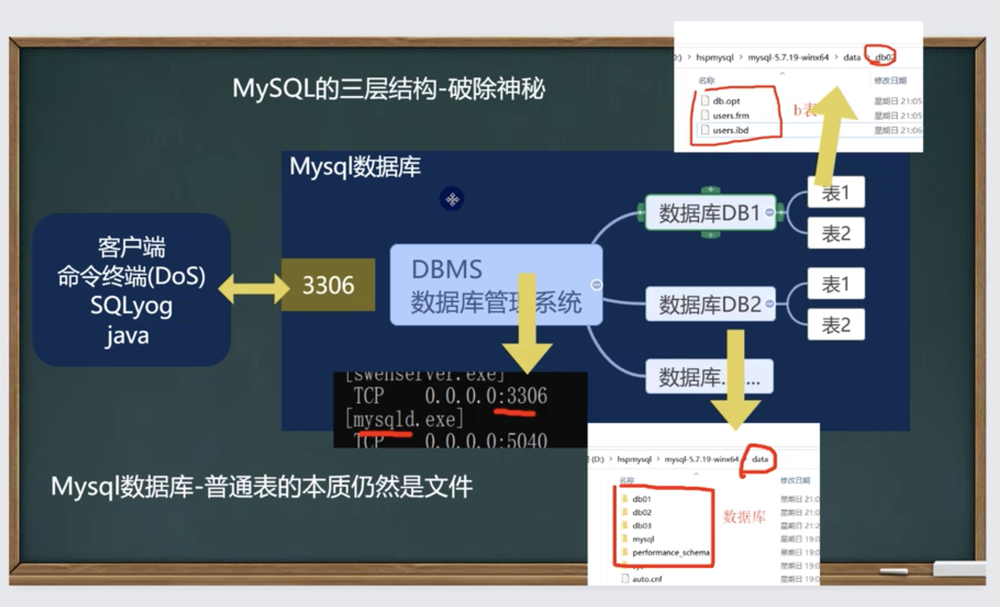

# java与MySQL by 韩顺平




## 创建数据库

```sql
CREATE DATABASE [IF NOT EXISTS]db name
[create_specification [create_specification]...]

create_specification:
[DEFAULT]CHARACTER SET name
[DEFAULT]COLLATE name
```

1. CHARACTER SET:指定数据库采用的字符集，如果不指定字符集，默认utf8
2. COLLATE:指定数据库字符集的校对规则（常用的utf8_bin[区分大小写]、utf8_general_ci[不区分大消息] 注意默认是utf8_general_ci)

## 查看&删除数据库

显示数据库语句：

SHOW DATABASES;

显示数据库创建语句：

SHOW CREATE DATABASE db name;

数据库删除语句[慎用]：

DROP DATABASE [IF EXISTS] db name;


创建数据库/表的时候, 为了规避关键字,可以用\`\`包裹起来.


## 备份恢复数据库

```sh
这不是windows的命令
# 导出  
mysqldump -u <user_name> -p --databases <数据库1> <数据库2> <数据库n> > someFile.sql

# 导入
mysql -u <user_name> -p [<数据库>可省略] < someFile.sql


# 另一种导入: 在sql命令行里执行的.
source ./someFile.sql


# 备份数据库中的表
mysqldump -u <user_name> -p 数据库 表1 表2 表n > someFile.sql
```


## 创建表

```sql
CREATE TABLE table_name
(
field1 datatype,
field2 datatype,
field3 datatype
)character set字符集 collate 校对规则 engine 存储引擎


field:指定列名
datatype:指定列类型（字段类型）
character set:如不指定则为所在数据库字符集
collate:如不指定则为所在数据库校对规则
engine:引擎（这个涉及内容较多，后面单独讲解）
```


## 列类型


Decimal: M最大65, 默认为10, D最大30, 默认为0.


**字符串的使用**

CHAR(size)

固定长度字符串最大255字符

VARCHAR(size)

可变长度字符串最大65532字节 [utf8编码最大21844字符, 1-3个字节用于记录大小]

21844 = (65535-3) / 3 


细节

1. char(4)/这个4表示字符数（最大255），不是字节数，不管是中文还是字母都是放四个，按字符计算
   varchar(4)/这个4表示字符数，不管是字母还是中文都以定义好的表的编码来存放数据.
   不管是中文还是英文字母，都是最多存放4个，是按照字符来存放的.
2. char(4)是定长(固定大小)，就是说，即使你插入'aa',也会占用分配的4个字符
   varchar(4)是变长(变化大小)，就是说，如果你插入了'aa',实际占用空间大小并不是4个字符，而是按照实际占用空间来分配（老韩说明：varchar本身还需要占用1-3个字节来记录存放内容长度)
3. 什么时候使用char,什么时候使用varchar
   1. 如果数据是定长，推荐使用char,比如md5的密码，邮编，手机号，身份证号码等.char(32)
   2. 如果一个字段的长度是不确定，我们使用varchar,比如留言，文章
   3. 查询速度：char>varchar
4. 在存放文本时，也可以使用Text数据类型.可以将TEXT列视为VARCHAR列，注意Text不能有默认值.大小0-2\^16字节如果希望存放更多字符，可以选择MEDIUMTEXT: 0-2\^24或者LONGTEXT: 0~2\^32


**日期**

```sql
CREATE TABLE birthday
(t1 DATE,t2 DATETIME,
t3 TIMESTAMP NOT NULL
DEFAULT CURRENT_TIMESTAMP
ON UPDATE CURRENT_TIMESTAMP);

-- timestamp时间戳


INSERT INTO birthday(t1,t2)
VALUES('2022-11-11','2022-11-11 10:10:10');
```


## 修改表

```sql
-- 添加列
ALTER TABLE tablename
ADD (column datatype [DEFAULT expr]
[, column datatype]...);


-- 修改列
ALTER TABLE tablename
MODIFY (column datatype [DEFAULT expr]
[, column datatype]...);

-- 删除列
ALTER TABLE tablename
DROP (column);

-- 修改列名, 注意这里的datatype必须加上, 不管数据类型是改了还是没改
ALTER TABLE tablename
CHANGE COLUMN oldname newname datatype;


-- 查看表的结构：
desc 表名；

-- 修改表名
Rename table 表名 to 新表名;

-- 修改表字符集
alter table 表名 character set 字符集;
```


## crud 

```sql
-- 增加
INSERT INTO
table_name [(column [, column...])]
VALUES (value [, value...]);

-- 更新
UPDATE table_name
SET col_namel=exprl [, col_name2=expr2 ..]
[WHERE where_definition]; -- 没有where 就会更新所有记录


-- 删除
DELETE FROM tbl_name
[WHERE where_definition]; -- 没有就会删除所有记录

-- 删除是不能删除某一个列的值 (用update 设置为null或者'')
-- 删除表用 DROP TABLE table_name;


```


```sql
-- select 
SELECT [DISTINCT] * | {column1,column2.column3..
FROM tablename;

DISTINCT: 显示结果时, 去除重复数据

-- 使用表达式对查询的列进行计算
SELECT *| {columnl expression,column2 expression,..}
FROM tablename;

-- 可以使用as语句
SELECT columnname as 别名 from 表名；
```


**select 子句**

| 比较运算符 | >  >=  <  <=  =  <> !=        |                                       |
| ---------- | ----------------------------- | ------------------------------------- |
|            | BETWEEN...AND...              | 显示在某一区间的值 [m, n]             |
|            | IN(set)                       | 显示在in列表中的值，例：in（100,200） |
|            | LIKE  '张%' <br /> NOTLIKE '' | 模糊查询: % 0-n个字符.   _ 1个字符    |
|            | IS NULL                       | 判断是否为空                          |
| 逻辑运算符 | and                           | 多个条件同时成立                      |
|            | or                            | 多个条件任一成立                      |
|            | not                           | 不成立，例：where not（salary>100);   |


```sql
SELECT columnl, column2, column3..
FROM table
order by column_name  asc|desc...


-- 1.Order by指定排序的列，排序的列既可以是表中的列名，也可以是select语句后指定的列名。
-- 2.Asc升序[默认]、Desc降序
-- 3.ORDER BY子句应位于SELECT语句的结尾
```


**统计函数**

```sql
Select count(*)|count(列名)from tablename
[WHERE where_definition]

-- 在没有where的情况下
-- count(*) 返回总记录条数
-- count(字段) 返回字段的非空记录个数.


-- 返回满足where条件的字段的和.
Select sum(列名) [，sum(列名)…] from tablename
[WHERE where_definition]

Select avg(列名) [，avg(列名)…] from tablename
[WHERE where_definition]

Select max/min(列名)from tablename
[WHERE where definition]

-- 分组统计
SELECT columnl,column2, column3...FROM table
group by column_name

-- 先用group by分组, 后用having 过滤
SELECT columnl,column2, column3... FROM table
group by column_name having ...


```

`where子句中不能使用类似于avg这种聚合函数, 而是要用having avg(sal)  < 2000`


**字符串函数**

| CHARSET(str)                          | 返回字串字符集                                    |
| ------------------------------------- | ------------------------------------------------- |
| CONCAT(string2[,..])                  | 连接字串                                          |
| INSTR(string,substring)               | 返回substring在string中出现的位置，没有返回o      |
| UCASE(string2)                        | 转换成大写                                        |
| LCASE(string2)                        | 转换成小写                                        |
| LEFT(string2，length) / RIGHT         | 从string2中的左边起取length个字符                 |
| LENGTH(string)                        | string长度[按照字节]                              |
| REPLACE(str,search_str ,replace_str)  | 在str中用replace_str替换search_str                |
| STRCMP(string1,string2)               | 逐字符比较两字串大小，                            |
| SUBSTRING(str，position[,length])     | 从str的position开始[从1开始计算]，取length 个字符 |
| LTRIM（string2）RTRIM（string2)  trim | 去除前端空格或后端空格                            |


```sql
-- CHARSET(str)返回字串字符集
SELECT CHARSET (ename)FROM emp;
-- CONCAT(string2[,···])
-- 连接字串，将多个列拼接成一列
SELECT CONCAT(ename,'工作是'，job) FROM emp;
-- INSTR (string substring)
-- 返回substring在string中出现的位置，没有返回0
-- dual 是亚元表, 系统表 可作为测试表使用
SELECT INSTR('huangshunping', 'ping') FROM DUAL;

--  如果字段job是manager 就替换成经理
SELECT ename, REPLACE(job, 'MANAGER', '经理') FROM emp;
```


**数学函数**

| ABS(num)                          | 绝对值                           |
| --------------------------------- | -------------------------------- |
| BIN (decimal_number)              | 十进制转二进制                   |
| CEILING（number2)                 | 向上取整，得到比num2大的最小整数 |
| CONV（number2,from base,to_bas e) | 进制转换                         |
| FLOOR（number2)                   | 向下取整，得到比num2小的最大整数 |
| FORMAT（number,decimal_places)    | 保留小数位数                     |
| HEX(DecimalNumber)                | 转十六进制                       |
| LEAST (number,number2 [, ...])    | 求最小值                         |
| MOD（numerator,denominator)       | 求余                             |
| RAND([seed])                      | RAND（[seed]）其范围为0≤v≤1.0    |


**日期函数**

| CURRENT_DATE（）                                 | 当前日期                             |
| ------------------------------------------------ | ------------------------------------ |
| CURRENT_TIME ()                                  | 当前时间                             |
| CURRENT_TIMESTAMP()                              | 当前时间戳                           |
| DATE（datetime)                                  | 返回datetime的日期部分               |
| DATE_ADD（date2，INTERVAL d_value d_type )       | 在date2中加上日期或时间              |
| DATE_SUB（date2，INTERVAL d_value d_type )       | 在date2上减去一个时间                |
| DATEDIFF（date1,date2)                           | 两个日期差(结果是天)                 |
| TIMEDIFF(date1,date2)                            | 两个时间差（多少小时多少分钟多少秒） |
| NOW（）                                          | 当前时间                             |
| YEAR\|MONTH\|DAY                                 | 年月日                               |
| UNIX_TIMESTAMP()                                 | unix时间戳(从1970到现在过的秒数)     |
| FROM_UNIXTIME(unix_seconds, '%Y-%m-%d %H:%i:%s') | 将unix时间戳转换为相应的格式的字段串 |


**加密和系统函数**

| USER()                                         | 查询用户                                                     |
| ---------------------------------------------- | ------------------------------------------------------------ |
| DATABASE()                                     | 数据库名称                                                   |
| MD5(str)                                       | 为字符串算出一个MD532的字符串，（用户密码）加密              |
| PASSWORD(str) <br />select * from mysql.user\G | 从原文密码str计算并返回密码字符串，通常用于对mysql 数据库的用户密码加密 |


**流程控制函数**

| IF(expr1,expr2,expr3)                                        | 如果expr1为True，则返回expr2否则返回 expr3                   |
| ------------------------------------------------------------ | ------------------------------------------------------------ |
| IFNULL(expr1,expr2)                                          | 如果expr1不为空NULL，则返回expr1，否则返回 expr2             |
| SELECT CASE WHEN expr1 THEN expr2 WHEN expr3 THEN expr4 ELSE expr5 END;[类似多重分支] | 如果expr1为TRUE，则返回expr2，如果expr3 为TRUE，返回expr4，否则返回expr5 |


## 分页查询

分页查询

1. 按雇员的id号升序取出,每页显示3条记录，请分别显示第一页，第二页第三页
2. 基本语法：select ... limit start,rows
   表示从start+1行开始取，取出rows行，start从0开始计算
3. 公式: limit =每页显示的记录条数 * (第几页-1), 每页显示的记录条数


**数据分组总结**

如果select语句同时包含有group by, having, limit, order by

那么他们的顺序是 group by, having, order by ,limit

```mysql
SELECT columnl,column2, column3 .. FROM table
group by column
having condition
order by columnx
limit <start>, <rows>;
```


## 多表查询

 在默认情况下：当两个表查询时，规则

1. 从第一张表中，取出一行和第二张表的每一行进行组合，返回结果[含有两张表的所有列 --> 笛卡尔集]
2. 一共返回的记录数第一张表行数*第二张表的行数
3. 这样多表查询默认处理返回的结果，称为笛卡尔集
4. 解决这个多表的关键就是要写出正确的过滤条件 where

 

老韩小技巧：多表查询的条件不能少于表的个数-1，否则会出现笛卡尔集


### 自连接

指在同一张表上的连接查询(将一张表看做两张)

```mysql
-- 自连接

-- 显示员工和其上级名字
SELECT A.ename as employee, B.ename as supervisor from emp as A, emp as B WHERE A.mgr = B.empno;
```

### 子查询

- 什么是子查询

子查询是指嵌入在其它sql语句中的select语句，也叫嵌套查询

- 单行子查询

单行子查询是指只返回一行数据的子查询语句

请思考：如何显示与SMITH同一部门的所有员工？

- 多行子查询

多行子查询指返回多行数据的子查询    使用关键字in


### 子查询作为临时表

​      

```mysql
SELECT goods_id, ecs_goods.cat_id,goods_name,shop_price
FROM (SELECT cat_id, MAX(shop_price) AS max_price
FROM ecs_goods
GROUP BY cat_id) AS temp, ecs_goods
WHERE
temp.cat_id = ecs_goods.cat_id
AND temp.max_price = ecs_goods.shop_price
```


### all, any

 跟max , min等价

```mysql
-- all 
-- 显示工资比30号部门所有人的工资都高的员工
SELECT * from emp WHERE sal > (select MAX(sal) from emp WHERE deptno=30);

SELECT * FROM emp WHERE sal > ALL(SELECT sal from emp WHERE deptno = 30);

-- any 
-- 显示 工资比30号部门任意一个员工高的人 
SELECT * FROM emp WHERE sal > ANY(SELECT sal from emp WHERE deptno = 30);

SELECT * FROM emp WHERE sal > (SELECT MIN(sal) from emp WHERE deptno = 30);

```


### 多列子查询

```
(字段1, 字段2...) = (select 字段1, 字段2 from ...)
```


## 表复制和去重

自我复制数据（蠕虫复制）

有时，为了对某个sql语句进行效率测试，我们需要海量数据时，可以使用此法为表创建海量数据


```mysql
-- 将emp 的 记录复制到my_tab01中
INSERT INTO my_tab01 
    SELECT empno, ename, sal, job, deptno from emp;

-- 自我复制
INSERT INTO my_tab01 
    SELECT * from my_tab01;

-- 将my_tab01的重复记录算作一条, 放进my_tab02
INSERT INTO my_tab02 
    SELECT DISTINCT * from my_tab01;
```


## 合并查询

有时在实际应用中，为了合并多个select语句的结果可以使用集合操作符号`union` `union all `

```mysql
-- 该操作符用于取得两个结果集的并集。
select ename,sal,job from emp where sal>2500 union  -- 去重
select ename,sal,job from emp where job='MANAGER';


select ename,sal,job from emp where sal>2500 union all -- 不去重
select ename,sal,job from emp where job='MANAGER';

```

## 外连接

1. 前面我们学习的查询，是利用where子句对两张表或者多张表，形成的笛卡尔积进行筛选，根据`关联条件`，显示所有匹配的记录，匹配不上的，不显示
2. 比如：列出部门名称和这些部门的员工名称和工作，`同时要求显示出那些没有员工的部门`。
3. ↑这个要求用已有的知识是无法达到的.
4. 左外连接 (如果左侧的表完全显示我们就说是左外连接)
5. 右外连接( 如果右侧的表完全显示我们就说是右外连接)
6. 老师小结：在实际的开发中，我们绝大多数情况下使用的是前面学过的连接 [内连接]

```mysql
-- 部门表左外连接员工表
SELECT dname, ename, job from dept LEFT JOIN emp ON  dept.deptno = emp.deptno;
```


## mysql约束

约束用于确保数据库的数据满足特定的商业规则. 在mysql中，约束包括：not null, unique, primary key, foreign key和check五种.


- primary key(主键)-基本使用

字段名 字段类型 primary key

用于唯一的标示表行的数据，当定义主键约束后，该列不能重复

- 细节

1. primary key: `不能重复而且不能为null`
2. 一张表最多只能有一个主键，但可以是复合主键
3. 主键的指定方式有两种
   1. 直接在字段名后指定：字段名 primakry key
   2. 在表定义最后写primary key(列名, [列名])  (多于1个列,那么就是复合主键)
4. 使用desc表名，可以看到primary key的情况.
5. 在实际开发中, 每个表往往都有主键


- not null(非空)

如果在列上定义了not null,,那么当插入数据时，必须为列提供数据

字段名 字段类型 not null

- unique(唯一)

当定义了唯一约束后，该列值是不能重复的

字段名 字段类型 unique

注意: 如果没有指定not null, 那么unique字段可以有多个null


- foreign key(外键)

用于定义主表和从表之间的关系：外键约束要定义在从表上，主表则必须具有主键约束或是unique约束.当定义外键约束后，要求外键列数据必须在主表的主键列存在或是为null

FOREIGN KEY (本表字段名) REFERENCES
主表名(主键名或unique字段名)

- 细节

1. 外键指向的表的字段，要求是primary key或者是unique
2. 表的类型是innodb,这样的表才支持外键
3. 外键字段的类型要和主键字段的类型一致（长度可以不同）
4. 外键字段的值，必须在主键字段中出现过，或者为null[前提是外键字段允许为null]
5. 一旦建立主外键的系，数据不能随意删除了


- check

用于强制行数据必须满足的条件，假定在sa列上定义了check约束，并要求sal列值在1000-2000之间, 如果不在这个范围内就会报错.

oracle和sql server均支持check,但是mysql5.7目前还不支持check,只做语法校验，但不会生效

基本语法

列名 类型  check (check条件) 

在mysql中实现check的功能，一般是在程序中控制或者通过触发器完成。

```mysql
CREATE TABLE
t23(
id INT PRIMARY KEY,
name VARCHAR(32),
sex VARCHAR(6) CHECK (sex IN('man','woman')),
sal DOUBLE CHECK (sal>1000 AND sal<2000)
);
```


## 自增长

字段名 整型 primary key  auto_increment


添加自增长的字段方式 [假设字段1是自增长的]

1. insert into xxx(字段1，字段2...) values(null,'值'…)：
2. insert into xxx(字段2.…) values ('值2'...)；
3. insert into xxx values(null,'值2'…)


细节

1. 一般来说自增长是和primary key配合使用的
2. 自增长也可以单独使用[但是需要配合一个unique]
3. 自增长修饰的字段为整数型的(虽然小数也可以但是非常非常少这样使用)
4. 自增长默认从1开始，也可以通过如下命令修改
   alter table 表名 auto increment=xxx;
5. 如果你添加数据时，给自增长字段（列指定的有值，则以指定的值为准)


## 索引

```mysql
-- 添加索引
create [unique] index index_name on table_name(column_name [length] [ASC|DESC], ...);

alter table table_name add index [index_name] (index_col_name, ...);

-- 添加主键(索引)
alter table table_name add primary key(column_name);

-- 删除索引
drop index index_name on table_name;

-- 删除主键索引
alter table drop primary key;

-- 索引使用
show index/indexes from table_name;
show keys from table_name;
desc table_name;

-- 修改索引 == 先删除,再添加新的.
```

**索引的原理**

没有索引为什么会慢？因为全表扫描

使用索引为什么会快？形成一个索引的数据结构，比如二叉树

**索引的代价**

1. 磁盘占用
2. 对dml(update delete insert)语句的效率影响


- 主键索引

主键就是主索引

- 唯一索引(UNIQUE)

- 普通索引

- 全文索引

适用于MyISAM, 一般开发不使用mysql自带的全文索引, 考虑使用: 全文搜索Solr和ElasticSearch(ES)


**小结：哪些列上适合使用索引**

1. 较频繁的作为查询条件字段应该创建索引
   select * from emp where empno=1
2. 唯一性太差的字段不适合单独创建索引，即使频繁作为查询条件
   select * from emp where sex ='男'
3. 更新非常频繁的字段不适合创建索引
   select * from emp where logincount=1
4. 不会出现在WHERE子句中字段不该创建索引


## 事务

**什么是事务**

事务用于保证数据的一致性，它由`一组相关的dml语句组成`，该组的dml语句要么全部成功，要么全部失败。如: 转账就要用事务来处理，用以保证数据的一致性。

**事务和锁**

当执行事务操作时(dml语句)，mysql会在表上加锁，防止其它用户改表的数据.这对用户来讲是非常重要的

**mysql数据库控制台事务的几个重要操作**

1. start transaction -- 开始一个事务
2. savepoint -- 设置保存点
3. rollback to 保存点名   -- 回退事务
4. rollback -- 回退全部事务
5. commit -- 提交事务，所有的操作生效，不能回退

**细节**

1. 没有设置保存点
2. 多个保存点
3. 存储引擎
4. 开始事务方式


**回退事务**
在介绍回退事务前，先介绍一下保存点(savepoint).保存点是事务中的点.用于取消部分事务，当结束事务时(commit),会自动的删除该事务所定义的所有保存点，当执行回退事务时，通过指定保存点可以回退到指定的点

**提交事务**

使用commit语句可以提交事务.当执行了commit语句子后，会确认事务的变化、结束事务、删除保存点、释放锁，数据生效。当使用commit语句结束事务子后，其它会话[其他连接]将可以查看到事务变化后的新数据[所有数据就正式生效.]


`注意, 如果回退到某个点,那么在它后面的点都会被删除, 也就是说不能回到该点之后的点了.`


**细节**

1. 如果不开始事务，默认情况下，d操作是自动提交的，不能回滚
2. 如果开始一个事务，你没有创建保存点.你可以执行rollback,默认就是回退到你事务开始的状态
3. 你也可以在这个事务中（还没有提交时），创建多个保存点.比如：savepoint aaa; 执行dml; savepoint bbb;
4. 你可以在事务没有提交前，选择回退到哪个保存点.
5. mysql的事务机制需要innodb的存储引擎才可以使用，myisam不好使
6. 开始一个事务start transaction / set autocommit=off;


**隔离级别**

事务隔离级别介绍

1. 多个连接开启各自事务操作数据库中数据时，数据库系统要负责隔离操作，以保证各个连接在获取数据时的准确性。
2. 如果不考虑隔离性，可能会引发如下问题：
   1. 脏读(dirty read)
      当一个事务读取另一个事务`尚未提交的改变(dml)`时，产生脏读
   2. 不可重复读(nonrepeatable read)
      同一查询在同一事务中多次进行，由于`其他提交事务所做的修改或删除`，每次返回不同的结果集，此时发生不可重复读
   3. 幻读(phantom read)
      同一查询在同一事务中多次进行, 由于`其他提交事务所做的插入操作`, 每次返回不同的结果集, 此时发生幻读


隔离级别定义了事务与事务之间的隔离程度

| Mysql隔离级别                             | 脏读 | 不可重复读 | 幻读 | 加锁读 |
| ----------------------------------------- | ---- | ---------- | ---- | ------ |
| 读未提交（Read uncommitted)               | v    | v          | v    | 不加锁 |
| 读已提交 （Read committed)                | x    | v          | V    | 不加锁 |
| 可重复读（Repeatable read）               | x    | x          | X    | 不加锁 |
| 可串行化（Serializable）[演示 重开客户端] | x    | x          | x    | 加锁   |

v -- 可能出现  x -- 不会出现


```mysql
-- 查看当前mysql的隔离级别
select @@transaction_isolation; 
-- 查看系统当前的隔离级别
select @@global.transaction_isolation; 

-- 设置 隔离级别
set session transaction isolation level READ UNCOMMITTED
-- 设置系统隔离级别
set global transaction isolation level READ UNCOMMITTED

-- mysql默认的事务隔离级别是repeatable read,一般情况下，没有特殊
-- 要求，没有必要修改（因为该级别可以满足绝大部分项目需求）
-- 可以写在my.ini / my.cnf里

```


## 存储引擎

**基本介绍**

1. MySQL的表类型由存储引擎(Storage Engines)决定，主要包括MyISAM、innoDB、Memory等
2. MySQL数据表主要支持六种类型，分别是：CSV、Memory、ARCHIVE、ARG MYISAM、MYISAM、InnoDB
3. 这六种又分为两类，一类是”`事务安全型`”(transaction-safe),比如：`InnoDB`; 其余都属于第二类，称为”非事务安全型”(non-transaction-safe)[mysiam和memory]。


```mysql
-- 显示当前数据库支持的存储引擎
show engines;

-- 创建表时指定引擎
create table tt ( 
	id int,
	`name` varchar(32)) engine memory;

-- 修改表的引擎
alter table tt engine=myisam;
```


| 特点           | Myisam | InnoDB | Memory | Archive |
| -------------- | ------ | ------ | ------ | ------- |
| 批量插入的速度 | 高     | 低     | 高     | 非常高  |
| 事务安全       |        | 支持   |        |         |
| 全文索引       | 支持   |        |        |         |
| 锁机制         | 表锁   | 行锁   | 表锁   | 行锁    |
| 存储限制       | 没有   | 64TB   | 有     | 没有    |
| B树索引        | 支持   | 支持   | 支持   |         |
| 哈希索引       |        | 支持   | 支持   |         |
| 集群索引       |        | 支持   |        |         |
| 数据缓存       |        | 支持   | 支持   |         |
| 索引缓存       | 支持   | 支持   | 支持   |         |
| 数据可压缩     | 支持   |        |        | 支持    |
| 空间使用       | 低     | 高     | N/A    | 非常低  |
| 内存使用       | 低     | 高     | 中等   | 低      |
| 支持外键       |        | 支持   |        |         |


- 重点介绍: myisam, innodb, memory

1. MyISAM不支持事务、也不支持外键，但其访问速度快，对事务完整性没有要求
2. InnoDB存储引擎提供了具有提交、回滚和崩溃恢复能力的事务安全。但是比起MyISAM存储引擎，InnoDB写的处理效率差一些并且会占用更多的磁盘空间以保留数据和索引。
3. MEMORY存储引擎使用存在内存中的内容来创建表。每个MEMORY:表只实际对应一个磁盘文件。MEMORY:类型的表访问非常得快，因为它的数据是放在内存中的，并且默认使用HASH索引。但是一旦服务关闭，表中的数据就会丢失掉，表的结构还在。


- 如何选择表的引擎

1. 如果你的应用不需要事务，处理的只是基本的CRUD操作，那么MyISAM是不二选择，速度快
2. 如果需要支持事务，选择InnoDB。
3. Memory存储引擎就是将数据存储在内存中，由于没有磁盘I/O的等待，速度极快。但由于是内存存储引擎，所做的任何修改在mysql服务重启后都将消失。（经典用法用户的在线状态）


## 视图

视图是一个虚拟表，其内容由查询定义。同真实的表一样，视图包含列，其数据来自对应的真实表（基表, 可以是多个）. 视图的修改可以影响基表数据, 反之亦然.

```mysql
-- 基本使用

-- 创建
create view 视图名 as select语句
-- 更新
alter view 视图名 as select语句
-- 查看创建视图的指令
SHOW CREATE VIEW 视图名
-- 删除视图
drop view 视图名1，视图名2
```

1. 创建视图后，到数据库去看，对应视图只有一个视图结构文件（形式：视图名.frm)
2. 视图的数据变化会影响到基表，基表的数据变化也会影响到视图[insert update delete]

```mysql
-- 针对前面的雇员管理系统
create view myview as select empno ,ename job,comm from emp;
select * from myview;
update myview set comm=200 where empno=7369; -- 修改视图，对基表都有变化
update emp set comm=100 where empno=7369; -- 修改基表，对视图也有变化

```

3. 视图中可以再使用视图


**视图实践**

1. 安全。一些数据表有着重要的信息。有些字段是保密的，不能让用户直接看到。这时就可以创建一个视图，在这张视图中只保留一部分字段。这样，用户就可以查询自己需要的字段，不能查看保密的字段。
2. 性能。关系数据库的数据常常会分表存储，使用外键建立这些表的之间关系。这时，数据库查询通常会用到连接(JOIN)。这样做不但麻烦，效率相对也比较低。如果建立一个视图，将相关的表和字段组合在一起，就可以避免使用JOIN查询数据。
3. 灵活。如果系统中有一张旧的表，这张表由于设计的问题，即将被废弃。然而，很多应用都是基于这张表，不易修改。这时就可以建立一张视图，视图中的数据直接映射到新建的表。这样，就可以少做很多改动，也达到了升级数据表的目的。  


## mysql管理

### Mysql用户

mysql中的用户，都存储在系统数据库mysql中user表中

其中user表的重要字段说明：

1. host: 允许登录的"位置”，localhost表示该用户只允许本机登录，也
   可以指定ip地址，比如：192.168.1.100
2. user: 用户名；
3. authentication_string: 密码，是通过mysql的password()函数加密之后的密码


```mysql
-- 创建用户
create user 'user_name'@'host_name' identified by 'pwd' 

-- 删除用户
drop user 'user_name'@'host_name'

-- 修改密码  不中用(还是见geekhour给的册子)
-- 自己的
set password = password('密码串') -- 我很怀疑能不能用了
-- 别人的
set password for '用户名'@'登录位置'= password('密码');

-- geekhour 修改密码
ALTER user 'joriri'@'localhost'
IDENTIFIED WITH caching_sha2_password BY '12345';
FLUSH PRIVILEGES;

-- 实测,这样也能改密码
alter USER 'test'@'localhost' IDENTIFIED BY '233';

```


### 权限

```mysql
-- 用户授权
grant 权限列表 on 库.对象名 to '用户名'@'登录位置' [identified by '密码'];

说明：
1.权限列表，多个权限用逗号分开
grant select on…
grant select,delete,create on......
grant all[privileges] on.. 表示赋予该用户在该对象上的所有权限

2.特别说明
*.*：代表本系统中的所有数据库的所有对象（表，视图，存储过程）
库.*：表示某个数据库中的所有数据对象（表，视图，存储过程等）

3.identified by可以省略，也可以写出.
   (1) 如果用户存在, 那么就是修改其密码
   (2) 如果不存在, 就是创建该用户
   
   
-- 回收用户授权   
revoke 权限列别 on 库.对象名 from '用户名'@'登录位置';

-- 权限生效指定
flush privileges
```


| 权限                    | 意义                                                         |
| ----------------------- | ------------------------------------------------------------ |
| ALL [PRIVILEGES]        | 设置除了GRANT OPTION之外的所有简单权限                       |
| ALTER                   | 允许使用ALTER TABLE                                          |
| ALTER ROUTINE           | 更改或取消已存储的子程序                                     |
| CREATE                  | 允许使用CREATE TABLE                                         |
| CREATE ROUTINE          | 创建已存储的子程序                                           |
| CREATE TEMPORARY TABLES | 允许使用CREATE TEMPORARY TABLE                               |
| CREATE USER             | 允许使用CREATE USER,DROP USER,RENAME USER和REVOKE ALL PRIVILEGES |
| CREATE VIEW             | 允许使用CREATE VIEW                                          |
| DELETE                  | 允许使用DELETE                                               |
| DROP                    | 允许使用DROP TABLE                                           |
| EXECUTE                 | 允许用户运行已存储的子程序                                   |
| FILE                    | 允许使用SELECT...INTO OUTFILE和LOAD DATA INFILE              |
| INDEX                   | 允许使用CREATE INDEX 和 DROP INDEX                           |
| INSERT                  | 允许使用INSERT                                               |
| LOCK TABLES             | 允许对您拥有SELECT权限的表使用LOCK TABLES                    |
| PROCESS                 | 允许使用SHOW FULL PROCESSLIST                                |
| REFERENCES              | 未被实施                                                     |
| RELOAD                  | 允许使用FLUSH                                                |
| REPLICATION      CLIENT | 允许用户询问从属服务器或主服务器的地址                       |
| REPLICATION SLAVE       | 用于复制型从属服务器（从主服务器中读取二进制日志事件）       |
| SELECT                  | 允许使用SELECT                                               |
| SHOW DATABASES          | SHOWDATABASES显示所有数据库                                  |
| SHOW VIEW               | 允许使用SHOW CREATE VIEW                                     |
| SHUTDOWN                | 允许使用mysqladmin shutdown                                  |
| SUPER                   | 允许使用CHANGE MASTER，KILL，PURGE MASTER LOGS和SET GLOBAL语句，mysqladmin debug命令: 允许您连接（一次），即使已达到max_connections. |
| UPDATE                  | 允许使用UPDATE                                               |
| USAGE                   | “无权限”的同义词                                             |
| GRANT OPTION            | 允许授予权限                                                 |


**细节**

1. 在创建用户的时候，如果不指定Host,则为%，%表示表示所有P都有连接权限
   create user xxx;
2. 你也可以这样指定
   create user 'xx'@'192.168.1.%' 表示xx用户在192.168.1.*的ip可以登录mysql
3. 在删除用户的时候，如果host不是%，需要明确指定'用户'@'host'


# JDBC和数据库连接池

JDBC为访问不同的数据库提供了统一的接口，为使用者屏蔽了细节问题。

Java程序员使用DBC,可以连接任何提供了JDBC驱动程序的数据库系统，从而完成对数据库的各种操作。


jdbc的相关类和接口在java.sql和javax.sql包中


JDBC程序编写步骤

1. 注册驱动-加载Driver类
2. 获取连接-得到Connection
3. 执行增删改查-发送SQL命令给mysql执行
4. 释放资源-关闭相关连接


```mysql
// jdbc连接mysql  to be add 
package com.joriri.jdbc;

import com.mysql.cj.jdbc.Driver;
import org.junit.jupiter.api.Test;

import java.io.FileInputStream;
import java.lang.reflect.Constructor;
import java.sql.Connection;
import java.sql.DriverManager;
import java.sql.Statement;
import java.util.Properties;

/**
 * @Author zxy
 * @Date 2024/11/14
 * @Description jdbc连接的5种方式
 */
public class JdbcDemo02 {
    public static void main(String[] args) throws Exception{
        // 使用方式5完成
        // 创建表news
        // 添加5条记录
        // 修改更新
        Properties properties = new Properties();
        properties.load(new FileInputStream("src/mysql.properties"));

        String url = properties.getProperty("url");
        String driver = properties.getProperty("driver");
        String user = properties.getProperty("user");
        String password = properties.getProperty("password");

        Class.forName(driver);
        Connection connection = DriverManager.getConnection(url, user, password);

//        System.out.println("通过配置文件得到连接"+connection);
        Statement statement = connection.createStatement();
//        String sql = "create table news (id int primary key auto_increment, name varchar(20) not null " +
//                "default '');";
//        String sql = "insert into news values (null,'test'), (null, 'test1'), (null, 'test2'),(null,'test3')" +
//                ",(null,'test4');";
//        String sql = "update news set name = 'haha' where id=1;";
        String sql = "delete from news where id=1;";
        // 不允许一次多条语句.
//        String sql = "insert into news values (null, 'hehe'); update news set name='haha' where id=3;";
        int i = statement.executeUpdate(sql);
        System.out.println("成功:"+i);

        statement.close();
        connection.close();


    }

    public void connet01() {
        // 正如demo01里的
    }


    @Test
    public  void  connec02() throws Exception {
        // 使用反射
        Class<?> aClass = Class.forName("com.mysql.cj.jdbc.Driver");
        Constructor<?> constructor = aClass.getConstructor();
        Driver driver = (Driver) constructor.newInstance();

        // 接下来都是一样的.
        String url = "jdbc:mysql://localhost:3306/hsp_demo";

        Properties properties = new Properties();
        properties.setProperty("user", "root");
        properties.setProperty("password", "Tamiyoisthe1!");

        Connection connect = driver.connect(url, properties); // 获得连接.
        System.out.println("通过反射得到"+connect);
        connect.close();

    }

    @Test
    public void connet03() throws Exception{
        // 使用DriverManager代替Driver.
        Class<?> aClass = Class.forName("com.mysql.cj.jdbc.Driver");
        Constructor<?> constructor = aClass.getConstructor();
        Driver driver = (Driver) constructor.newInstance();

        String url = "jdbc:mysql://localhost:3306/hsp_demo";
        String user = "root";
        String password = "Tamiyoisthe1!";

        DriverManager.registerDriver(driver);
        Connection connection = DriverManager.getConnection(url, user, password);
        System.out.println("通过drivermanager得到连接"+connection);
        connection.close();
    }

    @Test
    public void connet04() throws Exception{
        // 这种在开发中使用是最多的.
        // 简化connet03
        // 通过Class.forName自动完成注册驱动.
        // 其实这句话被注释了也能成功
        Class.forName("com.mysql.cj.jdbc.Driver");

        String url = "jdbc:mysql://localhost:3306/hsp_demo";
        String user = "root";
        String password = "Tamiyoisthe1!";

        Connection connection = DriverManager.getConnection(url, user, password);
        System.out.println("简化版本: 通过drivermanager得到连接"+connection);
        connection.close();

    }

    @Test
    public void connect05() throws Exception{
        // 将用户名和密码等信息写到配置文件里
        Properties properties = new Properties();
        properties.load(new FileInputStream("src/mysql.properties"));

        String url = properties.getProperty("url");
        String driver = properties.getProperty("driver");
        String user = properties.getProperty("user");
        String password = properties.getProperty("password");

        Class.forName(driver);
        Connection connection = DriverManager.getConnection(url, user, password);

        System.out.println("通过配置文件得到连接"+connection);
        connection.close();
    }
}

```


**ResultSet**

1. 表示数据库结果集的数据表，通常通过执行查询数据库的语句生成
2. ResultSeti对象保持一个光标指向其当前的数据行。最初，光标位于第一行之前
3. next方法将光标移动到下一行，并且由于在ResultSeti对象中没有更多行时返回false,因此可以在while循环中使用循环来遍历结果集

**statement**

1. Statement对象用于执行静态SQL语句并返回其生成的结果的对象
2. 在连接建立后，需要对数据库进行访问，执行命名或是SQL语句，可以通过
   1. Statement [存在sql注入风险]
   2. PreparedStatement [预处理]
   3. CallableStatement [存储过程]
3. Statement对象执行SQL语句,存在SQL注入风险
4. SQL注入是利用某些系统没有对用户输入的数据进行充分的检查，而在用户输入数据中注入非法的SQL语句段或命令，恶意攻击数据库
5. 要防范SQL注入，只要用PreparedStatement(从Statement扩展而来)取代Statement就可以了

```mysql
-- 假如现在有个表, 由两个字段: 姓名和密码组成
-- 模拟登录
-- 设置 姓名为 1' or
-- 设置 密码为 or '1'='1
-- 如果使用java的Statement, 很容易被注入成功
```


**PreparedStatement**

1. PreparedStatement执行的SQL语句中的参数用问号(？)来表示，调用PreparedStatement对象的setXxx()方法来设置这些参数.setXxx()方法有两个参数，第一个参数是要设置的SQL语句中的参数的索引（从1开始），第二个是设置的SQL语句中的参数的值
2. 调用executeQuery(), 返回ResultSet对象
3. 调用executeUpdate(): 执行更新，包括增、删、修改


- 好处
  - 不使用+来拼接sql语句,减少语法错误
  - 有效解决sql注入问题
  - 大大减少编译次数, 效率较高


**事务**

1. JDBC程序中当一个Connection对象创建时，默认情况下是自动提交事务：每次执行一个SQL语句时，如果执行成功，就会向数据库自动提交，而不能回滚
2. JDBC程序中为了让多个SQL语句作为一个整体执行，需要使用事务
3. 调用Connection的setAutoCommit(false)可以取消自动提交事务, 调用setSavepiont()设置保存点.
4. 在所有的SQL语句都成功执行后，调用Connection的commit()方法提交事务
5. 在其中某个操作失败或出现异常时，调用Connection的rollback()方法回滚事务


**批处理**

1. 当需要成批插入或者更新记录时。可以采用Java的批量更新机制，这一机制允许多条语句一次性提交给数据库批量处理。通常情况下比单独提交处理更有效率
2. JDBC的批量处理语句包括下面方法：
   addBatch():添加需要批量处理的SQL语句或参数
   executeBatch():执行批量处理语句；
   clearBatch():清空批处理包的语句
3. JDBC连接MySQL时，如果要使用批处理功能，在url中加参数`?rewriteBatchedStatements=true`
4. 批处理往往和PreparedStatement一起搭配使用，可以既减少编译次数，又减少运行次数，效率大大提高


 **传统连接数据库的弊端**

1. 传统的JDBC数据库连接使用DriverManager来获取，每次向数据库建立连接的时候都要`将Connection加载到内存中，再验证IP地址，用户名和密码(0.055~1s时间)`。需要数据库连接的时候，就向数据库要求一个, 频繁的进行数据库连接操作将占用很多的系统资源，容易造成服务器崩溃
2. 每一次数据库连接，使用完后都得断开，`如果程序出现异常而未能关闭，将导致数据库内存泄漏`，最终将导致重启数据库
3. 传统获取连接的方式，不能控制创建的连接数量，如连接过多，也可能导致内存泄漏，MySQL崩溃。解决传统开发中的数据库连接问题，可以采用数据库连接池技术(connection pool)


**数据库连接池基本介绍**

1. 预先在缓冲池中放入一定数量的连接，当需要建立数据库连接时，只需从“缓冲池”中取出一个，使用完毕之后再放回去
2. 数据库连接池负责分配、管理和释放数据库连接，它允许应用程序重复使用一个现有的数据库连接，而不是重新建立一个
3. 当应用程序向连接池请求的连接数超过最大连接数量时，这些请求将被加入到等待队列中


**数据库连接池种类**

1. JDBC的数据库连接池使用javax.sql.DataSource来表示，DataSource只是一个接口，该接口通常由第三方提供实现
2. `C3P0`数据库连接池，速度相对较慢，稳定性不错(hibernate,spring)
3. DBCP数据库连接池，速度相对c3p0较快，但不稳定
4. Proxool数据库连接池，有监控连接池状态的功能，稳定性较c3p0差一点
5. BoneCP数据库连接池，速度快
6. `Druid(德鲁伊)`是阿里提供的数据库连接池，集DBCP、C3PO、Proxool优点于一身的数据库连接池

 

**Apache--DBUtils**

1. 关闭connection后, resultset结果集不能使用
2. resultset不利于数据的管理


基本介绍

1. commons-dbutils是Apache组织提供的一个开源JDBC工具类库，它是对JDBC的封装，使用dbutils能极大简化jdbc编码的工作量
2. DbUtils类
   1. QueryRunner类：该类封装了SQL的执行，是线程安全的。可以实现增、删、改、查、批处理
   2. 使用QueryRunner类实现查询
   3. ResultSetHandler接口：该接口用于处理java.sql.ResultSet,将数据按要求转换为另一种形式

ArrayHandler:把结果集中的第一行数据转成对象数组。

ArrayListHandler:把结果集中的每一行数据都转成一个数组，再存放到List中。

BeanHandler:将结果集中的第一行数据封装到一个对应的JavaBean实例中。

BeanListHandler:将结果集中的每一行数据都封装到一个对应的JavaBean实例中，存放到List里。

ColumnListHandler:将结果集中某一列的数据存放到List中

KeyedHandler(name): 将结果集中的每行数据都封装到Map里，再把这些map再存到一个map里，其key为指定的key

MapHandler:将结果集中的第一行数据封装到一个Map里，key是列名，value就是对应的值

MapListHandler: 将结果集中的每一行数据都封装到一个Map里，然后再存放到List

ScalarHandler: 单行单列的查询, 返回的结果是Object


**BasicDAO**

增删改查通用方法

apache-dbutils+Druid简化了JDBC开发，但还有不足：

1. SQL语句是固定，不能通过参数传入，通用性不好，需要进行改进，更方便执行增删改查
2. 对于select操作，如果有返回值，返回类型不能固定，需要使用泛型
3. 将来的表很多，业务需求复杂，不可能只靠一个Java类完成


1. DAO:data access object数据访问对象
2. 这样的通用类，称为BasicDao,是专门和数据库交互的，即完成对数据库（表）的crud操作
3. 在BaiscDao的基础上,实现一张表对应一个Dao,更好的完成功能. e.g.Customer表-Customer.java(javabean)-CustomerDao.java


**完成一个简单设计**
com.hspedu.dao

1. com.hspedu.dao_.utils //工具类
2. com.hspedu.dao_.domain //javabean
3. com.hspedu.dao_.dao //存放XxxDAO和BasicDAO
4. com.hspedu.dao_.test //写测试类


