# SSM by B站 黑马程序员

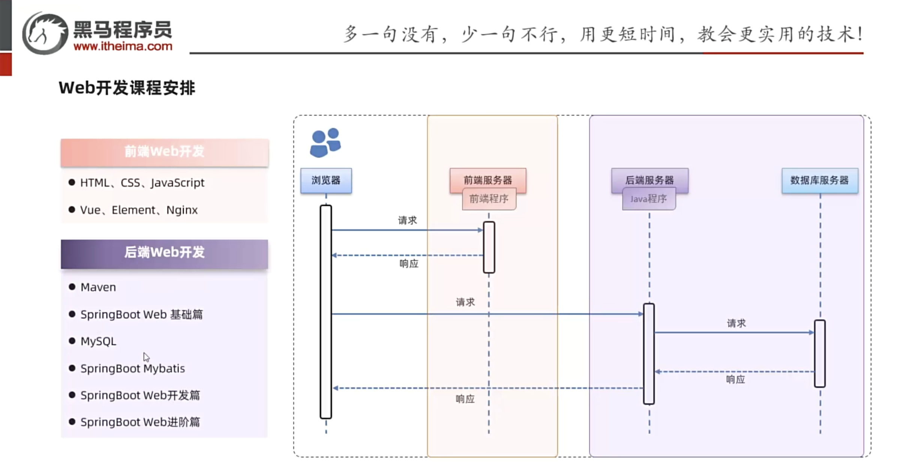

## day1-3: 前端

[w3school](https://www.w3school.com.cn/)

[HTML标签简写及全称大全](https://www.cnblogs.com/innovidory/p/7134381.html)

**函数定义**

```js
function add(a,b) {
  return a+b;
}

var add = function(a,b) {
  return a+b;
}
```


**箭头函数**

```js 
() => expression

param => expression

(param) => expression

(param1, paramN) => expression

() => {
  statements
}

param => {
  statements
}

(param1, paramN) => {
  statements
}

```

```js
// 传统匿名函数
(function (a) {
  return a + 100;
});

// 1. 移除“function”，并将箭头放置于参数和函数体起始大括号之间
(a) => {
  return a + 100;
};

// 2. 移除代表函数体的大括号和“return”——返回值是隐含的
(a) => a + 100;

// 3. 移除参数周围的括号
a => a + 100;

```


### vue

1. Vue是一套前端框架，免除原生)avaScriptr中的DOM操作，简化书写。
2. 基于MVWM(Model-View-ViewModel)思想，实现数据的双向绑定，将编程的关注点放在数据上。
3. [官网](https://v2.cn.vuejs.org)

```html
<!DOCTYPE html>
<html lang="en">
<head>
    <meta charset="UTF-8">
    <meta name="viewport" content="width=device-width, initial-scale=1.0">
    <title>vue</title>
    <script src="js/vue.min.js"></script>
</head>
<body>
    <!-- {{ message }} 是插值表达式 -->
    <div id="app">
        <input type="text" v-model="message"> {{message}}  
    </div>

    <script>
        // 定义Vue对象
        new Vue({
            el: "#app",  // 接管区域
            data: {
                message: "hello vue."
            }
        })

    </script>
</body>
</html>
```

#### 基础指令

| 指 令         | 作用                                                |
| ------------- | --------------------------------------------------- |
| v-bind<br />: | 为HTML标签绑定属性值，如设置href，css样式等         |
| v-model       | 在表单元素上创建双向数据绑定                        |
| v-on<br />@   | 为HTML标签绑定事件                                  |
| v-if          | 条件性的渲染某元素，判定为true时渲染，否则不渲染    |
| v-else-if     | ...                                                 |
| v-else        | ...                                                 |
| v-show        | 根据条件展示某元素，区别在于切换的是display属性的值 |
| v-for         | 列表渲染，遍历容器的元素或者对象的属性              |

> v-if 是条件成立才会渲染这个html元素, 而v-show不管条件成不成立都会渲染,但后者通过css的display属性来控制元素会不会显示.

```html
<!--  展示v-bind v-model v-on  -->
<!DOCTYPE html>
<html lang="en">
<head>
    <meta charset="UTF-8">
    <meta name="viewport" content="width=device-width, initial-scale=1.0">
    <title>vue</title>
    <script src="js/vue.min.js"></script>
</head>
<body>
    <div id="app">
    <a v-bind:href="url" target="_blank">点我</a><br/>
    <input v-model="url"><br/>
    <input type="button" value="点我" v-on:click="handle()">
    
    </div>
    
</body>
<script>
    new Vue({
        el: "#app",
        data: {
            url: "http://www.baidu.com"
        },
        methods: {
            handle: function(){
                alert("按钮被点击了.")
            }
        }
    })
</script>
</html>
```

```html
<!-- v-if v-show -->
<!DOCTYPE html>
<html lang="en">

<head>
    <meta charset="UTF-8">
    <meta name="viewport" content="width=device-width, initial-scale=1.0">
    <title>vue</title>
    <script src="js/vue.min.js"></script>
</head>

<body>
    <div id="app">
        <input type="text" name="test" v-model="age">
        <br />
        <span v-if="age < 35">青年</span>
        <span v-else-if="age <60">中年</span>
        <span v-else>老年</span>
        <br /><br />
        <span v-show="age<35">青年</span>
        <span v-show="age >=35 && age < 60">中年</span>
        <span v-show="age>=60">老年</span>


    </div>
</body>
<script>
    new Vue({
        el: "#app",
        data: {
            age: 25
        }
    })
</script>

</html>
```

```html
<!--  展示v-for -->
<!DOCTYPE html>
<html lang="en">
<head>
    <meta charset="UTF-8">
    <meta name="viewport" content="width=device-width, initial-scale=1.0">
    <title>vue</title>
    <script src="js/vue.min.js"></script>
</head>
<body>
    <div id="app">
    <div v-for="attr in attrs">{{attr}}</div>

    <div v-for="(attr, index) in attrs" :key="index">{{index+1}} : {{attr}}</div>
    </div>
</body>
<script>
    new Vue({
        el: "#app",
        data: {
            attrs: ["bj","sh","gz","sz"]
        }
    })
</script>
</html>
```

#### 生命周期

| 状态          | 阶段周期     |
| ------------- | ------------ |
| beforeCreate  | 创建前       |
| created       | 创建后       |
| beforeMount   | 挂载前       |
| ==mounted==   | ==挂载完成== |
| beforeUpdate  | 更新前       |
| updated       | 更新后       |
| beforeDestroy | 销毁前       |
| destroyed     | 销毁后       |

```html
<script>
  new Vue({
    el: "#app",
    data: {},
    mounted() {
      ...
    },
    methods: {},
  })
</script>
    
```


### Ajax

原生

```html
<body>
    <input types="button" value="获取数据" onclick="getData()">
    <div id="div1"></div>
</body>
<script>
    function getData() {
        //1.创建XMLHttpRequest
        var xmlHttpRequest = new XMLHttpRequest();
        //2.发送异步请求
        xmlHttpRequest.open('GET', 'http://yapi.smart-xwork.cn/mock/169327/emp/list');
        xmlHttpRequest.send(); //发送请求
        //3.获取服务响应数据
        xmlHttpRequest.onreadystatechange = function () {
            if (xmlHttpRequest.readyState == 4 && xmlHttpRequest.status == 200) {
                document.getElementById('div1').innerHTML = xmlHttpRequest.responseText;
            }
        }
    }
</script>
```

#### Axios

- 对原生的Ajax进行封装, 简化书写, 快速开发.
- [官网](https://www.axios-http.cn)

```js
axios({
  method: "get",
  url: "..."
}).then((result) =>{
  console.log(result.data);
});

axios({
  method: "post",
  url: "...",
  data: "id=1&.."
}).then((result) =>{
  ....
});
```

**请求方式别名**

1. axios.get(url [, config])
2. axios.delete(url [, config])
3. axios.post(url [, data[, config]])
4. axios.put(url [, data[, config]])


### vue-cli

```sh
vue ui
```

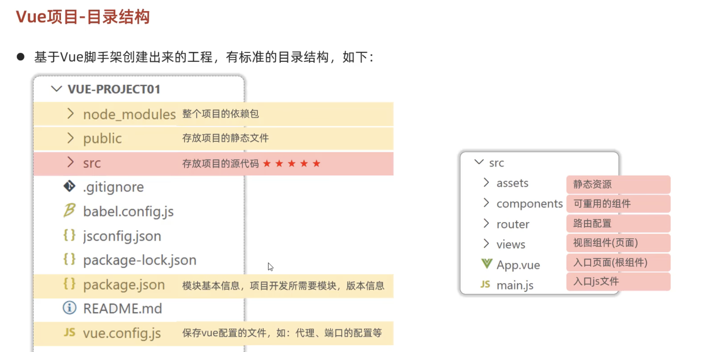


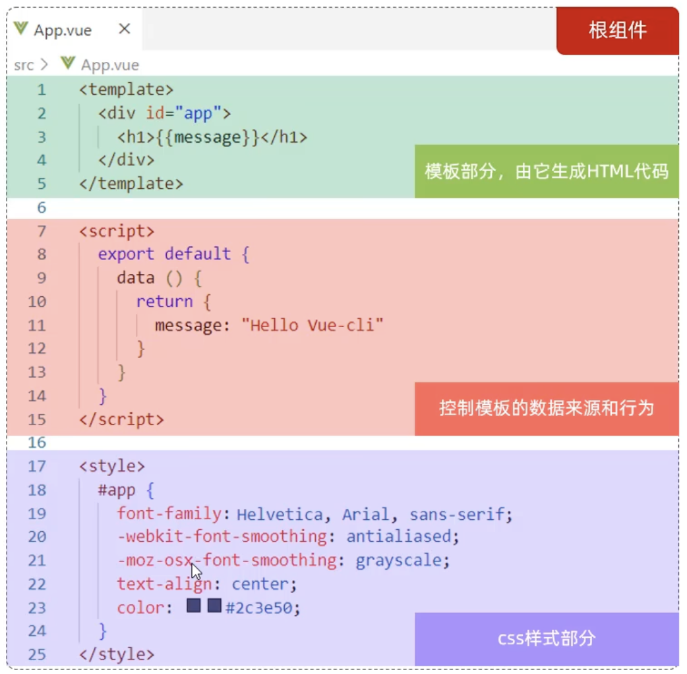

Vue的组件文件以.vue结尾，每个组件由三个部分组成：\<template>、\<script>、\<style>。


#### 使用ElementUI

1. 在当前vue-cli项目下安装
   ```sh
   npm install element-ui@2.15.3
   ```

2. 引入ElementUI组件库
   ```js
   import ElementUI from 'element-ui';
   import 'element-ui/lib/theme-chalk/index.css';
   
   Vue.use(ElementUI);
   ```

   

总之写完了就build得到dist文件夹, 接着放到nginx上

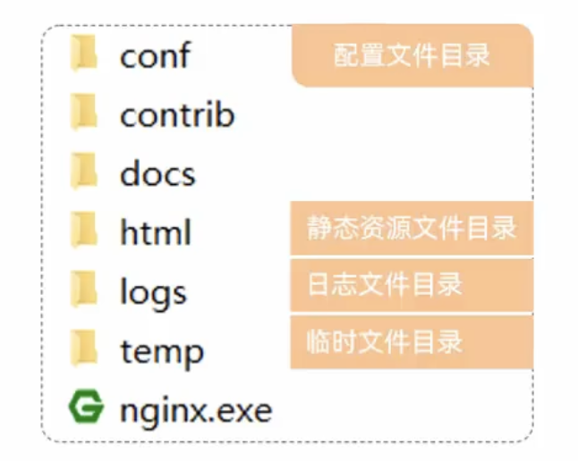

## day4-5: web扫盲

### http结构

#### 请求

```
[请求行]
[请求头]
[空行]
[请求体]

示例：

POST /form HTTP/1.1
Host: www.example.com
Content-Type: application/x-www-form-urlencoded
Content-Length: 27

field1=value1&field2=value2

```

**请求方式-GET**: 请求参数在请求行中，没有请求体，如：/brand/findAll?name=oPPo&status=1。GET请求大小是有限制的。

**请求方式-POST**: 请求参数在请求体中，POST请求大小是没有限制的。

| 字段            | 描述                                                         |
| --------------- | ------------------------------------------------------------ |
| Host            | 请求的主机                                                   |
| User-Agent      | 浏览器版本，例如Chrome浏览器的标识类似Mozilla/5.0 ...Chrome/79，IE浏览器的标识类似Mozilla/5.0(Windows NT...) like Gecko |
| Accept          | 表示浏览器能接收的资源类型，如text/*，image/*或者*/*表示所有; |
| Accept-Language | 表示浏览器偏好的语言，服务器可以据此返回不同语言的网页；     |
| Accept-Encoding | 表示浏览器可以支持的压缩类型，例如gzip，deflate等。          |
| Content-Type    | 请求主体的数据类型。                                         |
| Content-Length  | 请求主体的大小（单位：字节）。                               |

#### 响应

| 状态码 | 描述                                                         |
| ------ | ------------------------------------------------------------ |
| 1xx    | 响应中-临时状态码，表示请求已经接收，告诉客户端应该继续请求或者如果它已经完成则忽略它。 |
| 2xx    | 成功-表示请求已经被成功接收，处理已完成。                    |
| 3xx    | 重定向-重定向到其他地方；让客户端再发起一次请求以完成整个处理。 |
| 4xx    | 客户端错误-处理发生错误，责任在客户端。如：请求了不存在的资源、客户端未被授权、禁止访问等。 |
| 5xx    | 服务器错误-处理发生错误，责任在服务端。如：程序抛出异常等。  |

[状态码大全](https://www.runoob.com/http/http-status-codes.html)

```
[响应行]
[响应头]
[空行]
[响应体]

示例：

HTTP/1.1 200 OK
Content-Type: application/json
Content-Length: 53

{
  "status": "success",
  "message": "Data retrieved successfully",
  "data": {
    "field1": "value1",
    "field2": "value2"
  }
}

```

| 字段          | 描述                                                         |
| ------------- | ------------------------------------------------------------ |
| Cache-Control | 指示客户端应如何缓存，例如max-age=300表示可以最多缓存300秒。 |
| Set-Cookie    | 告诉浏览器为当前也main所在的域设置Cookie                     |


### SpringBoot

**好处:** 起步依赖; 自动配置

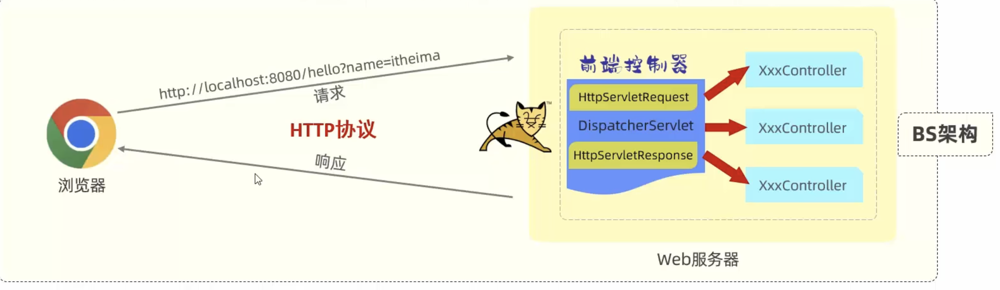

#### 请求参数接收

- 搭配postman

```java
package com.joriri;

import com.joriri.pojo.Employee;
import com.joriri.pojo.User;
import jakarta.servlet.http.HttpServletRequest;
import org.springframework.format.annotation.DateTimeFormat;
import org.springframework.web.bind.annotation.*;

import java.time.LocalDateTime;
import java.util.List;

/**
 * @Author zxy
 * @Date 2024/11/29
 * @Description
 */
@RestController
public class HelloController {
    /*
    入门
    功能接口
     */
    @RequestMapping("/hello")
    public String hello() {
        System.out.println("hello");
        return "hello";
    }

//    比较繁琐, 用HttpServletRequest来接受参数
    @RequestMapping("/simpledata")
    public String simpledata(HttpServletRequest request) {
        String name = request.getParameter("name");
        String age_str = request.getParameter("age");

        int age = Integer.parseInt(age_str);

        System.out.println(name+": "+age);

        return "ok";
    }

    /*
    简单参数
    直接定义跟参数名同名的形参来接受
    自动进行类型转换
     */
    @RequestMapping("/simpledata2")
    public String simpledata2(String name, Integer age) {
        System.out.println(name+": "+age);
        return "ok";
    }

    /*
    如果形参和网址的参数名不相同, 可以用RequestParam来解决
    @RequestParam 只要写上, 该形参的Required被置为true
     */
    @RequestMapping("/simpledata3")
    public String simpledata3(@RequestParam(name = "name") String user, Integer age) {
        System.out.println(user+": "+age);
        return "ok";
    }
    /*
    实体参数: 定义pojo对象, 其属性和参数同名.
     */
    @RequestMapping("/simplepojo")
    public String simplePojo(User user) {
        System.out.println(user);
        return "pojo ok";
    }

    /*
    复杂实体参数: pojo对象中的某个属性是另一个pojo对象
    依旧保持属性同名
    属性pojo的属性,要用.指定
    http://localhost:8080/complexpojo?id=22&user.name=jo&user.age=10
     */
    @RequestMapping("/complexpojo")
    public String complexPojo(Employee employee) {
        System.out.println(employee);
        return "complex pojo ok";
    }

    /*
    数组参数
     */
    @RequestMapping("/array")
    public String array(String[] hobby){
        for (String s : hobby) {
            System.out.println(s);
        }
        return "array ok";
    }

    /*
    使用集合来接受数组参数
    (因为默认是数组,所以要用@RequestParam)
     */
    @RequestMapping("/list")
    public String list(@RequestParam List<String> hobby) {
        for (String s : hobby) {
            System.out.println(s);
        }
        return "list ok";
    }

    /*
    日期参数
    @DateTimeFormat进行格式转换
     */
    @RequestMapping("/date")
    public String date(@DateTimeFormat(pattern = "yyyy-MM-dd HH:mm:ss")LocalDateTime date) {
        System.out.println(date);
        return "date ok";
    }

    /*
    json参数: 1. post方式 2. 用pojo映射 3. 形参前加上@RequestBody 4. postman在body里选择raw json
    {
    "id": "1",
    "user": {
        "name": "james",
        "age": 20
        }
    }
     */
    @RequestMapping("/json")
    public String json(@RequestBody Employee employee) {
        System.out.println(employee);
        return "json ok";
    }

    /*
    路径参数: localhost:8080/path/1 这里的参数1变成了路径的一部分
    使用@PathVariable
     */
    @RequestMapping("/path/{id}")
    public String pathParam(@PathVariable Integer id) {
        System.out.println(id);
        return "path ok";
    }

    /*
    多路径参数
     */
    @RequestMapping("/multipath/{id}/{name}")
    public String multiPath(@PathVariable Integer id, @PathVariable String name) {
        System.out.println(id+": "+name);
        return "multi path ok";
    }
}

```


#### 响应

```java
/*这个函数的返回值就是响应的内容*/
@RequestMapping("/hello")
    public String hello() {
        System.out.println("hello");
        return "hello";
    }

```

> @ResponseBody
>
> - 类型: `方法注解, 类注解`
> - 位置: Controller方法/类上
> - 作用: 将方法返回值直接响应, 如果返回值是 `实体对象/集合`, 会转换为`JSON`格式
> - @RestController=@Controller+@ResponseBody

```java
package com.joriri.controller;

import com.joriri.pojo.Employee;
import com.joriri.pojo.User;
import org.springframework.web.bind.annotation.RequestMapping;
import org.springframework.web.bind.annotation.RestController;

import java.util.ArrayList;
import java.util.List;

/**
 * @Author zxy
 * @Date 2024/11/29
 * @Description
 */
@RestController
public class ResponseController {
    @RequestMapping("/getstring")
    public String hello() {
        return "Hello World";
    }

    @RequestMapping("/getemp")
    public Employee emp() {
        Employee employee = new Employee();
        employee.setId(1);
        User user = new User();
        user.setAge(10);
        user.setName("hanson");
        employee.setUser(user);
        return employee;
    }

    @RequestMapping("/listuser")
    public List<User> list() {
        List<User> list = new ArrayList<>();
        User user = new User();
        user.setName("hh");
        user.setAge(20);
        User user1 = new User();
        user1.setName("hh1");
        user.setAge(22);
        list.add(user);
        list.add(user1);
        return list;
    }
}

```

**统一响应结果**

```java
public class Result {
  // 响应码 1成功 0失败
  private Integer code;
  // 提示信息
  private String msg;
  // 返回的数据
  private Object data;
}
```

```json
{
  "code": 1,
  "msg": "操作成功",
  "data": ...
}
```

```json
{
  "code": 0,
  "msg": "操作失败",
  "data": ...
}
```


#### 三层架构

mvc

#### IOC & DI

用处: **减少模块间的耦合**

控制反转：Inversion Of Control,简称IOC。对象的创建控制权由程序自身转移到外部（容器），这种思想称为控制反转

依赖注入：Dependency Injection,简称Dl。容器为应用程序提供运行时所依赖的资源，称之为依赖注入

Bean对象: IOC容器里创建管理的对象叫做Bean


SpringBoot的实现

- 将要送入容器管理的对象加上@Component注解
- 需要使用时, 在声明语句前加上@AutoWired注解
- 声明bean的时候，可以通过value属性指定bean的名字，如果没有指定，默认为`类名首字母小写`
- 使用以下四个注解都可以声明bean,但是在springboot集成web开发中，声明控制器bean只能用@Controller。
- 声明bean的四大注解，要想生效，还需要被组件扫描注解@ComponentScan扫描。
- @ComponentScan注解虽然没有显式配置，但是实际上已经包含在了启动类声明注解@SpringBootApplication中，默认扫描的范围是启动类所在包及其子包。 (`所以java代码都放在启动类的所在包或其子包路径下,减少配置项`)
- @Autowired注解，默认是按照类型进行，如果存在多个相同类型的bean,则会报错.通过一下三种方法解决
  - @Primary 在想要生效的Bean上加
  - @Qualifier(value="Bean的名称")   在@Autowired下面加上, 
  - @Resource(name="Bean的名称") 在声明前加上, 不用搭配@Autowired. 
- **@Autowired与@Resource的区别?**
  - @Autowired是spring框架提供的注解，而@Resource是JDK提供的注解
  - @Autowired默认是按照类型注入，而@Resource默认是按照名称注入


| 注解        | 说明                 | 位置                                                     |
| ----------- | -------------------- | -------------------------------------------------------- |
| @Component  | 声明bean的基础注解   | 不属于以下三类时，用此注解                               |
| @Controller | @Component的衍生注解 | 标注在控制器类上                                         |
| @Service    | @Component的衍生注解 | 标注在业务类上 (业务会有接口和实现类, 放在实现类上)      |
| @Repository | @Component的衍生注解 | 标注在数据访问类上  [由于与mybatis(@Mapper)整合，用的少] |


## day6-7: mysql

略

## day8-9: MyBatis

[文档](https://mybatis.net.cn/)

### 入门

这里的Mapper就相当于DAO

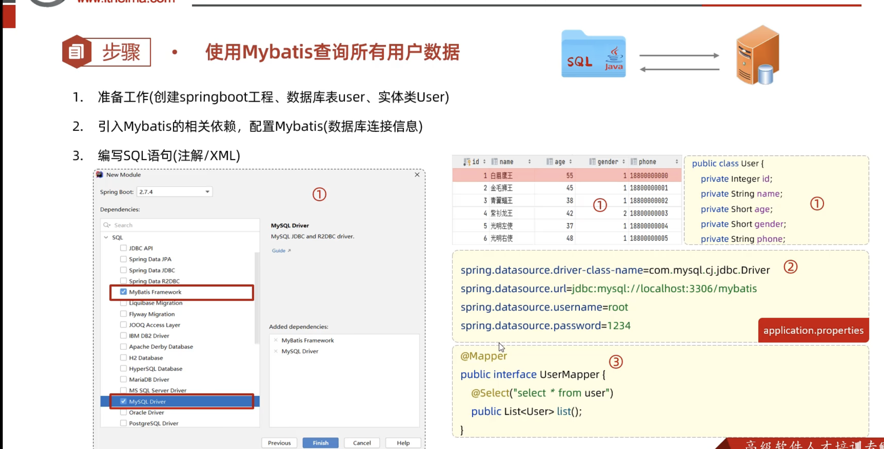


### lombok

| 注解                | 作用                                                         |
| ------------------- | ------------------------------------------------------------ |
| @Getter/@Setter     | 为所有的属性提供get/set方法                                  |
| @ToString           | 会给类自动生成易阅读的 toString 方法                         |
| @EqualsAndHashCode  | 根据类所拥有的非静态字段自动重写equals方法和hashCode方法     |
| @Data               | 提供了更综合的生成代码功能（@Getter+@Setter+@ToString+@EqualsAndHashCode） |
| @NoArgsConstructor  | 为实体类生成无参的构造器方法                                 |
| @AllArgsConstructor | 为实体类生成除了static修饰的字段之外带有各参数的构造器方法。 |


### 使用注解编辑sql

```java
package com.joriri.mapper;

import com.joriri.pojo.Emp;
import org.apache.ibatis.annotations.*;

import java.time.LocalDate;
import java.util.List;

/**
 * @Author zxy
 * @Date 2024/12/1
 * @Description 注意insert方法, 直接传入一个实体类, 在占位符中直接写实体类的属性
 */
@Mapper
public interface EmpMapper {
    @Delete("delete from emp where id = #{id}")
    public int deleteEmpById(Integer id);

    @Options(keyProperty = "id", useGeneratedKeys = true)   // 会自动将生成的主键值返回给emp的id字段
    @Insert("insert into emp(username,name,gender,image,job,entrydate,dept_id,create_time,update_time) values " +
            "(#{username},#{name},#{gender},#{image},#{job},#{entrydate},#{deptId},#{createTime},#{updateTime})")
    public int insertEmp(Emp emp);

    @Update("update emp set username=#{username},name=#{name},gender=#{gender},image=#{image},job=#{job}," +
            "entrydate=#{entrydate},dept_id=#{deptId},update_time=#{updateTime} where id=#{id}")
    public int updateEmpById(Emp emp);


    @Select("select * from emp where id=#{id}")
    public Emp getEmpById(Integer id);

    /* 发现 dept_id, create_time, update_time 这三个对应不上
    法1: 查询的时候起别名
    法2: 使用@Results和@Result
    法3: application.properties里开启mybatis的驼峰命名自动映射  a_column --> aColumn
     */
//    @Results({
//            @Result(column = "dept_id", property = "deptId"),
//            @Result(column = "create_time", property = "createTime"),
//            @Result(column = "update_time", property = "updateTime")
//    })
//    @Select("select * from emp where id=#{id}")
//    public Emp getEmpById(Integer id);

//    @Select("select * from emp where name like '%${name}%' and gender=#{gender} " +
//            "and entrydate between #{begin} and #{end} order by update_time desc")
//    public List<Emp> getEmpList(String name, Short gender, LocalDate begin, LocalDate end);


    // 避免使用${}, 所以用mysql的concat函数
    @Select("select * from emp where name like concat('%',#{name}, '%') and gender=#{gender} " +
            "and entrydate between #{begin} and #{end} order by update_time desc")
    public List<Emp> getEmpList(String name, Short gender, LocalDate begin, LocalDate end);


}

```


**占位符**

> #{}
>
> - 执行SQL时，会将#{...}替换为?, 生成预编译SQL,会自动设置参数值
> - 使用时机：参数传递，都使用#{…}
> - 不可以放在单引号里包裹成为新的字符串, 比如@Select("select * from emp where name like '%#{name}%' and ...") 这样是不行的.
>
> ${}
>
> - 拼接SQL。直接将参数拼接在SQL语句中，存在SQL注入问题
> - 使用时机：如果对表名、列表进行动态设置时使用。
> - @Select("select * from emp where name like '%${name}%' and ...")这样是可以的


### 使用XML配置文件编辑sql


>**规范**
>
>- XML配置文件是放在resources下的
>
>- XML映射文件的名称与Mapper接口名称一致，并且将XML映射文件和Mapper接口放置在相同包下  ==(同包同名)==。
>- XML映射文件的namespace属性为Mapper接口全限定名一致。
>- XML映射文件中sq语句的id与Mapper接口中的方法名一致，并保持返回类型一致。


### 动态sql

随着用户的输入或外部条件的变化而变化的SQL语句，我们称为动态SQL。

> \<if>
>
> \<where>
>
> \<update>
>
> \<set>
>
> \<foreach>
>
> \<sql>
>
> \<include>

```xml
<?xml version="1.0" encoding="UTF-8" ?>
<!DOCTYPE mapper
        PUBLIC "-//mybatis.org//DTD Mapper 3.0//EN"
        "http://mybatis.org/dtd/mybatis-3-mapper.dtd">
<mapper namespace="com.joriri.mapper.EmpMapper">

    <sql id="commonSelect">
        select id,
               username,
               password,
               name,
               gender,
               image,
               job,
               entrydate,
               dept_id,
               create_time,
               update_time
        from emp
    </sql>
    <!--    ResultType指单条记录所封装的类型-->
    <select id="getEmpList" resultType="com.joriri.pojo.Emp">
        <include refid="commonSelect"/>
        <where>
            <if test="name !=null">
                name like concat('%', #{name}, '%')
            </if>
            <if test="gender !=null">
                and gender = #{gender}
            </if>
            <if test="begin !=null and end !=null">
                and entrydate between #{begin} and #{end}
            </if>
        </where>
        order by update_time desc
    </select>

    <select id="getEmpById" resultType="com.joriri.pojo.Emp">
        <include refid="commonSelect"/>
        where id=#{id}
    </select>

    <update id="updateEmpById">
        update emp
        <set>
            <if test="username != null">
                username = #{username},
            </if>
            <if test="name != null">
                name = #{name},
            </if>
            <if test="gender != null">
                gender = #{gender},
            </if>
            <if test="image != null">
                image = #{image},
            </if>
            <if test="job != null">
                job = #{job},
            </if>
            <if test="entrydate != null">
                entrydata = #{entrydate},
            </if>
            <if test="deptId != null">
                dept_id = #{deptId},
            </if>
            <if test="updateTime">
                update_time = #{updateTime}
            </if>
        </set>
        where id = #{id}
    </update>

<!--    foreach
            collection: 遍历的集合
            item: 遍历出来的元素
            separator: 分隔符
            open: 在for 循环之前 sql需要添加的元素
            close: 在for 循环之后 sql需要添加的元素-->
    <delete id="deleteEmpByIds">
        delete from emp where id in
            <foreach collection="ids" item="id" separator="," open="(" close=")">#{id}</foreach>

    </delete>

</mapper>
```


## 案例1:  网页上表的增删改差

### REST(REpresentational State Transfer)风格

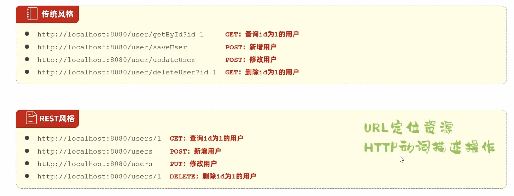

- REST是风格，是约定方式，约定不是规定，可以打破。
- 描述模块的功能通常使用复数，也就是加s的格式来描述，表示此类资源，而非单个资源。如：users、emps、books..…


### 上传文件

1. **前端页面三要素**
   1. 表单项type="file”
   2. 表单提交方式 post
   3. 表单的enctype属性multipart/form-data

2. **服务端接收文件**
   1. MultipartFile

**假如没有写存储的指令, 上传的文件会变为临时文件, 在命令响应完成后被清除**


```properties
#配置单个文件最大上传大小
spring.servlet.multipart.max-file-size=10MB
#配置单个请求最大上传大小（一次请求可以上传多个文件）
spring.servlet.multipart.max-request-size=100MB
```

```java
// MultipartFile  
String getOriginalFilename();/获取原始文件名
void transferTo(File dest);//将接收的文件转存到磁盘文件中
long getsize();/获取文件的大小，单位：字节
byte[] getBytes();/获取文件内容的字节数组
InputStream getinputStream();/获取收到的文件内容的输入流
```


### OSS

object storege service

sdk = software development kit 软件开发工具包，包括辅助软件开发的依赖(jar包)、代码示例等，都可以叫做SDK

Bucket 存储空间是用户用于存储对象(Object,就是文件)的容器，所有的对象都必须隶属于某个存储空间。

[阿里云oss](https://oss.console.aliyun.com/overview)


### 配置文件

在阿里云oss, 将密钥、bucket名写到java utils文件里是低效的, 配置在properties里要更好

```properties
aliyun.oss.endpoint=https://oss-cn-beijing.aliyuncs.com
aliyun.oss.bucketName=tilias-web-management
# aliyun.oss.OSS_ACCESS_KEY_ID
# aliyun.oss.OSS_ACCESS_KEY_SECRET
# 注意我已将ID和SECRET配置在本地路径下
```

在java文件中要使用这些字段, 通过@Value("${key}") 注入即可

```java
@Value("${aliyun.oss.endpoint}")
private String endpoint;

@Value("${aliyun.oss.bucketName}")
private String bucketName;
```


将properties --> yaml

```yaml
spring:
  application: tilias-web-management
  datasource:
    driver-class-name: com.mysql.cj.jdbc.Driver
    url: jdbc:mysql://localhost:3306/mybatis
    username: root
    password: Tamiyoisthe1!
  servlet:
    multipart:
      max-file-size: 10MB
      max-request-size: 100MB
mybatis:
  configuration:
    log-impl: org.apache.ibatis.logging.stdout.StdOutImpl
    map-underscore-to-camel-case: true
aliyun:
  oss:
    endpoint: https://oss-cn-beijing.aliyuncs.com
    bucketName: tilias-web-management
    region: cn-beijing
# 驼峰和中划线分隔是一样的.
```


@ConfigurationProperties

```java
package com.joriri.utils;

import lombok.Data;
import org.springframework.boot.context.properties.ConfigurationProperties;
import org.springframework.stereotype.Component;

@Data
@Component
@ConfigurationProperties(prefix = "aliyun.oss")
public class AliOSSProperties {
    private String endpoint;
    private String bucketName;
    private String region;
}

```


## 案例: 登录认证

### 登录校验

- 登录标记	
  - 会话跟踪
    - 客户端: Cookie
    - 服务端: Session
    - 令牌
- 统一拦截
  - Filter
  - Interceptor


#### cookie & session

**cookie**

优点:  http协议支持的技术 (resp: set-cookie,  req: cookie)

缺点: 1. 移动端APP无法使用Cookie.  2.不安全，用户可以自己禁用Cookie.  3.Cookie不能跨域 (三维度: 协议, ip, 端口)


**session**

优点: 存储在服务端, 安全

缺点: 1.服务器集群环境下无法直接使用Session.  2.Cookie的缺点

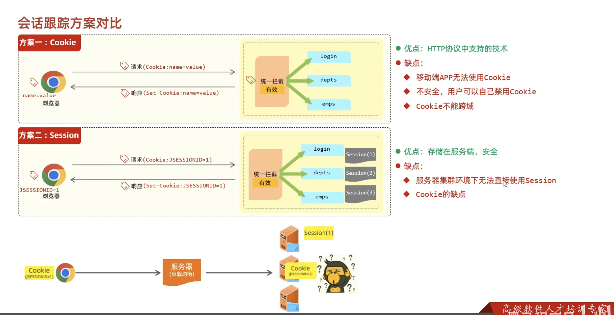


```java
package com.itheima.controller;

import com.itheima.pojo.Result;
import lombok.extern.slf4j.Slf4j;
import org.springframework.web.bind.annotation.GetMapping;
import org.springframework.web.bind.annotation.RestController;

import javax.servlet.http.Cookie;
import javax.servlet.http.HttpServletRequest;
import javax.servlet.http.HttpServletResponse;
import javax.servlet.http.HttpSession;

/**
 * Cookie、HttpSession演示
 */
@Slf4j
@RestController
public class SessionController {

    //设置Cookie
    @GetMapping("/c1")
    public Result cookie1(HttpServletResponse response){
        response.addCookie(new Cookie("login_username","itheima")); //设置Cookie/响应Cookie
        return Result.success();
    }

    //获取Cookie
    @GetMapping("/c2")
    public Result cookie2(HttpServletRequest request){
        Cookie[] cookies = request.getCookies();
        for (Cookie cookie : cookies) {
            if(cookie.getName().equals("login_username")){
                System.out.println("login_username: "+cookie.getValue()); //输出name为login_username的cookie
            }
        }
        return Result.success();
    }


    @GetMapping("/s1")
    public Result session1(HttpSession session){
        log.info("HttpSession-s1: {}", session.hashCode());

        session.setAttribute("loginUser", "tom"); //往session中存储数据
        return Result.success();
    }

    @GetMapping("/s2")
    public Result session2(HttpServletRequest request){
        HttpSession session = request.getSession();
        log.info("HttpSession-s2: {}", session.hashCode());

        Object loginUser = session.getAttribute("loginUser"); //从session中获取数据
        log.info("loginUser: {}", loginUser);
        return Result.success(loginUser);
    }
}

```


#### 令牌

用户登录后, 服务端生成令牌, 通过响应发送给客户端, 客户端收到后存储起来, 后续每次访问服务端都带上令牌, 服务端校验令牌的真伪

优点: 1.支持PC端、移动端 2.解决集群环境下的认证问题 3.减轻服务器端存储压力

缺点: 需要自己实现

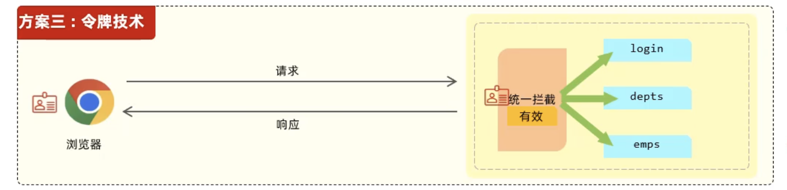

- **JWT**: [JSON Web Token](https://jwt.io/) 
- 定义了一种简洁的、自包含的格式，用于在通信双方以json数据格式安全的传输信息。由于数字签名的存在，这些信息是可靠的。
- 组成
  - 第一部分：Header(头)，记录令牌类型、签名算法等。例如：{"alg":"HS256","type":"JWT"}
  - 第二部分：Payload(有效载荷)，携带一些自定义信息、默认信息等。例如：{"id":"1","username":"Tom"}
  - 第三部分：Signature(签名)，防止Token被篡改、确保安全性。将header、payload,并加入指定秘钥，通过指定签名算法计算而来。
- 第一部分和第二部分: 都是Base64 (A-Z a-z 0-9 + / 来表示二进制数据的编码方式 )


依赖

```xml
<dependency>
<groupld>io.jsonwebtoken</groupld>
<artifactld>jjwt</artifactld>
<version>0.9.1</version>
</dependency>
```


#### Filter

在SpringBoot项目中使用配置两处:

1. Filter类上加@WebFilter注解，配置拦截资源的路径。
2. 引导类上加@ServletComponentScan开启Servlet组件支持。

过滤器的流程: 

1. 请求前
2. 请求处理
3. 响应后

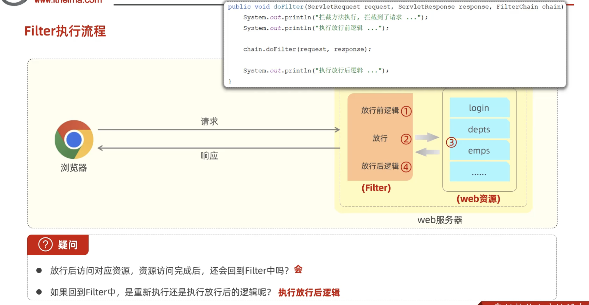

| 拦截路径     | urlPatterns值 | 含义                              |
| ------------ | ------------- | --------------------------------- |
| 拦截具体路径 | /login        | 只有访问/login路径时，才会被拦截  |
| 目录拦截     | /emps/*       | 访问/emps下的所有资源，都会被拦截 |
| 拦截所有     | /*            | 访问所有资源，都会被拦截          |

**过滤器链**: 按照类名字母顺序决定执行顺序


#### Interceptor

概念：是一种动态拦截方法调用的机制，类似于过滤器。Spig框架中提供的，用来动态拦截控制器方法的执行。

作用：拦截请求，在指定的方法调用前后，根据业务需要执行预先设定的代码。

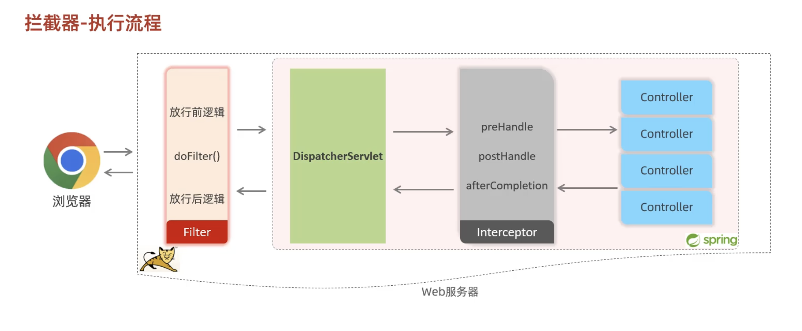

- 实现

1. 定义拦截器，实现Handlerlnterceptor接口，并重写其所有方法。
   ```java
   package com.itheima.interceptor;
   
   import com.alibaba.fastjson.JSONObject;
   import com.itheima.pojo.Result;
   import com.itheima.utils.JwtUtils;
   import lombok.extern.slf4j.Slf4j;
   import org.springframework.stereotype.Component;
   import org.springframework.util.StringUtils;
   import org.springframework.web.servlet.HandlerInterceptor;
   import org.springframework.web.servlet.ModelAndView;
   
   import javax.servlet.http.HttpServletRequest;
   import javax.servlet.http.HttpServletResponse;
   
   @Slf4j
   @Component
   public class LoginCheckInterceptor implements HandlerInterceptor {
       @Override //目标资源方法运行前运行, 返回true: 放行, 放回false, 不放行
       public boolean preHandle(HttpServletRequest req, HttpServletResponse resp, Object handler) throws Exception {
           //1.获取请求url。
           String url = req.getRequestURL().toString();
           log.info("请求的url: {}",url);
   
           //2.判断请求url中是否包含login，如果包含，说明是登录操作，放行。
           if(url.contains("login")){
               log.info("登录操作, 放行...");
               return true;
           }
   
           //3.获取请求头中的令牌（token）。
           String jwt = req.getHeader("token");
   
           //4.判断令牌是否存在，如果不存在，返回错误结果（未登录）。
           if(!StringUtils.hasLength(jwt)){
               log.info("请求头token为空,返回未登录的信息");
               Result error = Result.error("NOT_LOGIN");
               //手动转换 对象--json --------> 阿里巴巴fastJSON
               String notLogin = JSONObject.toJSONString(error);
               resp.getWriter().write(notLogin);
               return false;
           }
   
           //5.解析token，如果解析失败，返回错误结果（未登录）。
           try {
               JwtUtils.parseJWT(jwt);
           } catch (Exception e) {//jwt解析失败
               e.printStackTrace();
               log.info("解析令牌失败, 返回未登录错误信息");
               Result error = Result.error("NOT_LOGIN");
               //手动转换 对象--json --------> 阿里巴巴fastJSON
               String notLogin = JSONObject.toJSONString(error);
               resp.getWriter().write(notLogin);
               return false;
           }
   
           //6.放行。
           log.info("令牌合法, 放行");
           return true;
       }
   
       @Override //目标资源方法运行后运行
       public void postHandle(HttpServletRequest request, HttpServletResponse response, Object handler, ModelAndView modelAndView) throws Exception {
           System.out.println("postHandle ...");
       }
   
       @Override //视图渲染完毕后运行, 最后运行
       public void afterCompletion(HttpServletRequest request, HttpServletResponse response, Object handler, Exception ex) throws Exception {
           System.out.println("afterCompletion...");
       }
   }
   
   ```

   

2. 注册拦截器
   ```java
   package com.itheima.config;
   
   import com.itheima.interceptor.LoginCheckInterceptor;
   import org.springframework.beans.factory.annotation.Autowired;
   import org.springframework.context.annotation.Configuration;
   import org.springframework.web.servlet.config.annotation.InterceptorRegistry;
   import org.springframework.web.servlet.config.annotation.WebMvcConfigurer;
   
   @Configuration //配置类
   public class WebConfig implements WebMvcConfigurer {
   
       @Autowired
       private LoginCheckInterceptor loginCheckInterceptor;
   
       @Override
       public void addInterceptors(InterceptorRegistry registry) {
           registry.addInterceptor(loginCheckInterceptor).addPathPatterns("/**").excludePathPatterns("/login");
       }
   }
   
   ```

| 拦截路径   | 含义                 | 举例                                                |
| ---------- | -------------------- | --------------------------------------------------- |
| /*         | 一级路径             | 能匹配/depts，/emps，/login，不能匹配/depts/1       |
| /**        | 任意级路径           | 能匹配/depts，/depts/1，/depts/1/2                  |
| /depts/*   | /depts下的一级路径   | 能匹配/depts/1，不能匹配/depts/1/2，==/depts==      |
| /depts /** | /depts下的任意级路径 | 能匹配/depts，/depts/1，/depts/1/2，不能匹配/emps/1 |

**Filter和Interceptor**

- 接口规范不同：过滤器需要实现Filter接口，而拦截器需要实现HandlerInterceptor接口。
- 拦截范围不同：过滤器Filter会拦截所有的资源，而Interceptor只会拦截Spring环境中的资源。


#### 异常处理

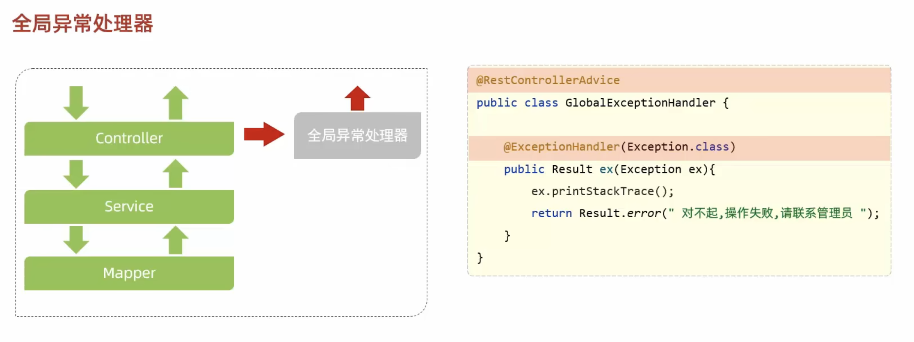

@RestControllerAdvice = @ControllerAdvice + @ResponseBody


### 事务管理

注解：@Transactional

位置：业务(service)层的方法上、类上、接口上

作用：将当前方法交给spring进行事务管理，方法执行前，开启事务；成功执行完毕，提交事务；出现异常，回滚事务

```yaml
# applicaiton.yaml
#开启事务管理日志  
logging:
	level:
		org.springframework.jdbc.support.JdbcTransactionManager: debug
```


默认情况下，只有出现RuntimeException才回滚异常。rollbackFor属性用于控制出现何种异常类型，回滚事务。

```java
@Transactional(rollbackFor = Exception.class)
public void delete(){ 
  ...
}
```


事务传播行为(propagation): 指当一个事务方法被另一个事务方法调用时，这个事务方法应该如何进行事务控制。


| 属性值           | 含义                                                         |
| ---------------- | ------------------------------------------------------------ |
| ==REQUIRED==     | 【默认值】需要事务，有则加入，无则创建新事务                 |
| ==REQUIRES_NEW== | 需要新事务，无论有无，总是创建新事务                         |
| SUPPORTS         | 支持事务，有则加入，无则在无事务状态中运行                   |
| NOTSUPPORTED     | 不支持事务，在无事务状态下运行，如果当前存在已有事务，则挂起当前事务 |
| MANDATORY        | 必须有事务，否则抛异常                                       |
| NEVER            | 必须没事务，否则抛异常                                       |
| ...              |                                                              |

**应用场景**

- REQUIRED:大部分情况下都是用该传播行为即可。
- REQUIRES_NEW:当我们不希望事务之间相互影响时，可以使用该传播行为。比如：下订单前需要记录日志，不论订单保存成功与
  否，都需要保证日志记录能够记录成功。


## AOP

AOP: Aspect Oriented Programming(面向切面编程、面向方面编程)，其实就是面向特定方法编程。

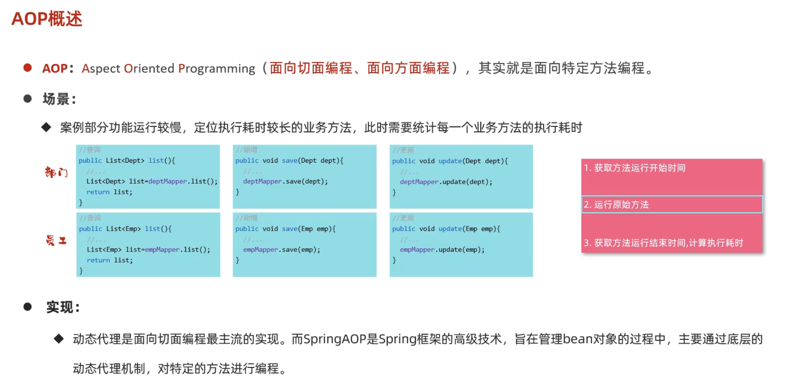

1. 引入依赖
   ```xml
   <dependency>
     <groupId>org.springframework.boot</groupId>
     <artifactId>spring-boot-starter-aop</artifactId>
   </dependency>
   ```

2. 编写AOP程序: 针对特定方法根据业务需要进行编程

   ```java
   package com.itheima.aop;
   
   import lombok.extern.slf4j.Slf4j;
   import org.aspectj.lang.ProceedingJoinPoint;
   import org.aspectj.lang.annotation.Around;
   import org.aspectj.lang.annotation.Aspect;
   import org.springframework.stereotype.Component;
   
   @Slf4j
   @Component // 要交给IOC容器管理
   @Aspect //AOP类
   public class TimeAspect {
   		/*
   		service.*.* 第一个*表示所有的接口/类, 第二个星表示所有的方法
   		*/
       //@Around("execution(* com.itheima.service.*.*(..))") //切入点表达式
       @Around("com.itheima.aop.MyAspect1.pt()")
       public Object recordTime(ProceedingJoinPoint joinPoint) throws Throwable {
           //1. 记录开始时间
           long begin = System.currentTimeMillis();
   
           //2. 调用原始方法运行
           Object result = joinPoint.proceed();
   
           //3. 记录结束时间, 计算方法执行耗时
           long end = System.currentTimeMillis();
           log.info(joinPoint.getSignature()+"方法执行耗时: {}ms", end-begin);
   
           return result;
       }
   
   }
   
   ```


### 核心概念

- 连接点：JoinPoint,可以被AOP控制的方法（暗含方法执行时的相关信息)
- 通知：Advice,指哪些重复的逻辑，也就是共性功能（最终体现为一个方法）
- 切入点：PointCut,匹配连接点的条件，通知仅会在切入点方法执行时被应用
- 切面：Aspect,描述通知与切入点的对应关系（通知+切入点）
- 目标对象：Target,通知所应用的对象


### 通知类型和顺序

- @Around:环绕通知，此注解标注的通知方法在目标方法前、后都被执行 
  - @Around环绕通知需要自己调用ProceedingJoinPoint.proceed()来让原始方法执行，其他通知不需要考虑目标方法执行
  - @Around环绕通知方法的返回值，必须指定为Object,来接收原始方法的返回值。
- @Before:前置通知，此注解标注的通知方法在目标方法前被执行
- @After：后置通知，此注解标注的通知方法在目标方法后被执行，无论是否有异常都会执行
- @AfterReturning：返回后通知，此注解标注的通知方法在目标方法后被执行，有异常不会执行
- @AfterThrowing：异常后通知，此注解标注的通知方法发生异常后执行
- @PointCut切入点表达式的注解


- 不同切面类中，默认按照切面类的类名字母排序：
  - 目标方法前的通知方法：字母排名靠前的先执行
  - 目标方法后的通知方法：字母排名靠前的后执行
- 用@Order(数字)加在切面类上来控制顺序
  - 目标方法前的通知方法：数字小的先执行
  - 目标方法后的通知方法：数字小的后执行

```java
package com.itheima.aop;

import lombok.extern.slf4j.Slf4j;
import org.aspectj.lang.ProceedingJoinPoint;
import org.aspectj.lang.annotation.*;
import org.springframework.stereotype.Component;

@Slf4j
@Component
//@Aspect
public class MyAspect1 {

    @Pointcut("execution(* com.itheima.service.impl.DeptServiceImpl.*(..))")
    public void pt(){}  // 可以在外部的切面类中调用, 需要设置成public

    @Before("pt()")
    public void before(){
        log.info("before ...");
    }

    @Around("pt()")
    public Object around(ProceedingJoinPoint proceedingJoinPoint) throws Throwable {
        log.info("around before ...");

        //调用目标对象的原始方法执行
        Object result = proceedingJoinPoint.proceed();

        log.info("around after ...");
        return result;
    }

    @After("pt()")
    public void after(){
        log.info("after ...");
    }

    @AfterReturning("pt()")
    public void afterReturning(){
        log.info("afterReturning ...");
    }

    @AfterThrowing("pt()")
    public void afterThrowing(){
        log.info("afterThrowing ...");
    }
}

```


### 切入点表达式

#### execute

> **execution(访问修饰符?  返回值  包名.类名.?方法名(方法参数) throws异常？)**
>
> ? 表示可省略
>
> ​	访问修饰符：可省略（比如：public、protected)
>
> ​	包名.类名：可省略
>
> ​	throws异常：可省略（注意是方法上声明抛出的异常，不是实际抛出的异常）

**通配符**

\* 单个独立的任意符号，可以通配任意返回值、包名、类名、方法名、任意类型的一个参数，也可以通配包、类、方法名的一部分(此时可以为空)

```
execution(* com.*service.*.update*(*)  // 返回值任意  以service结尾(包含service这个单词)的包名 任意包名 以update开头(包含update这个单词)的方法名 一个任意类型的形参
```

.. 多个连续的任意符号，可以通配任意层级的包，或任意类型任意个数(包括0个)的参数

```
execution(* com.itheima..DeptService.*(..))
```

**与或非**

可以使用  && || !  组合表达

```
execution() || execution() && execution
```

**书写建议**

- 所有业务方法名在命名时尽量规范，方便切入点表达式快速匹配。如：查询类方法都是find开头，更新类方法都是update开头。
- 描述切入点方法通常`基于接口描述`，而不是直接描述实现类，增强拓展性。
- 在满足业务需要的前提下，`尽量缩小切入点的匹配范围`。如：包名匹配尽量不使用 .. ，使用*匹配单个包。


#### @annotation

@annotation切入点表达式，用于匹配标识有特定注解的方法。

```
@annotation(com.itheima.anno.MyLog)
```

1. 创建自己的注解@MyLog, 加上@Retention 和 @Target
2. 给切入点方法加上自己的注解
3. 在切面类里使用@annotation


### 连接点

在Spring中用]oinPoint抽象了连接点，用它可以获得方法执行时的相关信息，如目标类名、方法名、方法参数等。

- 对于@Around通知，获取连接点信息只能使用Proceeding]oinPoint

- 对于其他四种通知，获取连接点信息只能使用JoinPoint,它是ProceedingJoinPoint的父类型


### 案例

**给项目的增删改 作记录: 操作人、操作时间、执行方法的全类名、执行方法名、方法运行时参数、返回值、方法执行时长**

- 准备：
  - 在案例工程中引入AOP的起步依赖
  - 导入资料中准备好的数据库表结构，并引入对应的实体类
- 编码：
  - 自定义注解@Log
  - 定义切面类，完成记录操作日志的逻辑


## springboot配置

### 配置文件优先级

properties > yml > yaml


### java系统属性 和 命令行参数

java系统属性:  -Dserver.port=9000

命令行参数: --server.port=9001

优先级: 命令行 > java

可以通过idea的vm options 和 program arguments来配置


假如已经被maven打成jar包

```bash
java -Dserver.port=9000 -jar tlias-web-management-0.0.1-SNAPSHOT.jar --server.port=10010
```


**总结: ** 命令行 > java系统属性 > 配置文件


### bean

#### bean的获取

默认情况下，Spring项目启动时，会把bean都创建好放在IOC容器中，如果想要主动获取这些bean,可以通过如下方式：

- 根据name获取: Object getBean(String name)
- 根据类型获取: \<T> T getBean(Class\<T> requiredType)
- 根据name 和类型获取:   \<T> T getBean(String name, Class\<T> requiredType)

首先要通过DI获取IOC容器对象 

```java
@AutoWired
private ApplicationContext applicationContext;

applicaitonContext.getBean(); // ...
```

> 上述所说的 [Spring项目启动时，会把其中的bean都创建好] 还会受到作用域及延迟初始化影响，这里主要针对于默认的单例
> 非延迟加载的bean而言。


#### bean的作用域

| 作用域      | 说明                                              |
| ----------- | ------------------------------------------------- |
| singleton   | 容器内同 名称 的 bean 只有一个实例（单例）（默认) |
| prototype   | 每次使用该bean时会创建新的实例（非单例）          |
| request     | 每个请求范围内会创建新的实例（web环境中，了解)    |
| session     | 每个会话范围内会创建新的实例（web环境中，了解）   |
| application | 每个应用范围内会创建新的实例（web环境中，了解)    |

通过@Scope在@Component的类上指定作用域, 且可以通过@Lazy来延迟初始化. [因为SpringBoot项目一开始,IOC容器也被初始化, 就会自动创建单例Bean]

实际开发中,绝大多数的Bean都是单例的.


#### 第三方Bean

如果要管理的bean对象来自于第三方（不是自定义的），是无法用@Component及衍生注解声明bean的，就需要用到@Bean注解

@Bean的名字可以指定, 默认是方法名.

```java
// 在配置类里构建返回第三方对象的方法, 加上@Bean注解
package com.joriri.config;

import org.dom4j.io.SAXReader;
import org.springframework.context.annotation.Bean;
import org.springframework.context.annotation.Configuration;

/**
 * @Author zxy
 * @Date 2024/12/5
 * @Description
 */
@Configuration
public class CommonConfig {
    @Bean // 将方法返回值交给IOC容器管理,成为IOC容器的Bean对象
    public SAXReader getSaxReader(DeptService deptService) {
      // 如果要使用其他Bean对象,可以设置形参, 容器会自动装配.
        return new SAXReader();
    }
}

```

## springboot原理

起步依赖: 就是maven的依赖传递

### 自动配置

引入依赖后, 如何将依赖中的Bean和配置类引入到项目的IOC容器里的?


1. @ComponentScan
2. @Import
   1. 普通类(标@Component的)、 配置类(标@Configuration和@Bean的)、ImportSelector接口实现类(方法selectImports()返回的是全类名的数组)
   2. 由第三方包自己决定, @EnableXxx注解, 封装@Import, Import里一般放ImportSelector接口的实现类.
      比如: 第三方包里有MyImportSelector这个接口实现类, 有一个EnableMyImportSelector的注解, 里面放上@Import(MyImportSelector.class).   最后只要在项目的启动类上加上@EnableMyImportSelector这个注解就行了

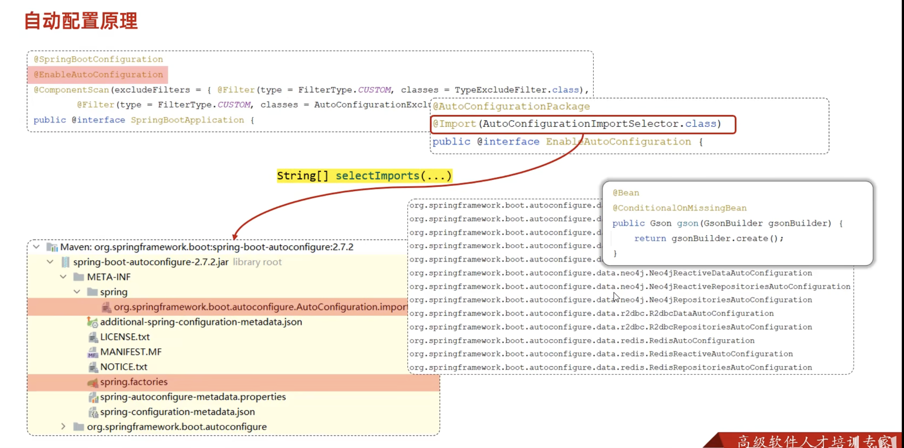

#### @Conditionnal

作用：按照一定的条件进行判断，在满足给定条件后才会注册对应的bean对象到Spring IOC容器中。

位置：方法、类

@Conditional本身是一个父注解，派生出大量的子注解：
@ConditionalOnClass:判断环境中是否有对应字节码文件，才注册bean到IOC容器。
@ConditionalOnMissingBean:判断环境中没有对应的bean(类型或名称)，才注册bean到IOC容器。
@ConditionalOnProperty:判断配置文件中有对应属性和值，才注册bean到IOC容器。

#### 自定义starter

在实际开发中，经常会定义一些公共组件，提供给各个项目团队使用。而在SpringBoot的项目中，一般会将这些公共组件封装为
SpringBoot的starter。

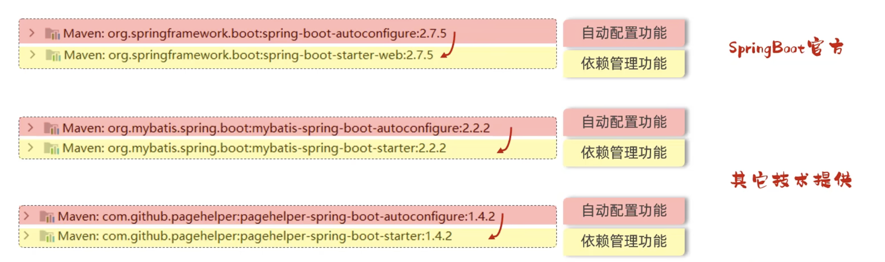

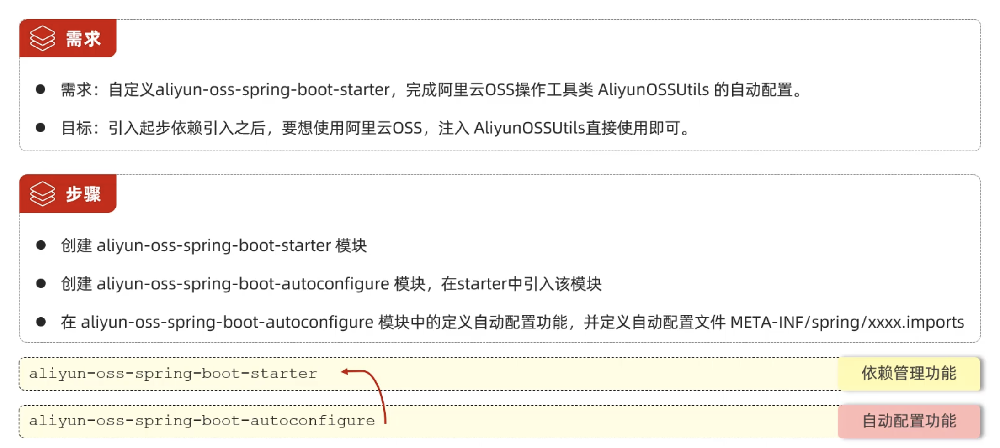

## maven

### 声明周期

- clean
  - pre-clean
  - `clean` 移除上次构建生成的文件
  - post-clean
- default
  - validate
  - initialize
  - generate-sources
  - process-sources
  - generate-resources
  - process-resources
  - `compile `编译项目源代码
  - process-classes
  - generate-test-sources
  - process-test-sources
  - generate-test-resources
  - process-test-resources
  - test-compile
  - process-test-classes
  - `test`使用合适的单元测试框架进行测试(junit)
  - prepare-package
  - `package` 将变以后的文件打包, e.g. jar, war
  - verify
  - `install`安装项目到本地maven仓库
  - deploy
- site
  - pre-site
  - site
  - post-site
  - site-deploy


### 继承和聚合

一般来说, 构建项目都是需要分模块开发的.

**继承**

概念：继承描述的是两个工程间的关系，与jva中的继承相似，子工程可以继承父工程中的配置信息，常见于依赖关系的继承。(跟java一样,单继承)

作用：简化依赖配置、统一管理依赖

实现：\<parent>\</parent>

以tilias-web-management为例

- 创建maven模块tlias-parent (它来继承spring-boot-starter-parent),该工程为父工程，设置打包方式pom(默认jar)。
  ```xml
  <parent>
    <groupId>org.springframework.boot</groupId>
    <artifactId>spring-boot-starter-parent</artifactId>
    <version>2.7.5</version>
    <relativePath/>
  </parent>
  <groupId>com.itheima</groupId>
  <artifactId>tlias-parent</artifactId>
  <version>1.0-SNAPSHOT</version>
  <packaging>pom</packaging>
  ```

  

- 在子工程的pom.xml里配置继承关系
  ```xml
  <parent>
    <groupId>com.itheima</groupId>   
    <artifactId>tlias-parent</artifactId>
    <version>1.0-SNAPSHOT</version>
    <relativePath>../tlias-parent/pom.xml</relativePath>
  </parent>
  <!--  如果父亲的gid和子的一样, 子的gid就可以省略-->
  ```

  

- 在父工程中配置各个工程共有的依赖（子工程会自动继承父工程的依赖, 如果子里又指定了某个版本的依赖,以子的为准, 跟方法重写差不多)。 


> jar:普通模块打包，springboot.项目基本都是jar包（内嵌tomcat.运行)
>
> war:普通web程序打包，需要部署在外部的tomcat服务器中运行
>
> pom：父工程或聚合工程，该模块不写代码，仅进行依赖管理


**版本锁定**

\<dependencyManagement>与\<dependencies>的区别是什么？

- \<dependencies>是直接依赖，在父工程配置了依赖，子工程会直接继承下来。

- \<dependencyManagement>是统一管理依赖版本，不会直接依赖，还需要在子工程中引入所需依赖（无需指定版本）

```xml
<?xml version="1.0" encoding="UTF-8"?>
<project xmlns="http://maven.apache.org/POM/4.0.0"
         xmlns:xsi="http://www.w3.org/2001/XMLSchema-instance"
         xsi:schemaLocation="http://maven.apache.org/POM/4.0.0 http://maven.apache.org/xsd/maven-4.0.0.xsd">
    <modelVersion>4.0.0</modelVersion>

    <parent>
        <groupId>org.springframework.boot</groupId>
        <artifactId>spring-boot-starter-parent</artifactId>
        <version>2.7.5</version>
        <relativePath/> <!-- lookup parent from repository -->
    </parent>

    <groupId>com.itheima</groupId>
    <artifactId>tlias-parent</artifactId>
    <version>1.0-SNAPSHOT</version>
    <packaging>pom</packaging>

    <!--聚合其他模块, -->
    <modules>
        <module>../tlias-pojo</module>
        <module>../tlias-utils</module>
        <module>../tlias-web-management</module>
    </modules>

    <properties>
        <maven.compiler.source>11</maven.compiler.source>
        <maven.compiler.target>11</maven.compiler.target>

        <lombok.version>1.18.24</lombok.version>
        <jjwt.version>0.9.1</jjwt.version>
        <aliyun.oss.version>3.15.1</aliyun.oss.version>
        <jaxb.version>2.3.1</jaxb.version>
        <activation.version>1.1.1</activation.version>
        <jaxb.runtime.version>2.3.3</jaxb.runtime.version>
    </properties>

    <dependencies>
        <dependency>
            <groupId>org.projectlombok</groupId>
            <artifactId>lombok</artifactId>
            <version>${lombok.version}</version>
        </dependency>
    </dependencies>

    <!--统一管理依赖版本-->
    <dependencyManagement>
        <dependencies>
            <!--JWT令牌-->
            <dependency>
                <groupId>io.jsonwebtoken</groupId>
                <artifactId>jjwt</artifactId>
                <version>${jjwt.version}</version>
            </dependency>

            <!--阿里云OSS-->
            <dependency>
                <groupId>com.aliyun.oss</groupId>
                <artifactId>aliyun-sdk-oss</artifactId>
                <version>${aliyun.oss.version}</version>
            </dependency>
            <dependency>
                <groupId>javax.xml.bind</groupId>
                <artifactId>jaxb-api</artifactId>
                <version>${jaxb.version}</version>
            </dependency>
            <dependency>
                <groupId>javax.activation</groupId>
                <artifactId>activation</artifactId>
                <version>${activation.version}</version>
            </dependency>
            <!-- no more than 2.3.3-->
            <dependency>
                <groupId>org.glassfish.jaxb</groupId>
                <artifactId>jaxb-runtime</artifactId>
                <version>${jaxb.runtime.version}</version>
            </dependency>
        </dependencies>
    </dependencyManagement>

</project>

```


**聚合**

将多个模块组织成一个整体，同时进行项目的构建。

聚合工程: 一个不具有业务功能的“空”工程（有且仅有一个pom文件, 所以tilias-web-mamagement既可以是父工程, 也可以是聚合工程）

作用: 快速构建项目（无需根据依赖关系手动构建，直接在聚合工程上构建即可）

代码: 见上面的 \<modules>

ps : 聚合工程中所包含的模块，在构建时，会自动根据模块间的依赖关系设置构建顺序，与聚合工程中模块的配置书写位置无关。


`继承与聚合`

- 作用
  - 聚合用于快速构建项目
  - 继承用于简化依赖配置、统一管理依赖
- 相同点：
  - 聚合与继承的pom.xml文件打包方式均为pom,可以将两种关系制作到同一个pom文件中
  - 聚合与继承均属于设计型模块，并无实际的模块内容
- 不同点：
  - 聚合是在聚合工程中配置关系，聚合可以感知到参与聚合的模块有哪些
  - 继承是在子模块中配置关系，父模块无法感知哪些子模块继承了自己


### 私服

略, 直接见文件
