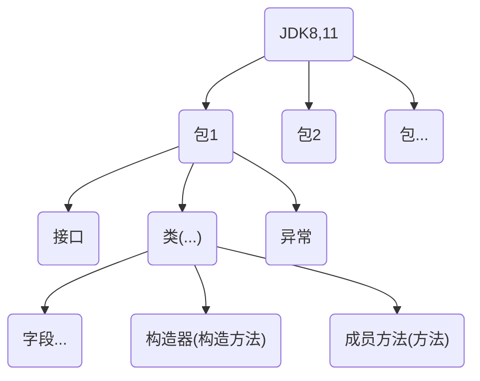

# java_45days_by_韩顺平

## 第一阶段-java基础

**Java重要特点**

1. Java语言是面向对象的(oop)
2. Java语言是健壮的。Java的强类型机制、异常处理、垃圾的自动收集等是Java程序健壮性的重要保证.
3. Java语言是跨平台性的。[即：一个编译好的.class文件可以在多个系统下运行，这种特地称为跨平台] 由jvm来做的. jvm包含在jdk中
4. Java语言是解释型的[了解]
   解释性语言：javascript,PHP,java   编译性语言：c/c++
   区别是：解释性语言，编译后的代码，不能直接被机器执行，需要解释器来执行. 编译性语言，编译后的代码，可以直接被机器执行，c/c++.


**各种名词及关系**

| name | desc                    |
| ---- | ----------------------- |
| jvm  | java virtual machine    |
| jdk  | java development kit    |
| jre  | java runtime evironment |

jdk = jre + java的开发工具(java +  javac javadoc javap etc.)

jre = jvm + java的核心类库 --> 如果想要**运行**一个**开发好**的java程序,直接装jre即可.


xxx.java -- 源文件 

xxx.class -- 字节码文件


**开发注意事项** 

1. Java源文件以.java为扩展名。源文件的基本组成部分是类(class),如本类中的Hello类。
2.  Java应用程序的执行入口是main0方法。它有固定的书写格式：
   public static void main(String[]args){...}
3. Java语言严格区分大小写。
4. Java方法由一条条语句构成，每个语句以“;”结束。
5. 大括号都是成对出现的，缺一不可。[习惯，先写{}再写代码]
6. 一个源文件中最多只能有一个public类。其它类的个数不限。(但是编译后,有几个类就会有几个class文件)[演示]
7. 如果源文件包含一个public类，则文件名必须按该类名命名！
8. 一个源文件中最多只能有一个public类。其它类的个数不限，也可以将main方法写在非public类中，然后指定运行非public类，这样入口方法就是非public的main方法.


**java代码规范** 

1. 类、方法的注释，要以javadoc的方式来写。
2. 非Java Doc的注释，往往是给代码的维护者看的，着重告诉读者为什么这样写，如何修改，注意什么问题等
3. 使用tab操作，实现缩进，默认整体向右边移动，用shift+tab整体向左移
4. 运算符和=两边习惯性各加一个空格。比如：2+4*5+345-89
5. 源文件使用utf-8编码
6. 行宽度不要超过80字符
7. 代码编写`次行风格`和`行尾风格`


### 变量

- int	4bytes
- double  8 bytes
- char
- String 


**+**

1. 左右两边都是数值, 加法
2. 左右任意是字符串, 拼接


### 数据类型

- 基本数据类型
  - 数值型
    - 整数: byte[1] short[2] int[4] long[8] --   默认是int,声明long型常量需要在后面加上`l`或者`L`
    - 浮点数: float[4] double[8]  -- 默认是double,声明float要在后面加`f`或则`F`    `对浮点数判断大小关系时要小心.如果两数的差值在某个精度范围内,才判定二者相等`
  - 字符型
    - char[2]  `本质是数字`.字符类型可直接存放一个数字, 只能用`''`,`""`是字符串.可以进行运算
    - Boolean[1`存疑`] true false 不能用0或者非0的整数代替.
- 引用数据类型
  - 类 class
  - 接口 interface 
  - 数组 [] 

```java 
public class FloatDemo {
    public static void main(String[] args) {
        double num1 = 2.7;
        double num2 = 8.1/3;
        System.out.println(num1);
        System.out.println(num2);
        System.out.println(num1==num2);
        System.out.println(Math.abs(num1-num2));
        if (Math.abs(num1-num2)<0.000001){
            System.out.println("相等");
        }
      char c = 97; 
      System.out.println(c);
      ch1 = 'a';
      System.out.println((int)ch1);
      System.out.println('a' + 10);
    }
}
```


### java API 

[在线文档](http://www.matools.com)



### 基本数据类型的转换

#### 自动转换

`自动类型转换`:**当java程序在进行赋值或者运算时,精度小的类型自动转换为精度大的数据类型**

char -> int -> long -> float -> double 

byte -> short -> int -> long -> float -> double  


**自动转换细节**

1. 有多种类型的数据混合运算时，系统首先自动将所有数据转换成容量最大的那种数据类型，然后再进行计算。
2. 当我们把精度（容量）大的数据类型赋值给精度（容量）小的数据类型时，就会报错，反之就会进行自动类型转换。
3. byte,short和char之间不会相互自动转换。
4. `byte, short, char` 三者可以计算,在`计算时会首先转换为int类型`
5. boolean不参与转换
6. 自动提升原则: 表达式结果的类型自动提升为操作数中最大的类型


#### 强制转换 

是自动转换的逆过程,将容量大的数据类型转换为容量小的数据类型. 使用时要加上强制转换符`()`,但可能造成精度降低或溢出,格外小心.

**强制转换细节**

1. 当进行数据从大--->小,就需要用强制转化 
2. 强制符号只针对于最近的操作数有效, 往往会使用小括号提升优先级
3. char类型可以保存int的常量值,但不能保存int的变量值,需要强转
4. byte 和 short 在进行运算时, 当做int处理.


#### 基本数据类型和String的转换

- basic --> string 将基本类型的值 + "" 即可
- string --> basic 调用基本类型的`包装类`的parseXX方法

