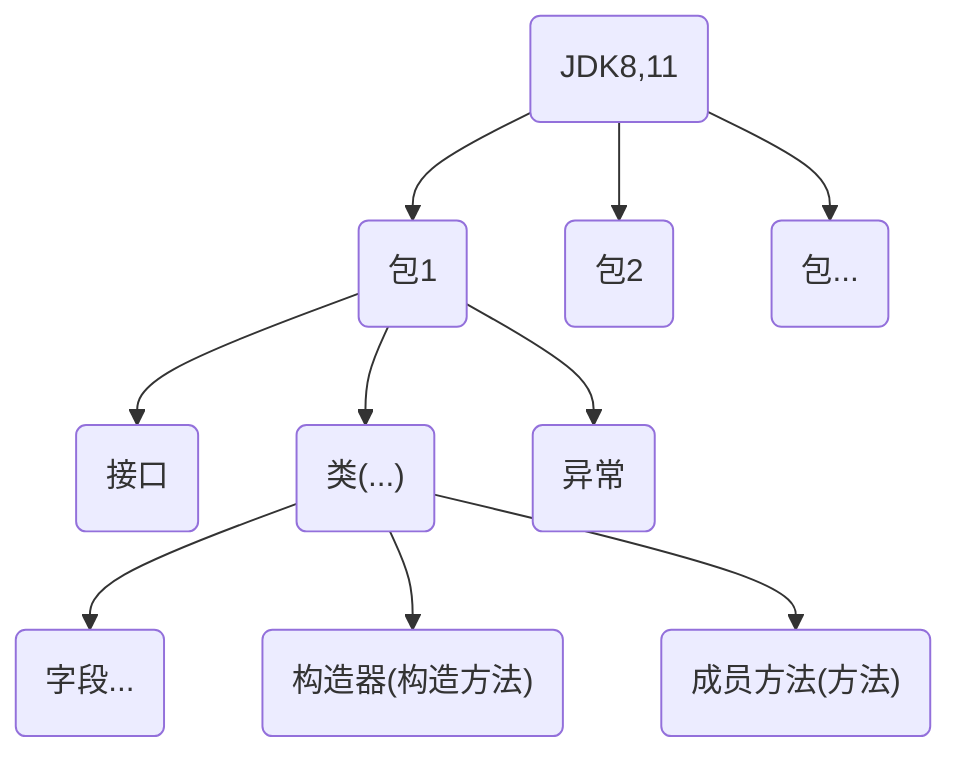

# java 45days by 韩顺平

## 第一阶段-java基础

**Java重要特点**

1. Java语言是面向对象的(oop)
2. Java语言是健壮的。Java的强类型机制、异常处理、垃圾的自动收集等是Java程序健壮性的重要保证.
3. Java语言是跨平台性的。[即：一个编译好的.class文件可以在多个系统下运行，这种特地称为跨平台] 由jvm来做的. jvm包含在jdk中
4. Java语言是解释型的[了解]
   解释性语言：javascript,PHP,java   编译性语言：c/c++
   区别是：解释性语言，编译后的代码，不能直接被机器执行，需要解释器来执行. 编译性语言，编译后的代码，可以直接被机器执行，c/c++.


**各种名词及关系**

| name | desc                    |
| ---- | ----------------------- |
| jvm  | java virtual machine    |
| jdk  | java development kit    |
| jre  | java runtime evironment |

jdk = jre + java的开发工具(java +  javac javadoc javap etc.)

jre = jvm + java的核心类库 --> 如果想要**运行**一个**开发好**的java程序,直接装jre即可.


xxx.java -- 源文件 

xxx.class -- 字节码文件


**开发注意事项** 

1. Java源文件以.java为扩展名。源文件的基本组成部分是类(class),如本类中的Hello类。
2.  Java应用程序的执行入口是main0方法。它有固定的书写格式：
   public static void main(String[]args){...}
3. Java语言严格区分大小写。
4. Java方法由一条条语句构成，每个语句以“;”结束。
5. 大括号都是成对出现的，缺一不可。[习惯，先写{}再写代码]
6. 一个源文件中最多只能有一个public类。其它类的个数不限。(但是编译后,有几个类就会有几个class文件)[演示]
7. 如果源文件包含一个public类，则文件名必须按该类名命名！
8. 一个源文件中最多只能有一个public类。其它类的个数不限，也可以将main方法写在非public类中，然后指定运行非public类，这样入口方法就是非public的main方法.


**java代码规范** 

1. 类、方法的注释，要以javadoc的方式来写。
2. 非Java Doc的注释，往往是给代码的维护者看的，着重告诉读者为什么这样写，如何修改，注意什么问题等
3. 使用tab操作，实现缩进，默认整体向右边移动，用shift+tab整体向左移
4. 运算符和=两边习惯性各加一个空格。比如：2+4*5+345-89
5. 源文件使用utf-8编码
6. 行宽度不要超过80字符
7. 代码编写`次行风格`和`行尾风格`


### 变量

- int	4bytes
- double  8 bytes
- char
- String 


**+**

1. 左右两边都是数值, 加法
2. 左右任意是字符串, 拼接


### 数据类型

- 基本数据类型
  - 数值型
    - 整数: byte[1] short[2] int[4] long[8] --   默认是int,声明long型常量需要在后面加上`l`或者`L`
    - 浮点数: float[4] double[8]  -- 默认是double,声明float要在后面加`f`或则`F`    `对浮点数判断大小关系时要小心.如果两数的差值在某个精度范围内,才判定二者相等`
  - 字符型
    - char[2]  `本质是数字`.字符类型可直接存放一个数字, 只能用`''`,`""`是字符串.可以进行运算
    - Boolean[1`存疑`] true false 不能用0或者非0的整数代替.
- 引用数据类型
  - 类 class
  - 接口 interface 
  - 数组 [] 

```java 
public class FloatDemo {
    public static void main(String[] args) {
        double num1 = 2.7;
        double num2 = 8.1/3;
        System.out.println(num1);
        System.out.println(num2);
        System.out.println(num1==num2);
        System.out.println(Math.abs(num1-num2));
        if (Math.abs(num1-num2)<0.000001){
            System.out.println("相等");
        }
      char c = 97; 
      System.out.println(c);
      ch1 = 'a';
      System.out.println((int)ch1);
      System.out.println('a' + 10);
    }
}
```


### java API 

[在线文档](http://www.matools.com)


```mermaid
graph TD
    A("JDK8,11") --> B("包1")
    A --> C("包2")
    A --> D("包...")
    B --> E("接口")
    B --> F("类(...)")
    B --> G("异常")
    F --> H("字段...")
    F --> I("构造器(构造方法)")
    F --> J("成员方法(方法)")

```

### 基本数据类型的转换

#### 自动转换

`自动类型转换`:**当java程序在进行赋值或者运算时,精度小的类型自动转换为精度大的数据类型**

char -> int -> long -> float -> double 

byte -> short -> int -> long -> float -> double  


**自动转换细节**

1. 有多种类型的数据混合运算时，系统首先自动将所有数据转换成容量最大的那种数据类型，然后再进行计算。
2. 当我们把精度（容量）大的数据类型赋值给精度（容量）小的数据类型时，就会报错，反之就会进行自动类型转换。
3. byte,short和char之间不会相互自动转换。
4. `byte, short, char` 三者可以计算,在`计算时会首先转换为int类型`
5. boolean不参与转换
6. 自动提升原则: 表达式结果的类型自动提升为操作数中最大的类型


#### 强制转换 

是自动转换的逆过程,将容量大的数据类型转换为容量小的数据类型. 使用时要加上强制转换符`()`,但可能造成精度降低或溢出,格外小心.

**强制转换细节**

1. 当进行数据从大--->小,就需要用强制转化 
2. 强制符号只针对于最近的操作数有效, 往往会使用小括号提升优先级
3. char类型可以保存int的常量值,但不能保存int的变量值,需要强转
4. byte 和 short 在进行运算时, 当做int处理.


#### 基本数据类型和String的转换

- basic --> string 将基本类型的值 + "" 即可
- string --> basic 调用基本类型的`包装类`的parseXX方法

```java
public class StringToBasic {
    public static void main(String[] args) {
        //  basic to string 
        int a = 100;
        float b = 1.1F;
        double c = 8.1;
        boolean d = true; 
        String s1 = a + "";
        String s2 = b + "";
        String s3 = c + "";
        String s4 = d + "";
        System.out.println(s1);
        System.out.println(s2);
        System.out.println(s3);
        System.out.println(s4);

        // string to basic 
        String s5 = "123";
        int num1 = Integer.parseInt(s5);
        System.out.println(num1);
        double num2 = Double.parseDouble(s5);
        System.out.println(num2);
        float num3 = Float.parseFloat(s5);
        System.out.println(num3);
        long num4 = Long.parseLong(s5);
        System.out.println(num4);
        short num5 = Short.parseShort(s5);
        System.out.println(num5);
        byte num6 = Byte.parseByte(s5);
        System.out.println(num6);
        boolean num7 = Boolean.parseBoolean("true");
        System.out.println(num7);
        // 将字符串的第几个字符转换为char
        char ch = s5.charAt(2);
        System.out.println(ch);
    }
}

```


### 运算符

在java中, % 的本质是 `a % b = a - a / b * b` 注意这里的 a/b是直接去掉小数部分的(也就是直接取整)

ps : **python的的余数是按照整除（向下取整）得到的商来计算的。**


```java
int i =1;
i = i++; 
System.out.println(i); 
// 1 
// 1. temp =i; 2. i++; 3. i = temp

int i = 1;
i = ++i;
System.out.println(i);
// 2 
// 1. temp = ++i; 2. i = temp
```

```java
"233" instanceof String
```

| a     | b     | a&b   | a&&b  | a\|b  | a\|\|b | !a    | a^b   |
| ----- | ----- | ----- | ----- | ----- | ------ | ----- | ----- |
| true  | true  | true  | true  | true  | true   | false | false |
| true  | false | flase | false | true  | true   | false | true  |
| false | true  | false | false | true  | true   | true  | true  |
| false | false | false | false | false | false  | true  | false |


- 短路与&& 和逻辑与&
  - &&当第一个为假,后面不用判断了
  - &始终要全部判断
  - &&效率高
- 短路或|| 和 逻辑或|
  - || 当第一个为真,后面不用判断
  - | 始终要全部判断
  - ||效率高


复合赋值运算符 

+=

-+ 

*=

/=

%=

**存在类型(强制)转换**

#### 三元运算符

条件表达式? 表达式1:表达式2 

条件为真, 结果取1; 反之取2


**细节**

1. 表达式1和2 要为可以赋给接受变量的类型(或者可以自动转换)
2. 三元运算符可以转换为if else


#### 运算优先级 

1. 下表,优先级从高到底.
2. 只有单目运算符 和 赋值运算符是从右到左的.

|      | . () {} ; ,                    |
| ---- | ------------------------------ |
| R->L | ++  --  ~    !(data type)      |
| L->R | * / %                          |
| L->R | +   -                          |
| L->R | <<    >>    >>>    位移        |
| L->R | <   >   <=    >=    instanceof |
| L->R | !=     ==                      |
| L->R | &                              |
| L->R | ^                              |
| L->R | \|                             |
| L->R | &&                             |
| L->R | II                             |
| L->R | ？:                            |
| R->L | =   *=  /=   %=                |
|      | +=   -=  <<=    >>=            |
|      | >>>=   &=   ^=   \|=           |


#### 标识符命名规则

1. 26个大小写字母,数字,  下划线_ , $ 
2. 不可以数字开头
3. 不可以使用关键字和保留字
4. 区分大小写.
5. 不能包含空格

#### 命名规范

标识符命名规范

1. 包名：多单词组成时所有字母都小写：aaa.bbb.ccc
   比如com.hsp.crm
2. 类名、接口名：多单词组成时，所有单词的首字母大写：XXxYyyZzz
   比如：TankShotGame  `大驼峰`
3. 变量名、方法名：多单词组成时，第一个单词首字母小写，第二个单词开始每个单词首字母大写：xxYyyZzz
   比如：tankShotGame `小驼峰`
4. 常量名：所有字母都大写。多单词时每个单词用下划线连接：XXX_YYY_ZZZ
   比如：定义一个所得税率TAX_RATE 
5. 后面我们学习到类，包，接口，等时，我们的命名规范要这样遵守，更加详细的看文档.


###  进制

对于整数，有四种表示方式：

1. 二进制：0,1，满2进1.以0b或0B开头。
2. 十进制：0-9，满10进1。
3. 八进制：0-7，满8进1,以数字0开头表示。
4. 十六进制：0-9及A(10)-F(15),满16进1.以0x或0X开头表示。此处的A-F不区分大小写。

#### 位运算 

`计算用补码`

`看计算结果用原码`

| 符号 | 意义     |
| ---- | -------- |
| >>   | 位右移   |
| <<   | 位左移   |
| >>>  | 算数右移 |
| ~    | 按位取反 |
| &    | 按位与   |
| \|   | 按位或   |
| ^    | 按位异或 |


\>> 低位溢出,用符号位补高位.

<< 符号位不变,低位补0

\>>>无符号右移,低位溢出,高位补0

没有<<<这个东西.

m\>>n,本质上就是$m/2^n$

m<<n,本质上是$m*2^n$


### 顺序控制

```java
if () {
  
}
else if () {
  
}
else {
  
}
```

```java
// 歌手比赛, 成绩大于8进入决赛,否则淘汰, 并根据性别提示进入男子组/女子组.
import java.util.Scanner;
public class If02 {
    public static void main(String[] args) {
        
        Scanner myScanner = new Scanner(System.in);
        System.out.println("请输入你的成绩:");
        double score = myScanner.nextDouble();
        if (score < 0 || score > 10){
            System.out.println("成绩范围有误,必须要在0-10之间.");
        }
        else {
            if (score > 8.0) {
                System.out.println("请输入你的性别:");
              	// 接收字符的方法就是先接收字符串, 接着取其第0位.
                char gender = myScanner.next().charAt(0);
                if (gender == '男') {
                    System.out.println("进入男子决赛组.");
                }
                else if (gender == '女') {
                    System.out.println("进入女子决赛组.");    
                }
                else {
                    System.out.println("进入无性别组.");
                }
            }
            else {
                System.out.println("你被淘汰了.");
            }
        }           
    }
}

```

```java
// switch 
switch(expr) {
  case 常量1:
    code ...;
    break;
  case 常量2:
    code ...;
    break;
  default:
    code...;
    // break;
}

```

**switch有穿透的现象**

即: 假如某个case里没有写break, 将当前case里的代码执行后,会直接跳进它下一个case里.

**switch细节**

1. 表达式数据类型，应和case后的常量类型一致，或者能`自动转成`可以相互比较的类型，比如输入的是字符，而常量是int
2. switch(表达式)中表达式的返回值必须是：(byte,short,int,char,enum,`String`)[注意不在switch语句里,String判断相等的方法.]
3. case子句中的值必须是常量，而不能是变量
4. default子句是可选的，当没有匹配的case时，执行default
5. break语句用来在执行完一个case分支后使程序跳出switch语句块；如果没有写break,程序会顺序执行到switch结尾

```java
// 穿透的一个例子
int month = myScanner.nextInt();
switch(month) {
  case 3:
  case 4: 
  case 5: 
    System.out.println("spring");
    break;
  case 6: 
  case 7: 
  case 8: 
    System.out.println("Summer");
    break;
 //  ...
    
}
```


### 循环控制

```java
for(循环变量初始化;循环条件;循环变量迭代) {
  循环操作;
}
```

**细节**

1. 循环条件是返回一个布尔值的表达式

2. for(循环判断条件)中的初始化和变量迭代可以写到其它地方，但是两边的分号不能省略 
   ```java
   for(;循环条件;) {
   
   }
   ```

   

3. 循环初始值可以有多条初始化语句，但要求类型一样，并且中间用逗号隔开，循环变量迭代也可以有多条变量迭代语句，中间用逗号隔开。

---

```java
循环变量初始化;
while(循环条件) {
  循环体;
  循环变量迭代;
}
```

**细节**

1. 循环条件是返回一个布尔值的表达式
2. while是先判断再执行.

---

```java
循环变量初始化;
do {
  循环体;
  循环变量迭代;
}while(循环条件);
```

1. 先执行,再判断. 总会执行1次
2. 最后有一个分号.

---

 break可以通过指定label来明确终止的是哪一层循环. 没指定就跳出最近的一个循环.

```java
label1: 
for (int j =0; j < 4; j++) {
  label2:
  for (int i =0; i < 10; i++) {
    if (i == 2) {
      break label1;
    }
    System.out.println("i = " + i);
  }  
}
```

ps: 只要是在循环前写`xx: `, 就可以确定它是个标签.

`在实际开发中,不建议使用标签.`

continue 也可以带标签