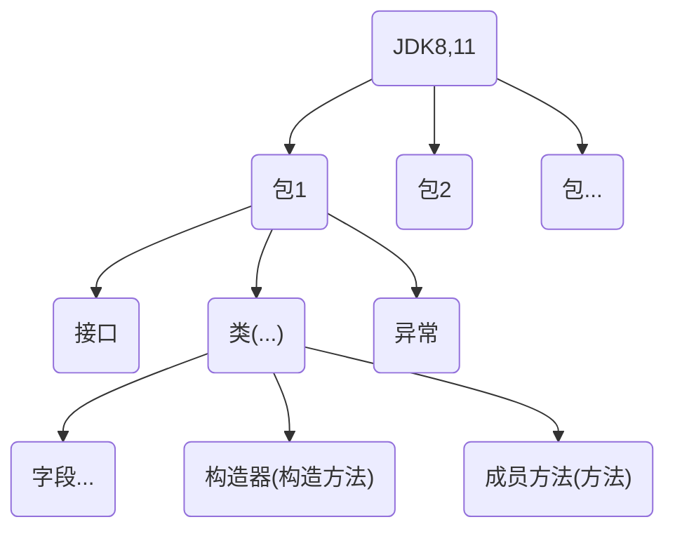
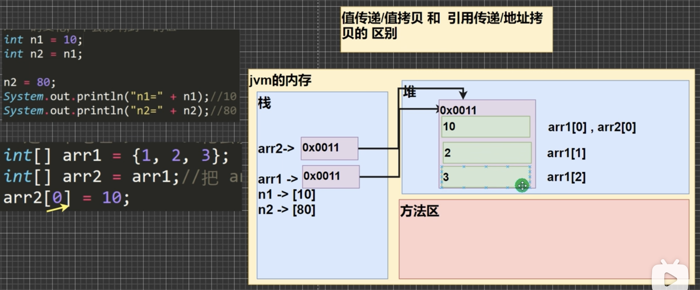
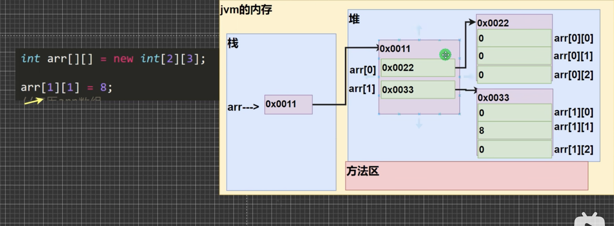
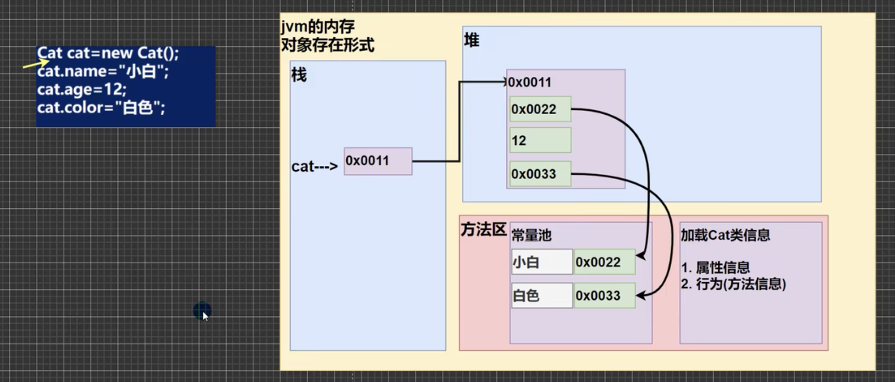
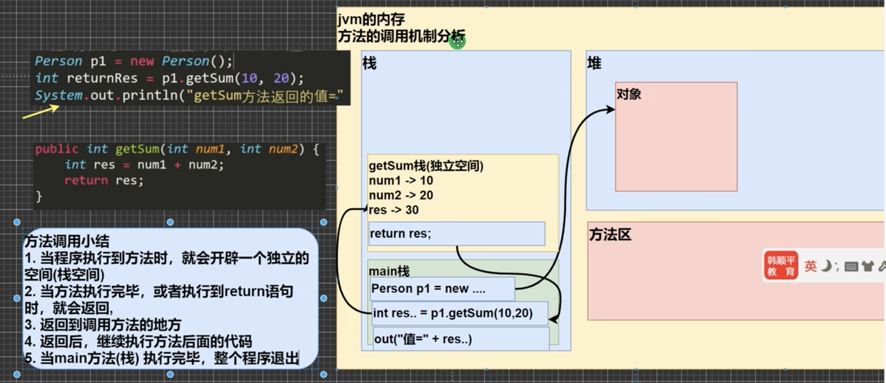
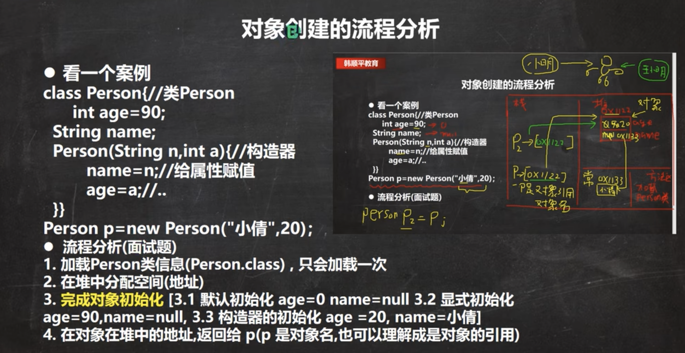
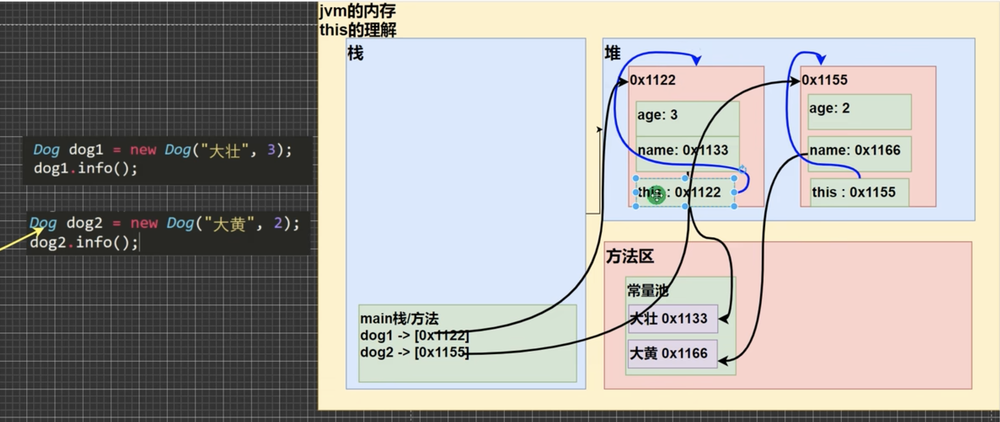
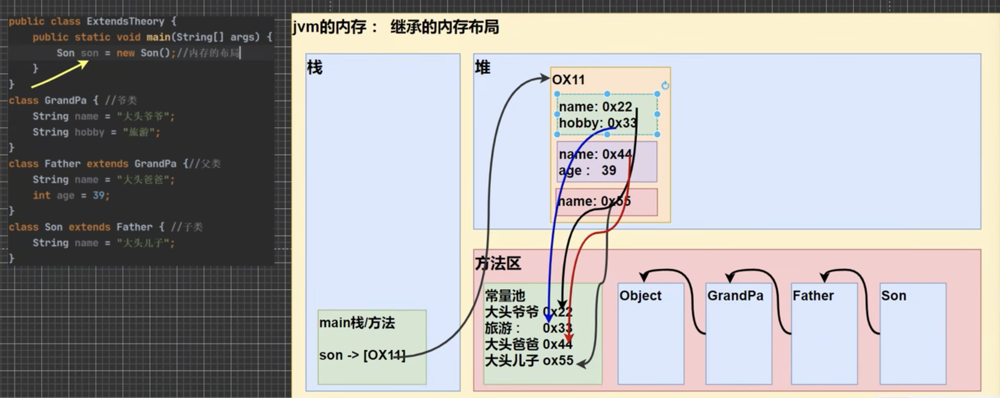

# java 45days by 韩顺平

## 第一阶段-java基础

**Java重要特点**

1. Java语言是面向对象的(oop)
2. Java语言是健壮的。Java的强类型机制、异常处理、垃圾的自动收集等是Java程序健壮性的重要保证.
3. Java语言是跨平台性的。[即：一个编译好的.class文件可以在多个系统下运行，这种特地称为跨平台] 由jvm来做的. jvm包含在jdk中
4. Java语言是解释型的[了解]
   解释性语言：javascript,PHP,java   编译性语言：c/c++
   区别是：解释性语言，编译后的代码，不能直接被机器执行，需要解释器来执行. 编译性语言，编译后的代码，可以直接被机器执行，c/c++.


**各种名词及关系**

| name | desc                    |
| ---- | ----------------------- |
| jdk  | java development kit    |
| jre  | java runtime evironment |
| jvm  | java virtual machine    |

jdk = jre + java的开发工具(java +  javac javadoc javap etc.)

jre = jvm + java的核心类库 --> 如果想要**运行**一个**开发好**的java程序,直接装jre即可.

xxx.java -- 源文件 

xxx.class -- 字节码文件


**开发注意事项** 

1. Java源文件以.java为扩展名。源文件的基本组成部分是类(class),如本类中的Hello类。
2.  Java应用程序的执行入口是main0方法。它有固定的书写格式：
   public static void main(String[]args){...}
3. Java语言严格区分大小写。
4. Java方法由一条条语句构成，每个语句以“;”结束。
5. 大括号都是成对出现的，缺一不可。[习惯，先写{}再写代码]
6. 一个源文件中最多只能有一个public类。其它类的个数不限。(但是编译后,有几个类就会有几个class文件)[演示]
7. 如果源文件包含一个public类，则文件名必须按该类名命名！
8. 一个源文件中最多只能有一个public类。其它类的个数不限，也可以将main方法写在非public类中，然后指定运行非public类，这样入口方法就是非public的main方法.


**java代码规范** 

1. 类、方法的注释，要以javadoc的方式来写。
2. 非Java Doc的注释，往往是给代码的维护者看的，着重告诉读者为什么这样写，如何修改，注意什么问题等
3. 使用tab操作，实现缩进，默认整体向右边移动，用shift+tab整体向左移
4. 运算符和=两边习惯性各加一个空格。比如：2+4*5+345-89
5. 源文件使用utf-8编码
6. 行宽度不要超过80字符
7. 代码编写`次行风格`和`行尾风格`


### 变量

- int	4bytes
- double  8 bytes
- char
- String 


**+**

1. 左右两边都是数值, 加法
2. 左右任意是字符串, 拼接


### 数据类型

- 基本数据类型
  - 数值型
    - 整数: byte[1] short[2] int[4] long[8] --   默认是int,声明long型常量需要在后面加上`l`或者`L`
    - 浮点数: float[4] double[8]  -- 默认是double,声明float要在后面加`f`或则`F`    `对浮点数判断大小关系时要小心.如果两数的差值在某个精度范围内,才判定二者相等`
  - 字符型
    - char[2]  `本质是数字`.字符类型可直接存放一个数字, 只能用`''`,`""`是字符串.可以进行运算
    - Boolean[1`存疑`] true false 不能用0或者非0的整数代替.
- 引用数据类型
  - 类 class
  - 接口 interface 
  - 数组 [] 

```java 
public class FloatDemo {
    public static void main(String[] args) {
        double num1 = 2.7;
        double num2 = 8.1/3;
        System.out.println(num1);
        System.out.println(num2);
        System.out.println(num1==num2);
        System.out.println(Math.abs(num1-num2));
        if (Math.abs(num1-num2)<0.000001){
            System.out.println("相等");
        }
      char c = 97; 
      System.out.println(c);
      ch1 = 'a';
      System.out.println((int)ch1);
      System.out.println('a' + 10);
    }
}
```


### java API 

[在线文档](http://www.matools.com)


```mermaid
graph TD
    A("JDK8,11") --> B("包1")
    A --> C("包2")
    A --> D("包...")
    B --> E("接口")
    B --> F("类(...)")
    B --> G("异常")
    F --> H("字段...")
    F --> I("构造器(构造方法)")
    F --> J("成员方法(方法)")

```

### 基本数据类型的转换

#### 自动转换

`自动类型转换`:**当java程序在进行赋值或者运算时,精度小的类型自动转换为精度大的数据类型**

char -> int -> long -> float -> double 

byte -> short -> int -> long -> float -> double  


**自动转换细节**

1. 有多种类型的数据混合运算时，系统首先自动将所有数据转换成容量最大的那种数据类型，然后再进行计算。
2. 当我们把精度（容量）大的数据类型赋值给精度（容量）小的数据类型时，就会报错，反之就会进行自动类型转换。
3. byte,short和char之间不会相互自动转换。
4. `byte, short, char` 三者可以计算,在`计算时会首先转换为int类型`
5. boolean不参与转换
6. 自动提升原则: 表达式结果的类型自动提升为操作数中最大的类型


#### 强制转换 

是自动转换的逆过程,将容量大的数据类型转换为容量小的数据类型. 使用时要加上强制转换符`()`,但可能造成精度降低或溢出,格外小心.

**强制转换细节**

1. 当进行数据从大--->小,就需要用强制转化 
2. 强制符号只针对于最近的操作数有效, 往往会使用小括号提升优先级
3. char类型可以保存int的常量值,但不能保存int的变量值,需要强转
4. byte 和 short 在进行运算时, 当做int处理.


#### 基本数据类型和String的转换

- basic --> string 将基本类型的值 + "" 即可
- string --> basic 调用基本类型的`包装类`的parseXX方法

```java
public class StringToBasic {
    public static void main(String[] args) {
        //  basic to string 
        int a = 100;
        float b = 1.1F;
        double c = 8.1;
        boolean d = true; 
        String s1 = a + "";
        String s2 = b + "";
        String s3 = c + "";
        String s4 = d + "";
        System.out.println(s1);
        System.out.println(s2);
        System.out.println(s3);
        System.out.println(s4);

        // string to basic 
        String s5 = "123";
        int num1 = Integer.parseInt(s5);
        System.out.println(num1);
        double num2 = Double.parseDouble(s5);
        System.out.println(num2);
        float num3 = Float.parseFloat(s5);
        System.out.println(num3);
        long num4 = Long.parseLong(s5);
        System.out.println(num4);
        short num5 = Short.parseShort(s5);
        System.out.println(num5);
        byte num6 = Byte.parseByte(s5);
        System.out.println(num6);
        boolean num7 = Boolean.parseBoolean("true");
        System.out.println(num7);
        // 将字符串的第几个字符转换为char
        char ch = s5.charAt(2);
        System.out.println(ch);
    }
}

```


### 运算符

在java中, % 的本质是 `a % b = a - a / b * b` 注意这里的 a/b是直接去掉小数部分的(也就是直接取整)

ps : **python的的余数是按照整除（向下取整）得到的商来计算的。**


```java
int i =1;
i = i++; 
System.out.println(i); 
// 1 
// 1. temp =i; 2. i++; 3. i = temp

int i = 1;
i = ++i;
System.out.println(i);
// 2 
// 1. temp = ++i; 2. i = temp
```

```java
"233" instanceof String
```

| a     | b     | a&b   | a&&b  | a\|b  | a\|\|b | !a    | a^b   |
| ----- | ----- | ----- | ----- | ----- | ------ | ----- | ----- |
| true  | true  | true  | true  | true  | true   | false | false |
| true  | false | flase | false | true  | true   | false | true  |
| false | true  | false | false | true  | true   | true  | true  |
| false | false | false | false | false | false  | true  | false |


- 短路与&& 和逻辑与&
  - &&当第一个为假,后面不用判断了
  - &始终要全部判断
  - &&效率高
- 短路或|| 和 逻辑或|
  - || 当第一个为真,后面不用判断
  - | 始终要全部判断
  - ||效率高


复合赋值运算符 

+=

-+ 

*=

/=

%=

**存在类型(强制)转换**

#### 三元运算符

条件表达式? 表达式1:表达式2 

条件为真, 结果取1; 反之取2


**细节**

1. 表达式1和2 要为可以赋给接受变量的类型(或者可以自动转换)
2. 三元运算符可以转换为if else


#### 运算优先级 

1. 下表,优先级从高到底.
2. 只有单目运算符 和 赋值运算符是从右到左的.

|      | . () {} ; ,                    |
| ---- | ------------------------------ |
| R->L | ++  --  ~    !(data type)      |
| L->R | * / %                          |
| L->R | +   -                          |
| L->R | <<    >>    >>>    位移        |
| L->R | <   >   <=    >=    instanceof |
| L->R | !=     ==                      |
| L->R | &                              |
| L->R | ^                              |
| L->R | \|                             |
| L->R | &&                             |
| L->R | II                             |
| L->R | ？:                            |
| R->L | =   *=  /=   %=                |
|      | +=   -=  <<=    >>=            |
|      | >>>=   &=   ^=   \|=           |


#### 标识符命名规则

1. 26个大小写字母,数字,  下划线_ , $ 
2. 不可以数字开头
3. 不可以使用关键字和保留字
4. 区分大小写.
5. 不能包含空格

#### 命名规范

标识符命名规范

1. 包名：多单词组成时所有字母都小写：aaa.bbb.ccc
   比如com.hsp.crm
2. 类名、接口名：多单词组成时，所有单词的首字母大写：XxxYyyZzz
   比如：TankShotGame  `大驼峰`
3. 变量名、方法名：多单词组成时，第一个单词首字母小写，第二个单词开始每个单词首字母大写：xxYyyZzz
   比如：tankShotGame `小驼峰`
4. 常量名：所有字母都大写。多单词时每个单词用下划线连接：XXX_YYY_ZZZ
   比如：定义一个所得税率TAX_RATE 
5. 后面我们学习到类，包，接口，等时，我们的命名规范要这样遵守，更加详细的看文档.


###  进制

对于整数，有四种表示方式：

1. 二进制：0,1，满2进1.以0b或0B开头。
2. 十进制：0-9，满10进1。
3. 八进制：0-7，满8进1,以数字0开头表示。
4. 十六进制：0-9及A(10)-F(15),满16进1.以0x或0X开头表示。此处的A-F不区分大小写。

#### 位运算 

`计算用补码`

`看计算结果用原码`

| 符号 | 意义     |
| ---- | -------- |
| >>   | 位右移   |
| <<   | 位左移   |
| >>>  | 算数右移 |
| ~    | 按位取反 |
| &    | 按位与   |
| \|   | 按位或   |
| ^    | 按位异或 |


\>> 低位溢出,用符号位补高位.

<< 符号位不变,低位补0

\>>>无符号右移,低位溢出,高位补0

没有<<<这个东西.

m\>>n,本质上就是$m/2^n$

m<<n,本质上是$m*2^n$


### 顺序控制

```java
if () {
  
}
else if () {
  
}
else {
  
}
```

```java
// 歌手比赛, 成绩大于8进入决赛,否则淘汰, 并根据性别提示进入男子组/女子组.
import java.util.Scanner;
public class If02 {
    public static void main(String[] args) {
        
        Scanner myScanner = new Scanner(System.in);
        System.out.println("请输入你的成绩:");
        double score = myScanner.nextDouble();
        if (score < 0 || score > 10){
            System.out.println("成绩范围有误,必须要在0-10之间.");
        }
        else {
            if (score > 8.0) {
                System.out.println("请输入你的性别:");
              	// 接收字符的方法就是先接收字符串, 接着取其第0位.
                char gender = myScanner.next().charAt(0);
                if (gender == '男') {
                    System.out.println("进入男子决赛组.");
                }
                else if (gender == '女') {
                    System.out.println("进入女子决赛组.");    
                }
                else {
                    System.out.println("进入无性别组.");
                }
            }
            else {
                System.out.println("你被淘汰了.");
            }
        }           
    }
}

```

```java
// switch 
switch(expr) {
  case 常量1:
    code ...;
    break;
  case 常量2:
    code ...;
    break;
  default:
    code...;
    // break;
}

```

**switch有穿透的现象**

即: 假如某个case里没有写break, 将当前case里的代码执行后,会直接跳进它下一个case里.

**switch细节**

1. 表达式数据类型，应和case后的常量类型一致，或者能`自动转成`可以相互比较的类型，比如输入的是字符，而常量是int
2. switch(表达式)中表达式的返回值必须是：(byte,short,int,char,enum,`String`)[注意不在switch语句里,String判断相等的方法.]
3. case子句中的值必须是常量，而不能是变量
4. default子句是可选的，当没有匹配的case时，执行default
5. break语句用来在执行完一个case分支后使程序跳出switch语句块；如果没有写break,程序会顺序执行到switch结尾

```java
// 穿透的一个例子
int month = myScanner.nextInt();
switch(month) {
  case 3:
  case 4: 
  case 5: 
    System.out.println("spring");
    break;
  case 6: 
  case 7: 
  case 8: 
    System.out.println("Summer");
    break;
 //  ...
    
}
```


### 循环控制

```java
for(循环变量初始化;循环条件;循环变量迭代) {
  循环操作;
}
```

**细节**

1. 循环条件是返回一个布尔值的表达式

2. for(循环判断条件)中的初始化和变量迭代可以写到其它地方，但是两边的分号不能省略 
   ```java
   for(;循环条件;) {
   
   }
   ```

   

3. 循环初始值可以有多条初始化语句，但要求类型一样，并且中间用逗号隔开，循环变量迭代也可以有多条变量迭代语句，中间用逗号隔开。

---

```java
循环变量初始化;
while(循环条件) {
  循环体;
  循环变量迭代;
}
```

**细节**

1. 循环条件是返回一个布尔值的表达式
2. while是先判断再执行.

---

```java
循环变量初始化;
do {
  循环体;
  循环变量迭代;
}while(循环条件);
```

1. 先执行,再判断. 总会执行1次
2. 最后有一个分号.

---

 break可以通过指定label来明确终止的是哪一层循环. 没指定就跳出最近的一个循环.

```java
label1: 
for (int j =0; j < 4; j++) {
  label2:
  for (int i =0; i < 10; i++) {
    if (i == 2) {
      break label1;
    }
    System.out.println("i = " + i);
  }  
}
```

ps: 只要是在循环前写`xx: `, 就可以确定它是个标签.

`在实际开发中,不建议使用标签.`

continue 也可以带标签


### 数组

数组的使用 

```java
// 动态初始化 1
int[] a = new int[5];

// 等价与
// int a[] = new int[5];

// 动态初始化 2 
// 先声明
int[] a;

// 再创建
a = new int[10];

// 静态初始化 3
int[] a  = {2,4,5,6,7,9}
// 等价于 
int[] a = new int[6];
a[0]=2;
a[1]=4;
...
// 等价于 
int[] a = new int[]{2,4,6,9,10,11}
```


1. 数组是多个相同类型数据的组合，实现对这些数据的统一管理
2. 数组中的元素可以是任何数据类型，包括基本类型和引用类型,但是不能混用。
3. 数组创建后，如果没有赋值，有默认值
   int 0, short 0, byte 0, long 0,
   float 0.0 ,double 0.0 ,char \u0000,
   boolean false,  String null
4. 使用数组的步骤
   1. 声明数组并开辟空间
   2. 给数组各个元素赋值
   3. 使用数组
5. 数组的下标是从0开始的。
6. 数组下标必须在指定范围内使用，否则报：下标越界异常，比如
   int[]arr=new int[5]:则有效下标为0-4
7. 数组属引用类型，数组型数据是对象(object)

#### 数组拷贝

jvm内存里, 基本数据类型存放在栈里, 引用类型存放在堆里.

 

#### 数组扩容

- 挺麻烦的, 先定义一个新数组, 将原先值循环放进新的,最后将原数组指向新数组.
- 缩减也是同样的道理.
- 使用`链表扩容`更方便.

```java
import java.util.Scanner;
public class ArrayAdd02 {
    public static void main(String[] args) {
        int[] arr = {1, 2, 3};
        Scanner sc = new Scanner(System.in);
        do {
            int[] arr2 = new int[arr.length + 1]; 
            System.out.println("请输入一个整数：");
            int num = sc.nextInt();
            for (int i = 0; i < arr.length; i++) {
                arr2[i] = arr[i];
            }
            arr2[arr.length] = num;
            arr = arr2;
            System.out.println("数组扩容后的元素为：");
            for (int i = 0; i < arr.length; i++) {
                System.out.print(arr[i] + " ");
            }
            System.out.println("是否继续添加？（y/n）");
            String choice = sc.next();
            if (choice.equals("n")) {
                break;
            }
        } while (true);
        sc.close();
        System.out.println("程序结束！");
    }
}
```

### 排序

- 内部排序: 将所有的数据加载到内存中进行排序(交换, 选择, 插入)
- 外部排序: 借助外存进行排序.(合并排序, 直接合并排序)

### 查找

-  顺序查找
- 二分查找 (要求数组是有序的.)

### 二维数组

```java
public class TwoDiArray {
    public static void main(String[] args) {
        int[][] aa = {{0,0,0,0,0,0},{1,1,1,1,1,1,},{0,2,0,3,0,0},{0,0,0,0,0,0}};
        for (int i = 0; i< aa.length; i++) {
            for (int j =0; j < aa[i].length; j++) {
                System.out.print(aa[i][j]);
            }
            System.out.println();
        }
    }
}

```

#### 内存布局

```java
// 动态初始化 1
int[][] a = new int[2][3];

// 当然也可以先声明再开空间.2

// 创建二维数组,只确定一维数组的个数.(有3个一维数组.)
int[][] arr = new int[3][];
for (int i =0; i<3; i++) {
  arr[i] = new int[i+1];
  
  for (int j =0; j < a[i].length; j++) {
    arr[i][j] = i+1;
  }
}

// 静态初始化. 3 
```




**细节**

1. 一维数组的声明方式有：
   ```java
   int x[];
   int[] x;
   ```

   

2. 二维数组的声明方式有：
   ```java
   int x[][];
   int[][] x;
   ```

   

3. 二维数组实际上是由多个一维数组组成的，它的各个一维数组的长度可以相同，也可以不相同。比如：map\[][]是一个二维数组
   map\[][]={{1,2},{3,4,5}}
   map[0]是一个含有两个元素的一维数组，map[1]是一个含有三个元素的一维数组，我们也称为列数不等的二维数组。


### 类与对象 

对象是类的实例.

#### 属性

**对象在内存中的存在形式** 
Java内存的结构分析

1. 栈：一般存放基本数据类型(局部变量）
2. 堆：存放对象(Cat cat,数组等)
3. 方法区：常量池(常量，比如字符串),类加载信息
4. 示意图[Cat(name,age,price)]



**属性/成员变量---基本介绍**

1. 从概念或叫法上看：成损变量=属性=field(即成损变量是用来表示属性
   的，授课中，统一叫属性)
   案例演示：Car(name,price,color)
2. 属性是类的一个组成部分，一般是基本数据类型，也可是引用类型（对象，数组）
   比如我们前面定义猫类的int age就是属性

**注意事项和细节说明**

1. 属性的定义语法同变量，示例：`访问修饰符`   属性类型   属性名
   简单介绍访问修饰符: 控制属性的访问范围. public    protected   默认  private
2. 属性的定义类型可以为任意类型，包含基本类型或引用类型
3. 属性如果不赋值，有默认值，规则和数组一致。

#### 方法

```java
public class MethodDemo {
    public static void main(String[] args) {
        Person me = new Person();
        me.name = "鼠鼠";
        me.age = 23;
        me.speak();
        me.cal(100);
        int result = me.getSum(5,6);
        System.out.println(result);    
    }
}

class Person {
    String name;
    int age;

    // public 表示方法公开
    // void 该方法没有返回值
    // speak() speak方法名  ()形参列表
    //  {} 方法体
    public void speak() {
        System.out.println(name+"我啊,是一个好人~");
    }

    public void cal(int n) {
        double sum = .0;
        for (int i=1; i< n+1;i++) {
            sum +=i;
        }
        System.out.println("1+2+...+"+n+"="+sum);
    }

    // int: 方法执行后, 返回一个int值.
    public int getSum(int x, int y) {
        // System.out.println(x+"+"+y+"="+(x+y));
        return x+y;
    }
}

```



 

**注意事项和使用细节**

- 访问修饰符（作用是控制方法使用的范围）
  如果不写默认访问，[有四种：public,protected,默认，private],具体在后面说
- 返回数据类型
  1. 一个方法最多有一个返回值[思考，如何返回多个结果?] --> 数组
  2. 返回类型可以为任意类型，包含基本类型或引用类型（数组，对象）
  3. 如果方法要求有返回数据类型，则方法体中最后的执行语句必须为return值；而且要求返回值类型必须和return的值类型一致或兼容
  4. 如果方法是void,则方法体中可以没有return语句，或者只写return;  
- 方法名
  遵循驼峰命名法，最好见名知义，表达出该功能的意思即可，比如得到两个数的和getSum,开发中按照规范

- 形参列表
  1. 一个方法可以有0个参数，也可以有多个参数，中间用逗号隔开，比如getSum(int x,int y)
  2. 参数类型可以为任意类型，包含基本类型或引用类型，比如printArr(int\[][] map)
  3. 调用带参数的方法时，一定对应着参数列表传入相同类型或兼容类型的参数！[getSum]
  4. 方法定义时的参数称为形式参数，简称形参；方法调用时的参数称为实际参数，简称实参，实参和形参的类型要一致或兼容、个数、顺序必须一致.
- 方法体
  里面写完成功能的具体的语句，可以为输入、输出、变量、运算、分支、循环、方法调用，但里面`不能再定义方法`！即：方法不能嵌套定义。

- 方法细节调用说明
  1. 同一个类中的方法调用：直接调用即可。比如print(参数)：
  2. `跨类`中的方法A类调用B类方法：需要`通过对象名`调用。比如`对象名.方法名(参数)`；
     实例化被调用的对象, 取其方法.
  3. 特别说明一下：`跨类`的`方法调用`和方法的`访问修饰符相关`，先暂时这么提一下. 后面我们讲到访问修饰符时，还要再细说。

#### 方法传参机制 

基础类型  -- 形参改变`不会影响`主参

引用类型 -- 形参改变`会影响`主参

### 递归问题

**递归重要规则**

1. 执行一个方法时，就创建一个新的受保护的独立空间（栈空间）
2. 方法的局部变量是独立的，不会相互影响
3. 如果方法中使用的是引用类型变量（比如数组），就会共享该引用类型的数据.
4. 递归必须向退出递归的条件逼近，否则就是无限递归，出现StackOverflowError,死龟了: (
5. 当一个方法执行完毕，或者遇到return, 就会返回，遵守谁调用就将结果返回给谁，同时当方法执行完毕或者返回时，该方法也就执行完毕。

### 作业

eg : 递归八皇后


### 重载(overload) 

java中允许同一个类中，多个`同名方法`的存在，但要求`形参列表不一致`！

- 个数
- 类型
- 顺序

比如：System.out.println(); out是PrintStream类型

- 重载的好处
  - 减轻了起名的麻烦
  - 减轻了记名的麻烦

**注意事项和使用细节**

1. 方法名：必须相同
2. 参数列表：必须不同（参数类型或个数或顺序，至少有一样不同，参数名无要求)
3. 返回类型：无要求  (也就是说判断是否重载, 从名字看到参数就行了.)


### 可变参数

java 允许将同一个类中多个`同名同功能`, 但是`参数个数不同`的方法,`封装`成`一个方法`.通过可变参数实现.

**基本语法**

```java
访问修饰符 返回类型 方法名 (数据类型... 形参名) {

}
```


**注意事项和使用细节**
VarParameterDetail.java

1. 可变参数的实参可以为0个或任意多个
2. 可变参数的实参可以为数组
3. 可变参数的本质就是数组
4. 可变参数可以和普通类型的参数一起放在形参列表，但必须保证可变参数在最后
5. 一个形参列表中只能出现一个可变参数


### 作用域

1. 在java编程中，主要的变量就是属性（成员变量）和局部变量
2. 我们说的局部变量一般是指在成员方法中定义的变量。
3. java中作用域的分类
   全局变量：也就是属性，作用域为整个类体
   局部变量：也就是除了属性之外的其他变量，作用域为定义它的代码块中！
4. 全局变量可以不赋值，直接使用，因为有默认值，局部变量必须赋值后，才能使用，因为没有默认值。


**注意事项和使用细节**

1. 属性和局部变量可以重名，访问时遵循`就近原则`
2. 在同一个作用域中，比如在同一个成员方法中，两个局部变量，不能重名
3. 属性生命周期较长，伴随着对象的创建而创建，伴随着对象的死亡而死亡。局部变量，生命周期较短，伴随着它的代码块的执行而创建，伴随着代码块的结束而死亡。即在一次方法调用过程中。
4. 作用域不同
   全局变量：可以被本类使用，或其他类使用 (通过对象调用)
   局部变量：只能在本类中对应的方法中使用
5. 修饰符不同
   全局变量/属性可以加修饰符
   局部变量不可以加修饰符

### 构造器/构造方法 

相当于`def __init__()`

**基本语法**

```java
[修饰符] 方法名 (形参列表) {
  方法体;
}
```

1. 构造器的修饰符可以默认
2. 构造器`没有返回值`
3. 方法名必须和类名一样
4. 参数列表遵守成员方法一样的规则
5. 构造器的调用由系统完成 (在创建对象时,系统会自动调用构造器完成对象的`初始化`)


**注意事项和使用细节**

1. 一个类可以定义多个不同的构造器，即构造器重载
   比如：我们可以再给Person类定义一个构造器，用来创建对象的时候，只指定人名，不需要指定年龄
2. 构造器名和类名要相同
3. 构造器没有返回值
4. 构造器是完成对象的初始化，并不是创建对象
5. 在创建对象时，系统自动的调用该类的构造方法
6. 如果程序员没有定义构造方法，系统会自动给类生成一个默认无参构造方法(也叫默认构造方法) 可以用`javap`反编译看看.
7. 一旦定义了自己的构造器，默认的构造器就`覆盖`了，就不能再使用默认的无参构造器，除非显式地定义一下，即：Person(){}



### this

相当于`self`

可以用hashCode()来看一下两个同类对象是不是同一个...

**细节**

1. ths关键字可以用来访问本类的属性、方法、构造器
2. this用于区分当前类的属性和局部变量
3. 访问成员方法的语法：this.方法名（参数列表）
4. 访问构造器语法：this(参数列表);   注意只能在`构造器中使用`(只能在构造器中访问另一个构造器,且必须放在首行)
5. this不能在类定义的外部使用，只能在类定义的方法中使用




### 包

**作用**

1. 区别相同名字的类 
2. 当类很多时,可以很好地管理类 
3. 控制访问范围 

**基本语法** 

```java
package com.haha;
// package 关键字, 表示打包 
// com.haha 表示包名
```

**本质上就是创建不同的文件夹来保存类文件.**


**包的命名**

- 命名规则
  只能包含数字、字母、下划线、小圆点，但不能用数字开头，不能是关键字或保留字
  demo.class.exec1  // no, class 是关键字
  demo.12a // no // no, 数字开头
  demo.ab12.oa
- 命名规范
  一般是小写字母+小圆点一般是
  com.公司名.项目名.业务模块名
  比如：com.hspedu.oa.model;  com.hspedu.oa.controller;
  举例：
  com.sina.crm.user /用户模块
  com.sina.crm.order /订单模块
  com.sina.crm.utils //工具类
- 常用的包
  *表示全部的类, 建议使用哪个类就导入哪个类.
  - java.lang.*  // 基本包, 默认引用
  - Java.util.*  // 工具包, Scann在这里.
  - java.net.*   // 网络包,网络开发
  - java.awt.*  // 界面开发 gui


**注意事项和使用细节**

1. package的作用是`声明当前类所在的包`, 需要放在class的最上面, 一个类中最多只有一句package
2. import指令位置放在package的下面，在类定义前面，可以有多句且没有顺序要求


### 访问修饰符 

java提供四种访问控制修饰符号控制`方法和属性（成员变量）`的`访问权限（范围）`

1. 公开级别：用public修饰，对外公开
2. 受保护级别：用protected修饰，对子类和同一个包中的类公开
3. 默认级别：没有修饰符号，向同一个包的类公开
4. 私有级别：用private修饰，只有类本身可以访问，不对外公开.


| 访问级别 | 修饰符     | 同类 | 同包 | 子类 | 不同包 |
| -------- | ---------- | ---- | ---- | ---- | ------ |
| 公开     | public     | √    | √    | √    | √      |
| 受保护   | protected  | √    | √    | √    | ×      |
| 默认     | 没有修饰符 | √    | √    | ×    | ×      |
| 私有     | private    | √    | ×    | ×    | ×      |

**使用的注意事项**

1. 修饰符可以用来修饰类中的属性，成员方法以及类
2. 只有`默认`和`public`才能`修饰类`！并且遵循上述访问权限的特点。
3. 因为没有学习继承，因此关于在子类中的访问权限，我们讲完子类后，在回头讲解
4. 成员方法的访问规则和属性完全一样

```sh
# 使用案例在Modifier开头的文件里
.
├── use
│   ├── Import01.java
│   ├── ModifierU2.java
│   ├── ModifierUse.java
│   └── Test.java
├── xiaoming
│   ├── Dog.java
│   └── ModifierU3.java
└── xiaoqiang
    └── Dog.java
```


### 封装

面向对象编程(OOP)的三大特征

- 封装(encapsulation)
- 继承(inheritance)
- 多态(polymorphism)


**封装**就是把抽象出的数据[`属性`]和对数据的操作[`方法`]封装在一起,数据被保护在内部,程序的其他部分只有通过`被授权`的操作[`方法`],才能对数据进行操作.

**好处**

- 隐藏细节  方法 <---调用
- 可以对数据进行验证, 保证安全合理

**封装的实现步骤**

1. 将属性进行私有化(`private`)【不能直接修改属性】

2. 提供一个公共(`public`)的set方法，用于对属性判断并赋值

   ```java
   public void setXxx(类型参数名){
     //加入数据验证的业务逻辑
     属性=参数名：
   }
   ```

   

3. 提供一个公共(`public`)的get方法，用于获取属性的值

   ```java
   public XX getXxx(){//权限判断
   	return xx;
   }
   ```

   

**将构造器与setXX结合**


### 继承 

**语法**

```java
class 子类 extends 父类 {
  代码行;
}
```

**细节**

1. 子类继承了所有的属性和方法,但私有属性和方法不能在子类直接访问,可以通过父类提供的公共方法去访问.
2. 子类必须调用父类的构造器完成父类的初始化 `super()`
3. 当创建子类对象时,不管使用子类的哪个构造器,默认情况总会去`调用父类的无参构造器`,如果父类`没有提供`无参构造器,则`必须在子类的构造器中用super去指定使用父类的哪个构造器`完成对父类的初始化工作,否则编译不会通过.
4. 如果希望指定去调用父类的某个构造器,则显式的调用一下 `super(参数列表)`
5. super只能在构造器中使用，且需要放在构造器第一行
6. super()和this()都只能放在构造器第一行，因此这两个方法不能共存在一个构造器
7. java所有类都是Object类的子类.
8. 父类构造器的调用不限于直接父类,将一直向上追溯知道Object类(顶级父类)
9. 子类最多只能继承一个父类(指 直接继承) ,即java是单继承机制.
10. 不能滥用继承,子类和父类之间必须满足is-a的逻辑关系.



### super

代表父类的引用, 用于访问父类的属性,方法,构造器

1. 访问父类的属性，但不能访问父类的private属性[案例]
   super.属性名；
2. 访问父类的方法，不能访问父类的private方法
   super.方法名（参数列表）；
3. 访问父类的构造器（这点前面用过）：
   super(参数列表)：只能放在构造器的第一句，只能出现一句！

**细节**

1. 调用父类的构造器的好处 (分工明确，父类属性由父类初始化，子类的属性由子类初始化)
2. 当子类中有和父类中的成员（属性和方法）`重名`时，为了`访问父类的成员`，`必须通过super`。如果没有重名，
   使用super、this、直接访问是一样的效果！
3. super的访问不限于直接父类，如果爷爷类和本类中有同名的成员，也可以使用super:去访问爷爷类的成员；如果多个基类中都有同名的成员，使用superi访问遵循就近原则。A->B->C

- super和this 的区别

| No.  | 区别点     | this                                                   | Super                                     |
| ---- | ---------- | ------------------------------------------------------ | ----------------------------------------- |
| 1    | 访问属性   | 访问本类中的属性，如果本类没有此属性则从父类中继续查找 | super 访问父类中的属性                    |
| 2    | 调用方法   | 访问本类中的方法，如果本类没有此方法则从父类继续查找.  | 直接访问父类中的方法                      |
| 3    | 调用构造器 | 调用本类构造器，必须放在构造器的首行                   | 调用父类构造器，必须放在子 类构造器的首行 |
| 4    | 特殊       | 表示当前对象                                           | 子类中访问父类对象                        |

### 方法重写/覆盖(override)

`属性没有重写`

简单的说：方法覆盖（重写）就是子类有一个方法，和父类的某个方法的`名称、返回类型、参数`一样，那么我们就说子类的这个方法覆盖了父类的那个方法

**细节**

1. 子类的方法的`参数`，`方法名称`，要和父类方法的参数，方法名称`完全一样`。
2. 子类方法的`返回类型`和父类方法返回类型`一样`，`或`者是父类返回类型的`子类`. 
   比如父类返回类型是Object,子类方法返回类型是String
3. 子类方法`不能缩小`父类方法的`访问权限`


- 重载和重写的对比

| 名称            | 发生范围 | 方法名   | 形参列表                          | 返回类型                                                     | 修饰符                               |
| --------------- | -------- | -------- | --------------------------------- | ------------------------------------------------------------ | ------------------------------------ |
| 重载(overload)  | 本类     | 必须一样 | 类型，个数或者顺 序至少有一个不同 | 无要求                                                       | 无要求                               |
| 重写（override) | 父子类   | 必须一样 | 相同                              | 子类重写的方法,返回的类型和父 类返回的类型一致，或者是其子类 | 子类方法不能缩小父类方法的访问范围 . |


### 多态

方法或对象具有多种状态

方法: 重写和重载就体现多态

**对象的多态** 核心

`父类的引用是可以指向它子类的对象的`

1. 一个对象的`编译类型`和`运行类型`可以不一致
2. 编译类型在定义对象时，就确定了，不能改变
3. 运行类型是可以变化的.
4. 编译类型看定义时=号的左边，
   运行类型看=号的右边

```java
Animal animal = new Dog();
// animal 编译类型是Animal, 运行类型是Dog
animal = new Cat();
// animal 的运行类型变成了Cat,但编译类型始终是Animal
```

**细节**

多态的前提是：两个对象（类）存在继承关系

**多态的向上转型**

1. 本质：父类的引用指向了子类的对象
2. 语法：父类类型 引用名 = new 子类类型();
3. 特点：编译类型看左边，运行类型看右边。
   可以调用父类中的所有成员（需遵守访问权限），
   `不能调用子类中特有成员`；   ---> 因为在编译阶段,能调用哪些成员是由编译类型决定的.
   最终`运行效果看子类的具体实现`！

**多态的向下转型**

1. 语法：子类类型 引用名 =（子类类型）`父类引用`;
2. 只能强转父类的引用，不能强转父类的对象
3. 要求父类的引用必须指向的是当前目标类型的对象
4. 向下转型后可以调用子类类型中所有的成员

`属性没有重写,编译类型是什么,属性就取编译类型的值`

`instanceof`用来判断对象的`运行类型`是否为x类型或者x类型的子类


<font size=5 color='crimson'>属性 -- 看编译类型</font>

<font size=5 color='crimson'>方法 -- 看运行类型</font>

### 动态绑定机制

java的动态绑定机制

1. 当调用对象`方法`的时候，`该方法会和该对象的内存地址/运行类型绑定`
2. 当调用对象`属性`时，`没有动态绑定机制`，哪里声明，哪里使用

```java
class A { //  base class
  public int i =10;
  
  public int sum() {
    return getI() + 10;
  }
  
  public int sum1() {
    return i + 10;
  }
  
  public getI() {
    return i;
  }
}

class B extends A { // sub class 
  public int i = 20; 
  
  public int sum() {
    return i + 20;
  }
  
  public int sum1() {
    return i + 10;
  }
  
  public getI() {
    return i;
  } 
}


// main 
A a = new B();
sout(a.sum()); // 40
sout(a.sum1());  // 30 
```

```java
// what if we cancle the sum() in B
class B extends A { // sub class 
  public int i = 20; 
  
 // public int sum() {
  //  return i + 20;
  //}
  
  public int sum1() {
    return i + 10;
  }
  
  public getI() {
    return i;
  } 
}

// main 
A a = new B();
sout(a.sum()); // 30 
sout(a.sum1());  // 30 
```

```java
// what if we cancle the sum1() in B, too.
class B extends A { // sub class 
  public int i = 20; 
  
 // public int sum() {
  //  return i + 20;
  //}
  
//  public int sum1() {
 //   return i + 10;
  //}
  
  public getI() {
    return i;
  } 
}

// main 
A a = new B();
sout(a.sum()); // 30 
sout(a.sum1());  // 20
```


### 多态的应用-- 多态数组

数组的定义类型是父类类型, 里面保存的实际元素类型是子类类型.

### 多态参数 

方法定义的形参类型是父类类型,实参类型允许为子类类型

### equals

== 是一个比较运算符

- 基本类型和引用类型都可以判断
- 当判断`基本类型`时,判断的是`值是否相等`
- 当判断`引用类型`时,判断的是`地址是否相等`

equals

- 是Object类中的方法, 只能判断引用类型
- 默认判断地址, 子类往往重写,判断内容是否相等,比如Integer, String

### hashCode 

返回对象的哈希码值, 其是为了提高哈希表的性能.

1. 提高具有哈希结构的容器的效率！

2. 两个引用，如果指向的是同一个对象，则哈希值肯定是一样的！

3. 两个引用，如果指向的是不同对象，则哈希值(绝大多数情况下)是不一样的

4. 哈希值主要根据地址号来的, 不能完全将哈希值等价于地址。

5. 案例演示
   ```java
   A obj1 = new A();
   A obj2 = new A();
   A obj3 = obj1;
   ```

   

6. 后面在集合中，hashCode如果需要的话，也会重写

### toString 

默认返回: 全类名(包名+类名)+@+哈希值的十六进制

子类往往重写该方法.

当直接输出一个对象时,toString方法被默认调用

### finalize

1. 当对象被回收时，系统自动调用该对象的finalize方法。子类可以重写该方法，做一些释放资源的操作(比如: 数据库连接, 打开的文件...)
2. 什么时候被回收：当某个对象没有任何引用时，则就认为这个对象是一个垃圾对象，就会使用垃圾回收机制来销毁该对象，在销毁该对象前，会先调用finalize方法。
3. 垃圾回收机制的调用，是由系统来决定，也可以通过System.gc()主动触发垃圾回收机制

在实际开发中几乎不用 2333
