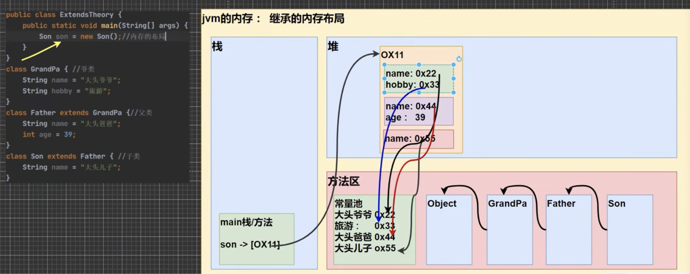
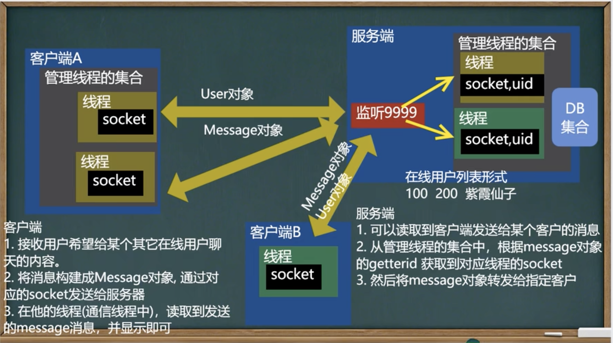

# java 45days by 韩顺平

## 第一阶段-java基础

**Java重要特点**

1. Java语言是面向对象的(oop)
2. Java语言是健壮的。Java的强类型机制、异常处理、垃圾的自动收集等是Java程序健壮性的重要保证.
3. Java语言是跨平台性的。[即：一个编译好的.class文件可以在多个系统下运行，这种特地称为跨平台] 由jvm来做的. jvm包含在jdk中
4. Java语言是解释型的[了解]
   解释性语言：javascript,PHP,java   编译性语言：c/c++
   区别是：解释性语言，编译后的代码，不能直接被机器执行，需要解释器来执行. 编译性语言，编译后的代码，可以直接被机器执行，c/c++.


**各种名词及关系**

| name | desc                    |
| ---- | ----------------------- |
| jdk  | java development kit    |
| jre  | java runtime evironment |
| jvm  | java virtual machine    |

jdk = jre + java的开发工具(java +  javac javadoc javap etc.)

jre = jvm + java的核心类库 --> 如果想要**运行**一个**开发好**的java程序,直接装jre即可.

xxx.java -- 源文件 

xxx.class -- 字节码文件


**开发注意事项** 

1. Java源文件以.java为扩展名。源文件的基本组成部分是类(class),如本类中的Hello类。
2.  Java应用程序的执行入口是main0方法。它有固定的书写格式：
   public static void main(String[]args){...}
3. Java语言严格区分大小写。
4. Java方法由一条条语句构成，每个语句以“;”结束。
5. 大括号都是成对出现的，缺一不可。[习惯，先写{}再写代码]
6. 一个源文件中最多只能有一个public类。其它类的个数不限。(但是编译后,有几个类就会有几个class文件)[演示]
7. 如果源文件包含一个public类，则文件名必须按该类名命名！
8. 一个源文件中最多只能有一个public类。其它类的个数不限，也可以将main方法写在非public类中，然后指定运行非public类，这样入口方法就是非public的main方法.


**java代码规范** 

1. 类、方法的注释，要以javadoc的方式来写。
2. 非Java Doc的注释，往往是给代码的维护者看的，着重告诉读者为什么这样写，如何修改，注意什么问题等
3. 使用tab操作，实现缩进，默认整体向右边移动，用shift+tab整体向左移
4. 运算符和=两边习惯性各加一个空格。比如：2+4*5+345-89
5. 源文件使用utf-8编码
6. 行宽度不要超过80字符
7. 代码编写`次行风格`和`行尾风格`


### 变量

- int	4bytes
- double  8 bytes
- char
- String 


**+**

1. 左右两边都是数值, 加法
2. 左右任意是字符串, 拼接


### 数据类型

- 基本数据类型
  - 数值型
    - 整数: byte[1] short[2] int[4] long[8] --   默认是int,声明long型常量需要在后面加上`l`或者`L`
    - 浮点数: float[4] double[8]  -- 默认是double,声明float要在后面加`f`或则`F`    `对浮点数判断大小关系时要小心.如果两数的差值在某个精度范围内,才判定二者相等`
  - 字符型
    - char[2]  `本质是数字`.字符类型可直接存放一个数字, 只能用`''`,`""`是字符串.可以进行运算
    - Boolean[1`存疑`] true false 不能用0或者非0的整数代替.
- 引用数据类型
  - 类 class
  - 接口 interface 
  - 数组 [] 

```java 
public class FloatDemo {
    public static void main(String[] args) {
        double num1 = 2.7;
        double num2 = 8.1/3;
        System.out.println(num1);
        System.out.println(num2);
        System.out.println(num1==num2);
        System.out.println(Math.abs(num1-num2));
        if (Math.abs(num1-num2)<0.000001){
            System.out.println("相等");
        }
      char c = 97; 
      System.out.println(c);
      ch1 = 'a';
      System.out.println((int)ch1);
      System.out.println('a' + 10);
    }
}
```


### java API 

[在线文档](http://www.matools.com)


### 基本数据类型的转换

#### 自动转换

`自动类型转换`:**当java程序在进行赋值或者运算时,精度小的类型自动转换为精度大的数据类型**

char -> int -> long -> float -> double 

byte -> short -> int -> long -> float -> double  


**自动转换细节**

1. 有多种类型的数据混合运算时，系统首先自动将所有数据转换成容量最大的那种数据类型，然后再进行计算。
2. 当我们把精度（容量）大的数据类型赋值给精度（容量）小的数据类型时，就会报错，反之就会进行自动类型转换。
3. byte,short和char之间不会相互自动转换。
4. `byte, short, char` 三者可以计算,在`计算时会首先转换为int类型`
5. boolean不参与转换
6. 自动提升原则: 表达式结果的类型自动提升为操作数中最大的类型


#### 强制转换 

是自动转换的逆过程,将容量大的数据类型转换为容量小的数据类型. 使用时要加上强制转换符`()`,但可能造成精度降低或溢出,格外小心.

**强制转换细节**

1. 当进行数据从大--->小,就需要用强制转化 
2. 强制符号只针对于最近的操作数有效, 往往会使用小括号提升优先级
3. char类型可以保存int的常量值,但不能保存int的变量值,需要强转
4. byte 和 short 在进行运算时, 当做int处理.


#### 基本数据类型和String的转换

- basic --> string 将基本类型的值 + "" 即可
- string --> basic 调用基本类型的`包装类`的parseXX方法

```java
public class StringToBasic {
    public static void main(String[] args) {
        //  basic to string 
        int a = 100;
        float b = 1.1F;
        double c = 8.1;
        boolean d = true; 
        String s1 = a + "";
        String s2 = b + "";
        String s3 = c + "";
        String s4 = d + "";
        System.out.println(s1);
        System.out.println(s2);
        System.out.println(s3);
        System.out.println(s4);

        // string to basic 
        String s5 = "123";
        int num1 = Integer.parseInt(s5);
        System.out.println(num1);
        double num2 = Double.parseDouble(s5);
        System.out.println(num2);
        float num3 = Float.parseFloat(s5);
        System.out.println(num3);
        long num4 = Long.parseLong(s5);
        System.out.println(num4);
        short num5 = Short.parseShort(s5);
        System.out.println(num5);
        byte num6 = Byte.parseByte(s5);
        System.out.println(num6);
        boolean num7 = Boolean.parseBoolean("true");
        System.out.println(num7);
        // 将字符串的第几个字符转换为char
        char ch = s5.charAt(2);
        System.out.println(ch);
    }
}

```


### 运算符

在java中, % 的本质是 `a % b = a - a / b * b` 注意这里的 a/b是直接去掉小数部分的(也就是直接取整)

ps : **python的的余数是按照整除（向下取整）得到的商来计算的。**


```java
int i =1;
i = i++; 
System.out.println(i); 
// 1 
// 1. temp =i; 2. i++; 3. i = temp

int i = 1;
i = ++i;
System.out.println(i);
// 2 
// 1. temp = ++i; 2. i = temp
```

```java
"233" instanceof String
```

| a     | b     | a&b   | a&&b  | a\|b  | a\|\|b | !a    | a^b   |
| ----- | ----- | ----- | ----- | ----- | ------ | ----- | ----- |
| true  | true  | true  | true  | true  | true   | false | false |
| true  | false | flase | false | true  | true   | false | true  |
| false | true  | false | false | true  | true   | true  | true  |
| false | false | false | false | false | false  | true  | false |


- 短路与&& 和逻辑与&
  - &&当第一个为假,后面不用判断了
  - &始终要全部判断
  - &&效率高
- 短路或|| 和 逻辑或|
  - || 当第一个为真,后面不用判断
  - | 始终要全部判断
  - ||效率高


复合赋值运算符 

+=

-+ 

*=

/=

%=

**存在类型(强制)转换**

#### 三元运算符

条件表达式? 表达式1:表达式2 

条件为真, 结果取1; 反之取2


**细节**

1. 表达式1和2 要为可以赋给接受变量的类型(或者可以自动转换)
2. 三元运算符可以转换为if else


#### 运算优先级 

1. 下表,优先级从高到底.
2. 只有单目运算符 和 赋值运算符是从右到左的.

|      | . () {} ; ,                    |
| ---- | ------------------------------ |
| R->L | ++  --  ~    !(data type)      |
| L->R | * / %                          |
| L->R | +   -                          |
| L->R | <<    >>    >>>    位移        |
| L->R | <   >   <=    >=    instanceof |
| L->R | !=     ==                      |
| L->R | &                              |
| L->R | ^                              |
| L->R | \|                             |
| L->R | &&                             |
| L->R | II                             |
| L->R | ？:                            |
| R->L | =   *=  /=   %=                |
|      | +=   -=  <<=    >>=            |
|      | >>>=   &=   ^=   \|=           |


#### 标识符命名规则

1. 26个大小写字母,数字,  下划线_ , $ 
2. 不可以数字开头
3. 不可以使用关键字和保留字
4. 区分大小写.
5. 不能包含空格

#### 命名规范

标识符命名规范

1. 包名：多单词组成时所有字母都小写：aaa.bbb.ccc
   比如com.hsp.crm
2. 类名、接口名：多单词组成时，所有单词的首字母大写：XxxYyyZzz
   比如：TankShotGame  `大驼峰`
3. 变量名、方法名：多单词组成时，第一个单词首字母小写，第二个单词开始每个单词首字母大写：xxYyyZzz
   比如：tankShotGame `小驼峰`
4. 常量名：所有字母都大写。多单词时每个单词用下划线连接：XXX_YYY_ZZZ
   比如：定义一个所得税率TAX_RATE 
5. 后面我们学习到类，包，接口，等时，我们的命名规范要这样遵守，更加详细的看文档.


###  进制

对于整数，有四种表示方式：

1. 二进制：0,1，满2进1.以0b或0B开头。
2. 十进制：0-9，满10进1。
3. 八进制：0-7，满8进1,以数字0开头表示。
4. 十六进制：0-9及A(10)-F(15),满16进1.以0x或0X开头表示。此处的A-F不区分大小写。

#### 位运算 

`计算用补码`

`看计算结果用原码`

| 符号 | 意义     |
| ---- | -------- |
| >>   | 位右移   |
| <<   | 位左移   |
| >>>  | 算数右移 |
| ~    | 按位取反 |
| &    | 按位与   |
| \|   | 按位或   |
| ^    | 按位异或 |


\>> 低位溢出,用符号位补高位.

<< 符号位不变,低位补0

\>>>无符号右移,低位溢出,高位补0

没有<<<这个东西.

m\>>n,本质上就是$m/2^n$

m<<n,本质上是$m*2^n$


### 顺序控制

```java
if () {
  
}
else if () {
  
}
else {
  
}
```

```java
// 歌手比赛, 成绩大于8进入决赛,否则淘汰, 并根据性别提示进入男子组/女子组.
import java.util.Scanner;
public class If02 {
    public static void main(String[] args) {
        
        Scanner myScanner = new Scanner(System.in);
        System.out.println("请输入你的成绩:");
        double score = myScanner.nextDouble();
        if (score < 0 || score > 10){
            System.out.println("成绩范围有误,必须要在0-10之间.");
        }
        else {
            if (score > 8.0) {
                System.out.println("请输入你的性别:");
              	// 接收字符的方法就是先接收字符串, 接着取其第0位.
                char gender = myScanner.next().charAt(0);
                if (gender == '男') {
                    System.out.println("进入男子决赛组.");
                }
                else if (gender == '女') {
                    System.out.println("进入女子决赛组.");    
                }
                else {
                    System.out.println("进入无性别组.");
                }
            }
            else {
                System.out.println("你被淘汰了.");
            }
        }           
    }
}

```

```java
// switch 
switch(expr) {
  case 常量1:
    code ...;
    break;
  case 常量2:
    code ...;
    break;
  default:
    code...;
    // break;
}

```

**switch有穿透的现象**

即: 假如某个case里没有写break, 将当前case里的代码执行后,会直接跳进它下一个case里.

**switch细节**

1. 表达式数据类型，应和case后的常量类型一致，或者能`自动转成`可以相互比较的类型，比如输入的是字符，而常量是int
2. switch(表达式)中表达式的返回值必须是：(byte,short,int,char,enum,`String`)[注意不在switch语句里,String判断相等的方法.]
3. case子句中的值必须是常量，而不能是变量
4. default子句是可选的，当没有匹配的case时，执行default
5. break语句用来在执行完一个case分支后使程序跳出switch语句块；如果没有写break,程序会顺序执行到switch结尾

```java
// 穿透的一个例子
int month = myScanner.nextInt();
switch(month) {
  case 3:
  case 4: 
  case 5: 
    System.out.println("spring");
    break;
  case 6: 
  case 7: 
  case 8: 
    System.out.println("Summer");
    break;
 //  ...
    
}
```


### 循环控制

```java
for(循环变量初始化;循环条件;循环变量迭代) {
  循环操作;
}
```

**细节**

1. 循环条件是返回一个布尔值的表达式

2. for(循环判断条件)中的初始化和变量迭代可以写到其它地方，但是两边的分号不能省略 
   ```java
   for(;循环条件;) {
   
   }
   ```

   

3. 循环初始值可以有多条初始化语句，但要求类型一样，并且中间用逗号隔开，循环变量迭代也可以有多条变量迭代语句，中间用逗号隔开。

---

```java
循环变量初始化;
while(循环条件) {
  循环体;
  循环变量迭代;
}
```

**细节**

1. 循环条件是返回一个布尔值的表达式
2. while是先判断再执行.

---

```java
循环变量初始化;
do {
  循环体;
  循环变量迭代;
}while(循环条件);
```

1. 先执行,再判断. 总会执行1次
2. 最后有一个分号.

---

 break可以通过指定label来明确终止的是哪一层循环. 没指定就跳出最近的一个循环.

```java
label1: 
for (int j =0; j < 4; j++) {
  label2:
  for (int i =0; i < 10; i++) {
    if (i == 2) {
      break label1;
    }
    System.out.println("i = " + i);
  }  
}
```

ps: 只要是在循环前写`xx: `, 就可以确定它是个标签.

`在实际开发中,不建议使用标签.`

continue 也可以带标签


### 数组

数组的使用 

```java
// 动态初始化 1
int[] a = new int[5];

// 等价与
// int a[] = new int[5];

// 动态初始化 2 
// 先声明
int[] a;

// 再创建
a = new int[10];

// 静态初始化 3
int[] a  = {2,4,5,6,7,9}
// 等价于 
int[] a = new int[6];
a[0]=2;
a[1]=4;
...
// 等价于 
int[] a = new int[]{2,4,6,9,10,11}
```


1. 数组是多个相同类型数据的组合，实现对这些数据的统一管理
2. 数组中的元素可以是任何数据类型，包括基本类型和引用类型,但是不能混用。
3. 数组创建后，如果没有赋值，有默认值
   int 0, short 0, byte 0, long 0,
   float 0.0 ,double 0.0 ,char \u0000,
   boolean false,  String null
4. 使用数组的步骤
   1. 声明数组并开辟空间
   2. 给数组各个元素赋值
   3. 使用数组
5. 数组的下标是从0开始的。
6. 数组下标必须在指定范围内使用，否则报：下标越界异常，比如
   int[]arr=new int[5]:则有效下标为0-4
7. 数组属引用类型，数组型数据是对象(object)

#### 数组拷贝

jvm内存里, 基本数据类型存放在栈里, 引用类型存放在堆里.

 

#### 数组扩容

- 挺麻烦的, 先定义一个新数组, 将原先值循环放进新的,最后将原数组指向新数组.
- 缩减也是同样的道理.
- 使用`链表扩容`更方便.

```java
import java.util.Scanner;
public class ArrayAdd02 {
    public static void main(String[] args) {
        int[] arr = {1, 2, 3};
        Scanner sc = new Scanner(System.in);
        do {
            int[] arr2 = new int[arr.length + 1]; 
            System.out.println("请输入一个整数：");
            int num = sc.nextInt();
            for (int i = 0; i < arr.length; i++) {
                arr2[i] = arr[i];
            }
            arr2[arr.length] = num;
            arr = arr2;
            System.out.println("数组扩容后的元素为：");
            for (int i = 0; i < arr.length; i++) {
                System.out.print(arr[i] + " ");
            }
            System.out.println("是否继续添加？（y/n）");
            String choice = sc.next();
            if (choice.equals("n")) {
                break;
            }
        } while (true);
        sc.close();
        System.out.println("程序结束！");
    }
}
```

### 排序

- 内部排序: 将所有的数据加载到内存中进行排序(交换, 选择, 插入)
- 外部排序: 借助外存进行排序.(合并排序, 直接合并排序)

### 查找

-  顺序查找
- 二分查找 (要求数组是有序的.)

### 二维数组

```java
public class TwoDiArray {
    public static void main(String[] args) {
        int[][] aa = {{0,0,0,0,0,0},{1,1,1,1,1,1,},{0,2,0,3,0,0},{0,0,0,0,0,0}};
        for (int i = 0; i< aa.length; i++) {
            for (int j =0; j < aa[i].length; j++) {
                System.out.print(aa[i][j]);
            }
            System.out.println();
        }
    }
}

```

#### 内存布局

```java
// 动态初始化 1
int[][] a = new int[2][3];

// 当然也可以先声明再开空间.2

// 创建二维数组,只确定一维数组的个数.(有3个一维数组.)
int[][] arr = new int[3][];
for (int i =0; i<3; i++) {
  arr[i] = new int[i+1];
  
  for (int j =0; j < a[i].length; j++) {
    arr[i][j] = i+1;
  }
}

// 静态初始化. 3 
```


**细节**

1. 一维数组的声明方式有：
   ```java
   int x[];
   int[] x;
   ```

   

2. 二维数组的声明方式有：
   ```java
   int x[][];
   int[][] x;
   ```

   

3. 二维数组实际上是由多个一维数组组成的，它的各个一维数组的长度可以相同，也可以不相同。比如：map\[][]是一个二维数组
   map\[][]={{1,2},{3,4,5}}
   map[0]是一个含有两个元素的一维数组，map[1]是一个含有三个元素的一维数组，我们也称为列数不等的二维数组。


### 类与对象 

对象是类的实例.

#### 属性

**对象在内存中的存在形式** 
Java内存的结构分析

1. 栈：一般存放基本数据类型(局部变量）
2. 堆：存放对象(Cat cat,数组等)
3. 方法区：常量池(常量，比如字符串),类加载信息
4. 示意图[Cat(name,age,price)]


**属性/成员变量---基本介绍**

1. 从概念或叫法上看：成损变量=属性=field(即成损变量是用来表示属性
   的，授课中，统一叫属性)
   案例演示：Car(name,price,color)
2. 属性是类的一个组成部分，一般是基本数据类型，也可是引用类型（对象，数组）
   比如我们前面定义猫类的int age就是属性

**注意事项和细节说明**

1. 属性的定义语法同变量，示例：`访问修饰符`   属性类型   属性名
   简单介绍访问修饰符: 控制属性的访问范围. public    protected   默认  private
2. 属性的定义类型可以为任意类型，包含基本类型或引用类型
3. 属性如果不赋值，有默认值，规则和数组一致。

#### 方法

```java
public class MethodDemo {
    public static void main(String[] args) {
        Person me = new Person();
        me.name = "鼠鼠";
        me.age = 23;
        me.speak();
        me.cal(100);
        int result = me.getSum(5,6);
        System.out.println(result);    
    }
}

class Person {
    String name;
    int age;

    // public 表示方法公开
    // void 该方法没有返回值
    // speak() speak方法名  ()形参列表
    //  {} 方法体
    public void speak() {
        System.out.println(name+"我啊,是一个好人~");
    }

    public void cal(int n) {
        double sum = .0;
        for (int i=1; i< n+1;i++) {
            sum +=i;
        }
        System.out.println("1+2+...+"+n+"="+sum);
    }

    // int: 方法执行后, 返回一个int值.
    public int getSum(int x, int y) {
        // System.out.println(x+"+"+y+"="+(x+y));
        return x+y;
    }
}

```


 

**注意事项和使用细节**

- 访问修饰符（作用是控制方法使用的范围）
  如果不写默认访问，[有四种：public,protected,默认，private],具体在后面说
- 返回数据类型
  1. 一个方法最多有一个返回值[思考，如何返回多个结果?] --> 数组
  2. 返回类型可以为任意类型，包含基本类型或引用类型（数组，对象）
  3. 如果方法要求有返回数据类型，则方法体中最后的执行语句必须为return值；而且要求返回值类型必须和return的值类型一致或兼容
  4. 如果方法是void,则方法体中可以没有return语句，或者只写return;  
- 方法名
  遵循驼峰命名法，最好见名知义，表达出该功能的意思即可，比如得到两个数的和getSum,开发中按照规范

- 形参列表
  1. 一个方法可以有0个参数，也可以有多个参数，中间用逗号隔开，比如getSum(int x,int y)
  2. 参数类型可以为任意类型，包含基本类型或引用类型，比如printArr(int\[][] map)
  3. 调用带参数的方法时，一定对应着参数列表传入相同类型或兼容类型的参数！[getSum]
  4. 方法定义时的参数称为形式参数，简称形参；方法调用时的参数称为实际参数，简称实参，实参和形参的类型要一致或兼容、个数、顺序必须一致.
- 方法体
  里面写完成功能的具体的语句，可以为输入、输出、变量、运算、分支、循环、方法调用，但里面`不能再定义方法`！即：方法不能嵌套定义。

- 方法细节调用说明
  1. 同一个类中的方法调用：直接调用即可。比如print(参数)：
  2. `跨类`中的方法A类调用B类方法：需要`通过对象名`调用。比如`对象名.方法名(参数)`；
     实例化被调用的对象, 取其方法.
  3. 特别说明一下：`跨类`的`方法调用`和方法的`访问修饰符相关`，先暂时这么提一下. 后面我们讲到访问修饰符时，还要再细说。

#### 方法传参机制 

基础类型  -- 形参改变`不会影响`实参

引用类型 -- 形参改变`会影响`实参

> 关于引用类型的形参改变有两种情况.
>
> 1. 形参肯定是和实参指向同一个堆地址的.
> 2. 如果此时在函数里, 形参改变了指向, 比如指向别的堆地址,或者常量池地址, 此时它是不会影响到实参的(因为实参仍然指向原先的地址).
> 3. 如果在函数里, 形参改变的是堆地址里的内容, 那么这种情况实参是会被影响到的.


### 递归问题

**递归重要规则**

1. 执行一个方法时，就创建一个新的受保护的独立空间（栈空间）
2. 方法的局部变量是独立的，不会相互影响
3. 如果方法中使用的是引用类型变量（比如数组），就会共享该引用类型的数据.
4. 递归必须向退出递归的条件逼近，否则就是无限递归，出现StackOverflowError,死龟了: (
5. 当一个方法执行完毕，或者遇到return, 就会返回，遵守谁调用就将结果返回给谁，同时当方法执行完毕或者返回时，该方法也就执行完毕。

### 作业

eg : 递归八皇后


### 重载(overload) 

java中允许同一个类中，多个`同名方法`的存在，但要求`形参列表不一致`！

- 个数
- 类型
- 顺序

比如：System.out.println(); out是PrintStream类型

- 重载的好处
  - 减轻了起名的麻烦
  - 减轻了记名的麻烦

**注意事项和使用细节**

1. 方法名：必须相同
2. 参数列表：必须不同（参数类型或个数或顺序，至少有一样不同，参数名无要求)
3. 返回类型：无要求  (也就是说判断是否重载, 从名字看到参数就行了.)


### 可变参数

java 允许将同一个类中多个`同名同功能`, 但是`参数个数不同`的方法,`封装`成`一个方法`.通过可变参数实现.

**基本语法**

```java
访问修饰符 返回类型 方法名 (数据类型... 形参名) {

}
```


**注意事项和使用细节**
VarParameterDetail.java

1. 可变参数的实参可以为0个或任意多个
2. 可变参数的实参可以为数组
3. 可变参数的本质就是数组
4. 可变参数可以和普通类型的参数一起放在形参列表，但必须保证可变参数在最后
5. 一个形参列表中只能出现一个可变参数


### 作用域

1. 在java编程中，主要的变量就是属性（成员变量）和局部变量
2. 我们说的局部变量一般是指在成员方法中定义的变量。
3. java中作用域的分类
   全局变量：也就是属性，作用域为整个类体
   局部变量：也就是除了属性之外的其他变量，作用域为定义它的代码块中！
4. 全局变量可以不赋值，直接使用，因为有默认值，局部变量必须赋值后，才能使用，因为没有默认值。


**注意事项和使用细节**

1. 属性和局部变量可以重名，访问时遵循`就近原则`
2. 在同一个作用域中，比如在同一个成员方法中，两个局部变量，不能重名
3. 属性生命周期较长，伴随着对象的创建而创建，伴随着对象的死亡而死亡。局部变量，生命周期较短，伴随着它的代码块的执行而创建，伴随着代码块的结束而死亡。即在一次方法调用过程中。
4. 作用域不同
   全局变量：可以被本类使用，或其他类使用 (通过对象调用)
   局部变量：只能在本类中对应的方法中使用
5. 修饰符不同
   全局变量/属性可以加修饰符
   局部变量不可以加修饰符

### 构造器/构造方法 

相当于`def __init__()`

**基本语法**

```java
[修饰符] 方法名 (形参列表) {
  方法体;
}
```

1. 构造器的修饰符可以默认
2. 构造器`没有返回值`
3. 方法名必须和类名一样
4. 参数列表遵守成员方法一样的规则
5. 构造器的调用由系统完成 (在创建对象时,系统会自动调用构造器完成对象的`初始化`)


**注意事项和使用细节**

1. 一个类可以定义多个不同的构造器，即构造器重载
   比如：我们可以再给Person类定义一个构造器，用来创建对象的时候，只指定人名，不需要指定年龄
2. 构造器名和类名要相同
3. 构造器没有返回值
4. 构造器是完成对象的初始化，并不是创建对象
5. 在创建对象时，系统自动的调用该类的构造方法
6. 如果程序员没有定义构造方法，系统会自动给类生成一个默认无参构造方法(也叫默认构造方法) 可以用`javap`反编译看看.
7. 一旦定义了自己的构造器，默认的构造器就`覆盖`了，就不能再使用默认的无参构造器，除非显式地定义一下，即：Person(){}


### this

相当于`self`

可以用hashCode()来看一下两个同类对象是不是同一个...

**细节**

1. this关键字可以用来访问本类的属性、方法、构造器
2. this用于区分当前类的属性和局部变量
3. 访问成员方法的语法：this.方法名（参数列表）
4. 访问构造器语法：this(参数列表);   注意只能在`构造器中使用`(只能在构造器中访问另一个构造器,且必须放在首行)
5. this不能在类定义的外部使用，只能在类定义的方法中使用


### 包

**作用**

1. 区别相同名字的类 
2. 当类很多时,可以很好地管理类 
3. 控制访问范围 

**基本语法** 

```java
package com.haha;
// package 关键字, 表示打包 
// com.haha 表示包名
```

**本质上就是创建不同的文件夹来保存类文件.**


**包的命名**

- 命名规则
  只能包含数字、字母、下划线、小圆点，但不能用数字开头，不能是关键字或保留字
  demo.class.exec1  // no, class 是关键字
  demo.12a // no // no, 数字开头
  demo.ab12.oa
- 命名规范
  一般是小写字母+小圆点一般是
  com.公司名.项目名.业务模块名
  比如：com.hspedu.oa.model;  com.hspedu.oa.controller;
  举例：
  com.sina.crm.user /用户模块
  com.sina.crm.order /订单模块
  com.sina.crm.utils //工具类
- 常用的包
  *表示全部的类, 建议使用哪个类就导入哪个类.
  - java.lang.*  // 基本包, 默认引用
  - Java.util.*  // 工具包, Scann在这里.
  - java.net.*   // 网络包,网络开发
  - java.awt.*  // 界面开发 gui


**注意事项和使用细节**

1. package的作用是`声明当前类所在的包`, 需要放在class的最上面, 一个类中最多只有一句package
2. import指令位置放在package的下面，在类定义前面，可以有多句且没有顺序要求


### 访问修饰符 

java提供四种访问控制修饰符号控制`方法和属性（成员变量）`的`访问权限（范围）`

1. 公开级别：用public修饰，对外公开
2. 受保护级别：用protected修饰，对子类和同一个包中的类公开
3. 默认级别：没有修饰符号，向同一个包的类公开
4. 私有级别：用private修饰，只有类本身可以访问，不对外公开.


| 访问级别 | 修饰符     | 同类 | 同包 | 子类 | 不同包 |
| -------- | ---------- | ---- | ---- | ---- | ------ |
| 公开     | public     | √    | √    | √    | √      |
| 受保护   | protected  | √    | √    | √    | ×      |
| 默认     | 没有修饰符 | √    | √    | ×    | ×      |
| 私有     | private    | √    | ×    | ×    | ×      |

**使用的注意事项**

1. 修饰符可以用来修饰类中的属性，成员方法以及类
2. 只有`默认`和`public`才能`修饰类`！并且遵循上述访问权限的特点。
3. 因为没有学习继承，因此关于在子类中的访问权限，我们讲完子类后，在回头讲解
4. 成员方法的访问规则和属性完全一样

```sh
# 使用案例在Modifier开头的文件里
.
├── use
│   ├── Import01.java
│   ├── ModifierU2.java
│   ├── ModifierUse.java
│   └── Test.java
├── xiaoming
│   ├── Dog.java
│   └── ModifierU3.java
└── xiaoqiang
    └── Dog.java
```


### 封装

面向对象编程(OOP)的三大特征

- 封装(encapsulation)
- 继承(inheritance)
- 多态(polymorphism)


**封装**就是把抽象出的数据[`属性`]和对数据的操作[`方法`]封装在一起,数据被保护在内部,程序的其他部分只有通过`被授权`的操作[`方法`],才能对数据进行操作.

**好处**

- 隐藏细节  方法 <---调用
- 可以对数据进行验证, 保证安全合理

**封装的实现步骤**

1. 将属性进行私有化(`private`)【不能直接修改属性】

2. 提供一个公共(`public`)的set方法，用于对属性判断并赋值

   ```java
   public void setXxx(类型参数名){
     //加入数据验证的业务逻辑
     属性=参数名：
   }
   ```

   

3. 提供一个公共(`public`)的get方法，用于获取属性的值

   ```java
   public XX getXxx(){//权限判断
   	return xx;
   }
   ```

   

**将构造器与setXX结合**


### 继承 

**语法**

```java
class 子类 extends 父类 {
  代码行;
}
```

**细节**

1. 子类继承了所有的属性和方法,但私有属性和方法不能在子类直接访问,可以通过父类提供的公共方法去访问.
2. 子类必须调用父类的构造器完成父类的初始化 `super()`
3. 当创建子类对象时,不管使用子类的哪个构造器,默认情况总会去`调用父类的无参构造器`,如果父类`没有提供`无参构造器,则`必须在子类的构造器中用super去指定使用父类的哪个构造器`完成对父类的初始化工作,否则编译不会通过.
4. 如果希望指定去调用父类的某个构造器,则显式的调用一下 `super(参数列表)`
5. super只能在构造器中使用，且需要放在构造器第一行
6. super()和this()都只能放在构造器第一行，因此这两个方法不能共存在一个构造器
7. java所有类都是Object类的子类.
8. 父类构造器的调用不限于直接父类,将一直向上追溯知道Object类(顶级父类)
9. 子类最多只能继承一个父类(指 直接继承) ,即java是单继承机制.
10. 不能滥用继承,子类和父类之间必须满足is-a的逻辑关系.



### super

代表父类的引用, 用于访问父类的属性,方法,构造器

1. 访问父类的属性，但不能访问父类的private属性[案例]
   super.属性名；
2. 访问父类的方法，不能访问父类的private方法
   super.方法名（参数列表）；
3. 访问父类的构造器（这点前面用过）：
   super(参数列表)：只能放在构造器的第一句，只能出现一句！

**细节**

1. 调用父类的构造器的好处 (分工明确，父类属性由父类初始化，子类的属性由子类初始化)
2. 当子类中有和父类中的成员（属性和方法）`重名`时，为了`访问父类的成员`，`必须通过super`。如果没有重名，使用super、this、直接访问是一样的效果！
3. super的访问不限于直接父类，如果爷爷类和本类中有同名的成员，也可以使用super:去访问爷爷类的成员；如果多个基类中都有同名的成员，使用superi访问遵循就近原则。A->B->C

- super和this 的区别

| No.  | 区别点     | this                                                   | Super                                     |
| ---- | ---------- | ------------------------------------------------------ | ----------------------------------------- |
| 1    | 访问属性   | 访问本类中的属性，如果本类没有此属性则从父类中继续查找 | super 访问父类中的属性                    |
| 2    | 调用方法   | 访问本类中的方法，如果本类没有此方法则从父类继续查找.  | 直接访问父类中的方法                      |
| 3    | 调用构造器 | 调用本类构造器，必须放在构造器的首行                   | 调用父类构造器，必须放在子 类构造器的首行 |
| 4    | 特殊       | 表示当前对象                                           | 子类中访问父类对象                        |

### 方法重写/覆盖(override)

`属性没有重写`

简单的说：方法覆盖（重写）就是子类有一个方法，和父类的某个方法的`名称、返回类型、参数`一样，那么我们就说子类的这个方法覆盖了父类的那个方法

**细节**

1. 子类的方法的`参数`，`方法名称`，要和父类方法的参数，方法名称`完全一样`。
2. 子类方法的`返回类型`和父类方法返回类型`一样`，`或`者是父类返回类型的`子类`. 
   比如父类返回类型是Object,子类方法返回类型是String
3. 子类方法`不能缩小`父类方法的`访问权限`


- 重载和重写的对比

| 名称            | 发生范围 | 方法名   | 形参列表                          | 返回类型                                                     | 修饰符                               |
| --------------- | -------- | -------- | --------------------------------- | ------------------------------------------------------------ | ------------------------------------ |
| 重载(overload)  | 本类     | 必须一样 | 类型，个数或者顺 序至少有一个不同 | 无要求                                                       | 无要求                               |
| 重写（override) | 父子类   | 必须一样 | 相同                              | 子类重写的方法,返回的类型和父 类返回的类型一致，或者是其子类 | 子类方法不能缩小父类方法的访问范围 . |


### 多态

方法或对象具有多种形态.

方法: 重写和重载就体现多态

**对象的多态** 核心

`父类的引用是可以指向它子类的对象的`

1. 一个对象的`编译类型`和`运行类型`可以不一致
2. 编译类型在定义对象时，就确定了，不能改变
3. 运行类型是可以变化的, 通过`getClass()`查看运行类型
4. 编译类型看定义时=号的左边，
   运行类型看=号的右边

```java
Animal animal = new Dog();
// animal 编译类型是Animal, 运行类型是Dog
animal = new Cat();
// animal 的运行类型变成了Cat,但编译类型始终是Animal
```

**细节**

多态的前提是：两个对象（类）存在继承关系

**多态的向上转型**

1. 本质：父类的引用指向了子类的对象
2. 语法：父类类型 引用名 = new 子类类型();
3. 特点：编译类型看左边，运行类型看右边。
   可以调用父类中的所有成员（需遵守访问权限），
   `不能调用子类中特有成员`；   ---> 因为在编译阶段,能调用哪些成员是由编译类型决定的.
   最终`运行效果看子类的具体实现`！

**多态的向下转型**

1. 语法：子类类型 引用名 =（子类类型）`父类引用`;
2. 只能强转父类的引用，不能强转父类的对象
3. 要求父类的引用必须指向的是当前目标类型的对象
4. 向下转型后可以调用子类类型中所有的成员

`属性没有重写,编译类型是什么,属性就取编译类型的值`

`instanceof`用来判断对象的`运行类型`是否为x类型或者x类型的子类


<font size=5 color='crimson'>属性 -- 看编译类型</font>

<font size=5 color='crimson'>方法 -- 看运行类型</font>

### 动态绑定机制

java的动态绑定机制

1. 当调用对象`方法`的时候，`该方法会和该对象的内存地址/运行类型绑定`
2. 当调用对象`属性`时，`没有动态绑定机制`，哪里声明，哪里使用

```java
class A { //  base class
  public int i =10;
  
  public int sum() {
    return getI() + 10;
  }
  
  public int sum1() {
    return i + 10;
  }
  
  public getI() {
    return i;
  }
}

class B extends A { // sub class 
  public int i = 20; 
  
  public int sum() {
    return i + 20;
  }
  
  public int sum1() {
    return i + 10;
  }
  
  public getI() {
    return i;
  } 
}


// main 
A a = new B();
sout(a.sum()); // 40
sout(a.sum1());  // 30 
```

```java
// what if we cancle the sum() in B
class B extends A { // sub class 
  public int i = 20; 
  
 // public int sum() {
  //  return i + 20;
  //}
  
  public int sum1() {
    return i + 10;
  }
  
  public getI() {
    return i;
  } 
}

// main 
A a = new B();
sout(a.sum()); // 30 
sout(a.sum1());  // 30 
```

```java
// what if we cancle the sum1() in B, too.
class B extends A { // sub class 
  public int i = 20; 
  
 // public int sum() {
  //  return i + 20;
  //}
  
//  public int sum1() {
 //   return i + 10;
  //}
  
  public getI() {
    return i;
  } 
}

// main 
A a = new B();
sout(a.sum()); // 30 
sout(a.sum1());  // 20
```


### 多态的应用-- 多态数组

数组的定义类型是父类类型, 里面保存的实际元素类型是子类类型.

### 多态参数 

方法定义的形参类型是父类类型,实参类型允许为子类类型

### equals

== 是一个比较运算符

- 基本类型和引用类型都可以判断
- 当判断`基本类型`时,判断的是`值是否相等`
- 当判断`引用类型`时,判断的是`地址是否相等`

equals

- 是Object类中的方法, 只能判断引用类型
- 默认判断地址, 子类往往重写,判断内容是否相等,比如Integer, String

### hashCode 

返回对象的哈希码值, 其是为了提高哈希表的性能.

1. 提高具有哈希结构的容器的效率！

2. 两个引用，如果指向的是同一个对象，则哈希值肯定是一样的！

3. 两个引用，如果指向的是不同对象，则哈希值(绝大多数情况下)是不一样的

4. 哈希值主要根据地址号来的, 不能完全将哈希值等价于地址。

5. 案例演示
   ```java
   A obj1 = new A();
   A obj2 = new A();
   A obj3 = obj1;
   ```

   

6. 后面在集合中，hashCode如果需要的话，也会重写

### toString 

默认返回: 全类名(包名+类名)+@+哈希值的十六进制

子类往往重写该方法.

当直接输出一个对象时,toString方法被默认调用

### finalize

1. 当对象被回收时，系统自动调用该对象的finalize方法。子类可以重写该方法，做一些释放资源的操作(比如: 数据库连接, 打开的文件...)
2. 什么时候被回收：当某个对象没有任何引用时，则就认为这个对象是一个垃圾对象，就会使用垃圾回收机制来销毁该对象，在销毁该对象前，会先调用finalize方法。
3. 垃圾回收机制的调用，是由系统来决定，也可以通过System.gc()主动触发垃圾回收机制

在实际开发中几乎不用 2333


## 第二阶段

 

### 类变量/静态变量

类变量也叫静态变量/静态属性，是该类的所有对象共享的变量，任何一个该类的对象去访问它时，取到的都是相同的值,同样任何一个该类的对象去修改它时，修改的也是同一个变量。

**如何定义**

```java
访问修饰符 static 数据类型 变量名; [推荐]
static 访问修饰符 数据类型 变量名;
```

**如何访问**

`类名.类变量名`   [推荐] [言外之意,即使没有创建对象也可以访问]

对象名.类变量名

`静态变量的访问修饰符是和普通属性一样的.`

**两个共识**

- 被同一个类的所有对象实例共享
- static类变量在类加载之时就生成了

**static对象保存在哪里**

两种说法

1. 方法区里的静态域   (jdk8之前)
2. 堆里class实例的尾部   (之后)


 

**细节**

1. 什么时候需要用类变量
   当我们需要让某个类的所有对象都共享一个变量时，就可以考虑使用类变量（静态变量)：比如：定义学生类，统计所有学生共交多少钱。Student(name,fee)
2. 类变量与实例变量（普通属性）区别
   类变量是该类的所有对象共享的，而实例变量是每个对象独享的。
3. 加上static称为类变量或静态变量，否则称为实例变量/普通变量/非静态变量
4. 类变量可以通过类名.类变量名或者对象名.类变量名来访问，但java设计者推荐我们使用类名类变量名方式访问。【前提是满足访问修饰符的访问权限和范围】
5. 实例变量不能通过类名.类变量名方式访问。
6. 类变量是在类加载时就初始化了，也就是说，即使没有创建对象，只要类加载了，就可以使用类变量了。
7. 类变量的生命周期是随类的加载开始，随着类消亡而销毁。


### 类方法/静态方法

**形式**

```java
访问修饰符 static 数据返回类型 方法名() {代码块} [推荐]
static 访问修饰符 数据返回类型  方法名() {代码块}
```

调用: `类名.类方法名`  or  对象名.类方法名

**使用场景**
当方法中不涉及到任何和对象相关的成员, 则可以将方法设计成静态方法,提高开发效率

比如 utils, Math, Arrays, Collections

在程序员实际开发中,往往会将一些通用的方法,设计成静态方法,这样不需要创建对象就可以使用了,比如打印一维数组,冒泡排序,完成某个计算任务...

<font color='crimson'>静态方法可以new一个对象</font>

**细节**

1. 类方法和普通方法都是随着类的加载而加载，将结构信息存储在方法区.
   类方法中无this的参数
   普通方法中隐含着this的参数
2. 类方法可以通过类名调用，也可以通过对象名调用
3. 普通方法和对象有关，需要通过对象名调用，比如对象名.方法名（参数），不能通过类名调用
4. `类方法中不允许`使用和`对象有关的关键字`，比如`this`和`super`.  普通方法（成员方法）可以
5. 类方法（静态方法）中只能访问静态变量或静态方法
6. 普通成员方法，既可以访问普通变量（方法）,也可以访问静态变量（方法）

小结：`静态方法，只能访问静态的成员，非静态的方法，可以访问静态成员和非静态成员(必须遵守访问权限)`

### main方法

1. java虚拟机需要调用类的main()方法，所以该方法的访问权限必须是public
2. java虚拟机在执行main()方法时不必创建对象，所以该方法必须是static
3. 该方法接收String类型的数组参数，该数组中保存执行java命令时传递给所运行的类的参数
4. java  执行的程序  参数1  参数2  参数3

**提示**

1. 在main()方法中，我们可以直接调用main方法所在类的静态方法或静态属性。
2. 但是，不能直接访问该类中的非静态成员，必须创建该类的一个实例对象后，才能通过这个对象去访问类中的非静态成员，

### 代码块

代码化块又称为初始化块，属于类中的成员, 即是类的一部分，类似于方法，将逻辑语句封装在方法体中，通过{} 包围起来。但和方法不同，没有方法名，没有返回，没有参数，只有方法体，而且不用通过对象或类显式调用，而是`加载类时,或创建对象时隐式调用`。

**语法**

```java
[修饰符] {
  代码;
};  
```

**注意**

1. 修饰符可选，要写的话，也只能写static
2. 代码块分为两类，使用static修饰的叫静态代码块，没有static修饰的，叫普通代码块。
3. 逻辑语句可以为任何逻辑语句（输入 输出 方法调用 循环 判断等）
4. ;可以写上，也可以省略。

**好处**

1. 相当于另外一种形式的构造器（对构造器的补充机制), 可以做初始化的操作
2. 场景: 如果多个构造器中都有重复的语句，可以抽取到初始化块中，提高代码的重用性
3. 执行顺序在构造器前

**细节**

1. `static代码块`也叫静态代码块，作用就是对类进行初始化，而且它随着`类的加载而执行`，并且`只会执行一次`。如果是普通代码块，每创建一个对象，就执行。

2. <font color = 'crimson'>类什么时候被加载 </font>

   1. 创建对象实例时(new)
   2. 创建子类对象实例，父类也会被加载
   3. 使用类的静态成员时（静态属性，静态方法）

3. `普通代码块`，在`创建对象实例`时，会被隐式的`调用`。每被`创建一次`，就会`调用一次`。`如果只是使用类的静态成员时，普通代码块并不会执行。`

4. <font color='crimson'>创建一个对象时，在一个类调用顺序是</font>

   1. 调用静态代码块和静态属性初始化（注意：静态代码块和静态属性初始化调用的优先级一样，如果有多个静态代码块和多个静态变量初始化，则按他们定义的顺序调用)
   2. 调用普通代码块和普通属性的初始化（注意：普通代码块和普通属性初始化调用的优先级一样，如果有多个普通代码块和多个普通属性初始化，则按定义顺序调用)
   3. 调用构造方法。

5. 构造方法（构造器）的最前面其实隐含了super()和调用普通代码块. 静态相关的代码块，属性初始化，在类加载时,就执行完毕,因此是优先于构造器和普通代码块执行的.

   ```java
   class A {
     public A() {
       super();
       //调用普通代码块
       System.out.prinln("ok");
     }
   }  
   ```

6. 我们看一下创建一个子类时（继承关系），他们的静态代码块，静态属性初始化，普通代码块，普通属性初始化，构造方法的调用顺序如下：

   1. 父类的静态代码块和静态属性（优先级一样，按定义顺序执行）
   2. 子类的静态代码块和静态属性（优先级一样，按定义顺序执行）
   3. 父类的普通代码块和普通属性初始化（优先级一样，按定义顺序执行）
   4. 父类的构造方法
   5. 子类的普通代码块和普通属性初始化（优先级一样，按定义顺序执行）
   6. 子类的构造方法

7. 静态代码块只能直接调用静态成员,普通代码块可以调用任意成员

###  单例设计模式

#### 饿汉式

**步骤**

1. 构造器私有化  --> 防止直接 new
2. 类的内部`创建`对象
3. 向外暴露一个静态的公共方法 getInstance

```java
public class SingleTon01 {
    public static void main(String[] args) {
        GirlFriend a = GirlFriend.getInstance();
        GirlFriend b = GirlFriend.getInstance();
        System.out.println(a);
        System.out.println(b);
        System.out.println(a==b);


    }
}

class GirlFriend {
    private String name;
    private static GirlFriend gf = new GirlFriend("tami");

    private GirlFriend(String name) {
        this.name = name;
    }

    public static GirlFriend getInstance() {
        return gf;
    }

    @Override
    public String toString() {
        return "GirlFriend{" +
                "name='" + name + '\'' +
                '}';
    }
}
```

#### 懒汉式 

1. 构造器私有化
2. `定义`一个static静态属性对象
3. 提供public的static方法,返回一个对象.

```java
public class SingleTon02 {
    public static void main(String[] args) {
        Wife a = Wife.getInstance();
        Wife b = Wife.getInstance();
        System.out.println(a);
        System.out.println(b);
        System.out.println(a==b);


    }
}

class Wife {
    private String name;
    private static Wife wife = null;

    private Wife(String name) {
        this.name = name;
    }

    public static Wife getInstance() {
        if (wife == null) {
            wife = new Wife("tami");
            return wife;
        }
        return wife;
    }

    @Override
    public String toString() {
        return "Wife{" +
                "name='" + name + '\'' +
                '}';
    }
}

```

#### 小结

**饿汉式VS懒汉式**

1. 二者最主要的区别在于创建对象的时机不同：饿汉式是在类加载就创建了对象实例，而懒汉式是在使用时才创建。
2. 饿汉式不存在线程安全问题，懒汉式存在线程安全问题。（后面学习线程后，会完善一把)
3. 饿汉式存在浪费资源的可能。因为如果程序员一个对象实例都没有使用，那么饿汉式创建的对象就浪费了，懒汉式是使用时才创建，就不存在这个问题。
4. 在我i们javaSE标准类中，java.lang.Runtime?就是经典的单例模式。

 

### final

final可以修饰`类`、`属性`、`方法`和`局部变量`.
在某些情况下，程序员可能有以下需求，就会使用到final:

1. 当不希望类被继承时，可以用final修饰   [final class XX]
2. 当不希望父类的某个方法被子类覆盖/重写(override)时，可以用final修饰   [访问修饰符 final 返回类型 方法名]
3. 当不希望类的的某个属性的值被修改，可以用final修饰   [访问修饰符 final 属性名] 
4. 当不希望某个局部变量被修改，可以使用final修饰.  同上, 一般来说,这种不准改的量要全大写

**细节**

1. final修饰的属性又叫常量,一般用XX_YY_ZZ命名
2. final修饰的属性在定义时,必须赋初值,且不能再修改.赋值可以在如下位置
   1. 定义时直接赋值.
   2. 先定义,再在构造器中赋值
   3. 先定义,再在代码块中赋值
3. 如果final修饰的属性是静态的,则初始化的位置只能是
   1. 定义时直接赋值
   2. 先定义,再在静态代码块中赋值.     不能在构造器中
4. final类不能继承,但是可以实例化对象
5. 如果类不是final,含有final方法,  该方法不能重写, 但可以被继承
6. 一般来说，如果一个类已经是final类了，就没有必要再将方法修饰成final方法。
7. final不能修饰构造方法（即构造器）
8. `final`和`static`往往`搭配使用`，效率更高 [`不会导致类的加载`]，底层编译器做了优化处理。
9. 包装类(Integer,Double,Float,Boolean等都是final),String也是final类


### 抽象类

当父类的某些方法，需要声明，但是又不确定如何实现时，可以将其声明为抽象方法，那么这个类就是抽象类

```java
abstract class Animal {
  String name;
  int age;
  abstract public void cry();
}  
```


1. 用abstract关键字来修饰一个类时，这个类就叫抽象类
   ```java
   访问修饰符 abstract 类名 { }
   ```

   

2. 用abstract关键字来修饰一个方法时，这个方法就是抽象方法
   ```java
   访问修饰符 abstract 返回类型 方法名 (参数列表);//没有方法体
   ```

   

3. 抽象类的价值更多作用是在于设计，是设计者设计好后，让子类继承并实现抽象类()

4. 抽象类，是考官比较爱问的知识点，在框架和设计模式使用较多


**细节**

1. 抽象类不能被实例化
2. 抽象类不一定要包含abstract方法。也就是说，抽象类可以没有abstract方法
3. 一旦类包含了abstract方法，则这个类必须声明为abstract
4. abstract只能修饰类和方法，不能修饰属性和其它的
5. 抽象类可以有任意成员[ 抽象类还是类]，比如：非抽象方法、构造器、静态属性等等
6. 抽象方法不能有主体，即不能实现
7. 如果一个类继承了抽象类，则它必须实现抽象类的所有抽象方法，除非它自己也声明为abstract类
8. 抽象方法不能使用private、final和static来修饰，因为这些关键字都是和重写相违背的

### 模版设计模式

设计一个抽象类(Template),能完成如下功能：

1) 编写方法calculateTime0,可以计算某段代码的耗时时间
2)  编写抽象方法job()
3) 编写一个子类Sub,继承抽象类Template,并实现job方法。
4) 编写一个测试类TestTemplate,看看是否好用。

```java
abstract class Template{//抽象类
	public abstract void job();//抽象方法
	public void caleTimes(){//统计耗时多久是确定
	//统计当前时间距离1970-1-10：0：0的时间差，单位ms
	long start System.currentTimeMillis();
	job();
	long end System.currentTimeMillis();
	System.out.println("耗时："+(end-start));
  }
}  
```


### 接口

接口就是给出些没有实现的方法，封装到一起，到某个类要使用的时候，在根据具体情况把这些方法写出来。

**语法**

```java
interface 接口名 {
  属性;
  方法(1.抽象方法 2.默认方法 3.静态方法);
}  
```

```java
class 类名 implements 接口 {
  自己属性;
  自己方法;
  必须实现的接口的抽象方法;
}  
```

1. 在Jdk7.0前接口里的所有方法都没有方法体。
2. Jdk8.0后接口可以有`静态方法`，`默认方法`，也就是说接口中可以有方法的具体实现

在工作中慢慢攒经验,

**细节 **

1) 接口不能被实例化
2) 接口中所有的方法是`public`方法，接口中抽象方法可以不用abstract修饰
3) 一个普通类实现接口，就必须将该接口的所有方法都实现。
4) 抽象类实现接口，可以不用实现接口的方法。
5) `一个类`同时可以实现`多个接口`
6) `接口中的属性`，只能是`final`的，而且是`public static final`修饰符。比如：
   int a=1;实际上是public static final int a=1;(必须初始化)
7) 接口中属性的访问形式：`接口名.属性名`  也可以`通过实现接口的类(实例)去访问`.
8) `一个接口`不能继承其它的类但是可以`继承多个别的接口`
9) `接口`的修饰符只能是`public`和`默认`，这点和类的修饰符是一样的。


**实现接口VS继承类**

1. 接口和继承解决的问题不同
   继承的价值主要在于：解决代码的复用性和可维护性。
   接口的价值主要在于：设计，设计好各种规范（方法），让其它类去实现这些方法。
2. 接口比继承更加灵活:  继承是满足is-a的关系，而接口只需满足like-a的关系
3. 接口在一定程度上实现代码解耦  [接口规范性+ 动态绑定]


**接口的多态特性**

1) 多态参数
   在前面的Usb接口案例，Usb usb, 既可以接收手机对象，又可以接收相机对像，就体现了接口多态（`接口引用可以指向实现了接口的类的对象`）

2) 多态数组
   演示一个案例：给Usb数组中，存放Phone和相机对象，Phone类还有一个特有的方法call(),请遍历Usb数组，如果是Phone对象，除了调用Usb接口定义的方法外，还需要调用Phone特有方法call.

3) 接口存在`多态传递`现象
   ```java
   interface IA {}
   interface IB extends IA{}
   
   class B implements IB {}
   
   main {
     IB i = new B();
     IA j = new B(); // 这里就体现多态传递
   }
   
   ```

   

### 内部类

**分类**

1. 定义在外部类的局部位置上(方法/代码块中)
   1. 局部内部类 (有类名)
   2. 匿名内部类 (没有类名, `重点`)
2. 定义在外部类的成员位置上
   1. 成员内部类 (没有static修饰)
   2. 静态内部类(有static修饰)


#### 局部内部类

说明：局部内部类是定义在外部类的局部位置，[方法/代码块]中，并目有类名。

1. 可以直接访问外部类的所有成员，包含私有的
2. `不能添加访问修饰符`，因为它的地位就是一个`局部变量`。局部变量是不能使用修饰符的。但是可以使用final修饰，因为局部变量也可以使用final.
3. 作用域: 仅仅在定义它的`方法`或`代码块`中
4. 局部内部类--访问-->外部类的成员[访问方式：直接访问]
5. 外部类访问-->局部内部类的成员
   访问方式: 在方法中创建对象，再访问（注意：必须在作用域内）
6. 外部其他类--不能访问-->局部内部类（因为局部内部类地位是一个局部变量）
7. 如果外部类和局部内部类的成员`重名`时，默认遵循`就近原则`，如果想访问外部类的成员，则可以使用（`外部类名.this.成员`）去访问
   解读: 外部类名.this 本质就是 外部类的对象, 谁调用的, 就指向谁.


#### 匿名内部类

说明: 匿名内部类是定义在外部类的局部位置, [方法/代码块], 且没有类名 

(1) 本质是类

(2) 内部类

(3) 该类无名

(4) 同时还是一个对象

**语法**

```java
new 类/接口(参数列表) {
  类体;
};  
```

**例子**

```java
package innerclassdemo;

public class AnonymousInnerClass {
    public static void main(String[] args) {
        Outer outer = new Outer();
        outer.method();
    }
}

class  Outer {

    private String name;

    // 需求: 想使用IA接口, 并创建对象
    // 传统方式: 写一个类, 实现该接口, 并创建对象
    // 假如现在只是使用一次 实现了该接口的类, 后面不再使用
    // 可以使用匿名内部类来简化.
    public void method() {

        // tiger 的编译类型   IA
        // tiger的运行类型  匿名内部类XXXX --> Outer04$1
        /*
         底层分配
         class Outer04$1 implements IA {
            @Override
            public void cry() {
                System.out.println("老虎叫~~~");
            }
        }

         */

        // jdk底层在创建匿名内部类Outer04$1之时, 立即就创建了Outer04$1的实例对象,
        // 并把地址返回给了tiger
        // 匿名内部类使用一次就不能再使用了
        IA tiger = new IA() {
            @Override
            public void cry() {
                System.out.println("老虎叫~~~");
            }
        };
        tiger.cry();
        System.out.println(tiger.getClass());


        // 基于类的匿名内部类.
        // father编译类型 Father
        // father运行类型 Outer$2
        // 底层创建匿名内部类
        /*
            class Outer$2 extends Father {
            }
         */

        // 其实也就是说这个继承了Father的匿名内部类只会用一次.
        Father father = new Father() {
            @Override
            public void test() {
                System.out.println("我是匿名内部类对Father类test方法的重写.");
            }
        };
        System.out.println(father.getClass());
        father.test();
    }

}

interface IA {
    void cry();
}

class Father {
    public Father() {}
    public void test() {}
}
```

 

**细节**

匿名内部类的语法比较奇特，请大家注意，因为`匿名内部类`既是一个`类的定义`, 同时它本身也是`一个对象`，因此从语法上看，它既有定义类的特征，也有创建对象的征，对前面代码分析可以看出这个特点，因此可以调用匿名内部类方法。

可以直接访问外都类的所有成员，包含私有的

不能添加访问修饰符，因为它的地位就是一个局部变量

作用域：仅仅在定义它的方法或代码块中

匿名内部类--访问-->外部类成损[访问方式：直接访问]

外部其他类--不能访问--->匿名内部类（因为匿名内部类地位是一个局部变量）

如果外部类和匿名内部类的成员重名时，匿名内部类访问的话，默认遵循就近原则，如果想访问外部类的成员，则可以使用（外部类名.this.成员）去访问


**实践**

- 当做实参直接传递,简单高效


#### 成员内部类

说明：成员内部类是定义在外部类的成员位置，并且没有static修饰。

1. 可以直接访问外部类的所有成员，包含私有的

2. `可以添加任意访问修饰符`(public、protected、默认、private),因为它的地位就是一个`成员`。
3. 作用域和外部类的其他成员一样，为整个类体. 比如前面案例，在外部类的成员方法中创建成员内部类对象，再调用方法，
4. 成员内部类--访问-->外部类成员（比如：属性) [访问方式：直接访问]
5. 外部类--访问-->内部类.  访问方式：创建对象，再访问
6. 外部其他类--访问-->成员内部类(三种方式)
   1. 用外部类的一个对象去 new
   2. 在外部类中编写一个方法返回内部类
   3. 合在一块写(方法1的合并版本.)
7. 如果外部类和内部类的成员重名时，内部类访问的话，默认遵循就近原则，如果想访问外部类的成员，则可以使用（外部类名.this.成员）去访问

```java
package innerclassdemo;

public class MemberInnerClass {
    public static void main(String[] args) {
        Outer01 outer01 = new Outer01();

        outer01.t1();

//        outer01.Inner inner = new outer01.Inner();
//        inner.say();
        // 外部其他类使用 成员内部类的三种方式.
        // 方法1.
        Outer01.Inner inner = outer01.new Inner();
        inner.say();

        // 方法2.
        Outer01.Inner inner2 = outer01.getInnerInstance();
        inner2.say();

        //方法3.
        Outer01.Inner inner3 = new Outer01().new Inner();
        inner3.say();

    }
}

class Outer01{
    public int n1 = 10;
    public String name = "张三";

    class Inner {
        public void say() {
            System.out.println("Hi, My name is "+name+", and I'm "+n1+" years old.");
        }
    }

    public void t1() {
        Inner inner = new Inner();
        inner.say();
    }

    public Inner getInnerInstance() {
        return new Inner();
    }
}

```

#### 静态内部类

说明：静态内部类是定义在外部类的成员位置，并且有static修饰

1. 可以直接访问外部类的所有静态成员，包含私有的，但不能直接访问非静态成员
2. 可以添加任意访问修饰符(public、.protected、默认、private), 因为它的地位就是一个成员。
3. 作用域：同其他的成员一样，为整个类体
4. 静态内部类--访问-->外部类（比如：静态属性）[访问方式：直接访问所有静态成员]
5. 外部类--访问-->静态内部类访问方式：创建对象，再访问
6.   外部其他类--访问-->静态内部类 (两种方式)
   1. 在外部其他类中 new 外部类.静态内部类();
   2. 写一个返回静态内部类的方法.
7. 如果外部类和静态内部类的成员重名时，静态内部类访问的时，默认遵循就近原则，如果想访问外部类的成员，则可以使用（`外部类名.成员`）去访问

```java
package innerclassdemo;

public class StaticInnerClass {
    public static void main(String[] args) {

        // 外部其他类使用 静态内部类
        // 方式1.
        Outer02.Inner inner = new Outer02.Inner();
        inner.say();

        // 方式2. 编写一个方法.
        Outer02.Inner inner2 = new Outer02().getInnerInstance();
        inner2.say();


    }
}

class Outer02 {
    public int n1= 10;
    public static String name = "张三";

    public static class Inner {
        public void say() {
            // 访问不了 不是静态属性的n1.
            System.out.println("Hi, My name is "+name);
        }
    }

    public Inner getInnerInstance() {
        return new Inner();
    }
}

```


### 枚举

E.g.  创建Season对象有如下特点

1. 季节的值是有限的几个值(spring,summer,,autumn,winter)
2. 只读，不需要修改。


枚举的两种实现方式

1. 自定义类实现枚举
2. 使用enum关键字


**自定义**

小结：进行自定义类实现枚举，有如下特点：

1. 构造器私有化
2. 本类内部创建一组对象 (全大写命名)
3. 对外暴露对象（通过为对象添加public final static修饰符）
4. 可以提供get方法，但是不要提供set

**使用关键字**

1. 使用enum代替class
2. 常量名（参数列表）
3. 如果有多个常量，使用`,`间隔
4. 如果使用enum来实现枚举，要求将定义常量对象，写在前面


**注意事项**

1. 当我们使用enum关键字开发一个枚举类时，默认会继承Enum类，而且是一个final类[如何证明]，老师使用javap工具来演示
2. 传统的public static final Season2 SPRING=new Season2("春天"，"温暖");简化成SPRING("春天”，"温暖")，这里必须知道，它调用的是哪个构造器.
3. 如果使用无参构造器创建枚举对象，则实参列表和小括号都可以省略
4. 当有多个枚举对象时，使用`,`间隔，最后有一个分号结尾 [静态的]
5. 枚举对象必须放在枚举类的行首


**常用方法**

| 方法      | 描述                                                      |
| --------- | --------------------------------------------------------- |
| toString  | 返回的就是当前对象的名字 (除非改写.)                      |
| name      | 返回当前对象名(常量名)                                    |
| ordinal   | 返回当前对象的位置号(从零开始)                            |
| values    | 返回当前枚举类的所有常量(数组)                            |
| valueOf   | 将字符串转换为枚举对象. 且字符串必须为已有常量名,否则异常 |
| compareTo | 比较两个枚举常量. 比的就是位置号, 结果是二者相减          |

**小结**

1) 使用enum关键字后，就不能再继承其它类了，因为enum会隐式继承Enum,而Java是单继承机制。
2) 枚举类和普通类一样，可以实现接口，如下形式。
   enum 类名 implements 接口1，接口2 {}

### 注解

1) 注解(Annotation)也被称为元数据(Metadata),用于修饰解释包、类、方法、属性、构造器、局部变量等数据信息。
2) 和注释一样，注解不影响程序逻辑，但注解可以被编译或运行，相当于嵌入在代码中的补充信息。
3) 在JavaSE中，注解的使用目的比较简单，例如标记过时的功能，忽略警告等。在JavaEE中注解占据了更重要的角色，例如用来配置应用程序的任何切面，代替java EE旧版中所遗留的繁冗代码和XML配置等。

使用Annotation时要在其前面增加@符号，并把该Annotation当成一个修饰符使用。用于修饰它支持的程序元素. @interface表示一天个注解类. @Target是修饰注解的注解(元注解)

三个基本的Annotation:

1. @Override:限定某个方法，是重写父类方法，该注解只能用于方法
2. @Deprecated:用于表示某个程序元素（类，方法等）已过时
3. @SuppressWarnings: 抑制编译器警告

**元注解**

1) Retention/指定注解的作用范围，三种SOURCE,CLASS,RUNTIME
2) Target/指定注解可以在哪些地方使用
3) Documented/指定该注解是否会在javadoc体现
4) Inherited/子类会继承父类注解


### 异常

当认为一段代码可能出现什么问题, 使用try-catch机制解决. 

Java语言中，将程序执行中发生的不正常情况称为“异常”。（开发过程中的语法错误和逻辑错误不是异常)

执行过程中所发生的异常事件可分为两大类

1. Error(错误)：Java虚拟机无法解决的严重问题。如：JVM系统内部错误、资源耗尽等严重情况。比如：StackOverflowError[栈溢出]和OOM(out of memory),Error是严重错误，程序会崩溃。
2. Exception: 其它因编程错误或偶然的外在因素导致的一般性问题，可以使用针对性的代码进行处理。例如空指针访问，试图读取不存在的文件，网络连接中断等等，Exception分为两大类：运行时异常和编译时异常。
3. 注意, `编译时异常必须要在编写代码的过程中处理掉`


#### Try--catch

```java
try {
  可疑代码;
 // 将异常生成对应的异常对象传递给catch块.
} catch(异常) {
  //对异常的处理代码;
} finally {
  //无论异常是否发生都会执行的代码;
}
```

**细节**

1. 如果try代码块可能有多个异常,可以用多个catch块分别捕获, 要求子类异常写在前面,父类异常在后面
2. try块在某行出异常后, 直接进入catch块, try块里异常行之后的代码不会被执行.
3. 可以进行try-finally,这种相当于没有捕获异常,在执行finally后程序会崩掉(相当于用了默认的throw, jvm接收到异常就会打印出错信息后退出.)

<font color='crimson'>注意, 即使return在try或者catch里, 在有finally的情况下都不会立即返回,必须优先处理完finally再返回.</font>

#### throws

1. 如果一个方法（中的语句执行时）可能生成某种异常，但是并不能确定如何处理这种异常，则此方法应显示地声明抛出异常，表明该方法将不对这些异常进行处理，而由该方法的调用者负责处理。
2. 在方法声明中用throws语句可以声明抛出异常的列表，throws后面的异常类型可以是方法中产生的异常类型，也可以是它的父类。

**细节**

1. 对于编译异常，程序中必须处理，比如try-catch或者throws
2. 对于运行时异常，程序中如果没有处理，默认就是throws的方式处理
3. 子类重写父类的方法时，对抛出异常的规定：子类重写的方法，所抛出的异常类型要么和父类抛出的异常一致，要么为父类抛出的异常的类型的子类型
4. 在throws过程中，如果有方法try-catch,就相当于处理异常，就可以不必throws


#### 自定义异常

当程序中出现了某些“错误”，但该错误信息并没有在Throwable子类中描述处理，这个时候可以自己设计异常类，用于描述该错误信息。

**自定义异常的步骤**

1. 定义类：自定义异常类名（程序员自己写）继承Exception或RuntimeException
2. 如果继承Exception,属于编译异常
3. 如果继承RuntimeException,属于运行异常（一般来说，继承RuntimeException)


```java
public class CustomException {
    public static void main(String[] args) {
        int age = 180;
        if (!(age >=18 && age <= 120)) {
            throw new AgeException("输入的年龄有问题.");
        }
        System.out.println("年龄处于合法区间.");

    }
}

class AgeException extends RuntimeException {
    public AgeException(String message) {
        super(message);
    }
}

```

**throw和throws的区别**

|        | 意义                     | 位置       | 后面跟的东西 |
| ------ | ------------------------ | ---------- | ------------ |
| throws | 异常处理的一种方式       | 方法声明处 | 异常类型     |
| throw  | 手动生成异常对象的关键字 | 方法体中   | 异常对象     |


### 8大Wrapper类

- 针对8中基本数据类型相应的引用类型--包装类
- 有了类的特点,就可以调用类中的方法

| 基本数据类型 | 包装类    |
| ------------ | --------- |
| boolean      | Boolean   |
| char         | Character |
| byte         | Byte      |
| short        | Short     |
| int          | Integer   |
| long         | Long      |
| float        | Float     |
| double       | Double    |

`自Byte往后都是Number的子类`

装箱和拆箱

jdk5之前都是手动.

但装箱底层一直调用的是`valueOf()`

#### 包装类<-->String类

```java
// Integer --> String
Integer i = 100;

// way 1.
String s1= i+"";

// way 2.
String s2 = i.toString();

// way 3.
String s3 = String.valueOf(i);


// String --> Integer
String s4 = "12345";

// way 1.
Integer i2 = Integer.parseInt(s4);

// way 2. 不建议
Integer i3 = new Integer(s4);

// way 3. 
Integer i4 = Integer.valueOf(s4);

```

**Integer和Character的常用方法**

```java
System.out.println(Integer.MIN_VALUE);//返回最小值
System.out.println(Integer.MAX_VALUE);//返回最大值

System.out.println(Character.isDigit('a')://判断是不是数字
System.out.println(Character.isLetter('a')://判断是不是字母
System.out.println(Character.isUpperCase('a');//判断是不是大写
System.out.println(Character.isLowerCase('a');//判断是不是小写
System.out.println(Character.isWhitespace('a');//判断是不是空格
                   
System.out.println(Character.toUpperCase('a');//转成大写
System.out.println(Character.toLowerCase('A');//转成小写
```


### String类

1. 字符串的字符使用Unicode编码, 一个字符(不管是字母还是汉字), 都占2个字节.
2. 常用构造方法
   1. String s1 = new String();
   2. String s2  = new String(String original);
   3. String s3 = new String(char[] a);
   4. String s4 = new String(char[] a,int startIndex, int count)
   5. 说明：Serializable接口  可串行 (能在网络中传输, 能保存到文件.)  Comparable接口 (能比较)
3. final. String不能被继承
4. `private final char value[];` 用于存放字符串内容, 此处的final指的是地址不能修改, 对于value数组里的内容,是可以修改的.

**两种创建String对象的区别**

方式一：直接赋值String s="hsp";

方式二：调用构造器String s2=new String("hsp");

1. 方式一：先从常量池查看是否有"hsp"数据空间，如果有，直接指向；如果没有则重新创建，然后指向。s最终指向的是常量池的空间地址
2. 方式二：先在堆中创建空间，里面维护了value属性，指向常量池的hsp空间。如果常量池没有"hsp",重新创建，如果有，直接通过value指向。s2最终指向的是堆中的空间地址。


- String.intern(): 当调用 intern() 方法时，如果字符串池中已经存在相同内容的字符串，则返回字符串池中的引用；否则，将该字符串添加到字符串池中，并返回对字符串池中的新引用。

<font color='crimson'>重要规则</font> String c1="ab”+"cd":常量相加，看的是池。String c1=a+b;变量相加，是在堆中


**常用方法**

1. equals/区分大小写，判断内容是否相等
2. equalslgnoreCase/忽略大小写的判断内容是否相等length/获取字符的个数，字符串的长度
3. indexOf/获取字符在字符串中第1次出现的索引，索引从0开始，如果找不到，返回-1
4. lastIndexOf/获取字符在字符串中最后1次出现的索引，索引从0开始，如找不到，返回-1
5. substring/截取指定范围的子串
6. trim/去前后空格
7. charAt:获取某索引l处的字符，注意不能使用Str[index]这种方式
8. toUpperCase
9. toLowerCase
10. concat
11. replace替换字符串中的字符
12. split分割字符串，对于某些分割字符，我们需要转义比如`| \\`等案例：String poem="锄禾日当午，汗滴禾下土，谁知盘中餐，粒粒皆辛苦"; 和文件路径.
13. compareTo/比较两个字符串的大小
14. toCharArray/转换成字符数组
15. format/格式字符串，%s字符串  %c字符  %d整型  %.2f浮点型   -->占位符
    案例，将一个人的信息格式化输出.

### StringBuffer类

代表可变的字符序列, 可以对字符串内容进行增删

很多方法和String想同, 但前者是可变长度的

StringBuffer是一个容器, 也是final类.

`char[] value`没有final, 即value存放的字符串内容是存放在堆中的.

**String VS StringBuffer**

1. String保存的是字符串常量，里面的值不能更改，每次String类的更新实际上就是更改地址，效率较低
   // private final char value[];
2. StringBuffer保存的是字符串变量，里面的值可以更改，每次StringBuffer的更新实际上可以更新内容，不用更新地址，效率较高
   // char[]value; //]这个放在堆.


**StringBuffer构造器**

StringBuffer()
构造一个其中不带字符的字符串缓冲区，其初始容量为16个字符。

StringBuffer(CharSequence seq)
public java.lang.StringBuilder(CharSequence seq)构造一个字符串缓冲区，它包含与指定的CharSequence相同的字符。

StringBuffer(int capacity)/capacity[容量]
构造一个不带字符，但具有指定初始容量的字符串缓冲区。即对char[]大小进行指定

StringBuffer(String str)
构造一个字符串缓冲区，并将其内容初始化为指定的字符串内容。


String <--> StringBuffer

```java
// String --> StringBuffer
String s = "hello";
// way 1.
StringBuffer b1 = new StringBuffer(s);

// way 2. 
StringBuffer b2 = new StringBuffer();
b2.append(s);


// StringBuffer --> String
// way 1.
String s2 = b1.toString();

// way 2. 
String s3 = new String(b1);
```


**StringBuffer类常见方法**

1) 增append
2) 删delete(start,end)
3) 改replace(start,end,string)//将start--end间的内容替换掉，不含end
4) 查indexOf/查找子串在字符串第1次出现的索引，如果找不到返回-1
5) 插insert
6) 获取长度length


### StringBuilder

1) 一个可变的字符序列。此类提供一个与StringBuffer兼容的API,但不保证同步(`不是线程安全的`)。该类被设计用作StringBuffer的一个简易替换，用在`字符串缓冲区被单个线程使用`的时候。如果可能，建议优先采用该类，因为在大多数实现中，它比StringBuffer要快
2) 在StringBuilder上的主要操作是append和insert方法，可重载这些方法，以接受任意类型的数据。


**String、StringBuffer和String Builder的比较**

1) StringBuilder和StringBuffer非常类似，均代表可变的字符序列，而且方法也一样
2) String:不可变字符序列，效率低，但是复用率高。
3) StringBuffer:可变字符序列、效率较高（增删）、线程安全
4) StringBuilder:可变字符序列、效率最高、线程不安全
5) String使用注意说明：
   string s="a";//创建了一个字符串
   s+="b"://实际上原来的"a"字符串对像已经丢弃了，现在又产生了一个字符串s+"b”(也就是"ab")。如果多次执行这些改变串内容的操作，会导致大量副本字符串对象存留在内存中，降低效率。如果这样的操作放到循环中，会极大影响程序的性能.
6) 结论：如果我们对String做大量修改，不要使用String

**使用结论：**

1. 如果字符串存在大量的修改操作，一般使用StringBuffer或String Builder
2. 如果字符串存在大量的修改操作，并在单线程的情况，使用StringBuilder
3. 如果字符串存在大量的修改操作，并在多线程的情况，使用StringBuffer
4. 如果我们字符串很少修改，被多个对象引用，使用String,比如配置信息等
5. StringBuilder的方法使用和StringBuffer一样，不再说.


### Math & Arrays & System 

- Arrays.toString
- Arrays.sort()
  - Comparator 

```java
import java.util.Arrays;
import java.util.Comparator;

public class ArraysDemo {
    public static void main(String[] args) {
        Integer[] arr = {1,5,7,9,0,2};
        Arrays.sort(arr, new Comparator<Integer>() {
            @Override
            public int compare(Integer o1, Integer o2) {
                return o2-o1;
            }
        });
        System.out.println(Arrays.toString(arr));
    }
}

```

- binarySearch
- copyOf
- fill
- Equals 
- asList


**System**

- exit
- arraycopy  (一般还是用Arrays.copyOf)
- currentTimeMillens
- gc  


### BigInteger & BigDecimal

- add 
- subtract
- multiply 
- divide 


### Date & calendar & LocalDate

```java
import java.text.ParseException;
import java.text.SimpleDateFormat;
import java.util.Date;

public class DateDemo {
    public static void main(String[] args) throws ParseException {
        Date d1 = new Date();
        System.out.println(d1);
      // yyyy MM dd这种对应日期关系 见文档.
        SimpleDateFormat sdf = new SimpleDateFormat("yyyy-MM-dd  HH:mm:ss E");
        String format = sdf.format(d1);
        System.out.println(format);

        // 将一个格式化的String转成对应的Date.
        // String格式要跟SimpleDateFormat对象的格式一样才能转换.
        String s = "2024-10-08  04:47:33 周二";
        Date d2 = sdf.parse(s);
        System.out.println(d2);
    }
}

```

```java
import java.util.Calendar;

public class CalendarDemo {
    public static void main(String[] args) {
        // Calendar是一个抽象类, 构造器私有
        // 提供getInstance()来获取对象
        Calendar c = Calendar.getInstance();
        System.out.println(c);
        System.out.println(c.get(Calendar.YEAR));
        // 月份从0开始
        System.out.println(c.get(Calendar.MONTH));
        System.out.println(c.get(Calendar.DAY_OF_MONTH));
        System.out.println(c.get(Calendar.HOUR_OF_DAY));
        System.out.println(c.get(Calendar.MINUTE));
        System.out.println(c.get(Calendar.SECOND));
        // Calendar没有提供专门的格式化方法.
    }
}
```

**第三代日期类常见方法**   JDK8加入

LocalDate(日期/年月日)

LocalTime(时间/时分秒)

LocalDateTime(日期时间/年月日时分秒) 

Instant

```java
import java.time.Instant;
import java.time.LocalDateTime;
import java.time.format.DateTimeFormatter;
import java.util.Date;

public class LocalDTDemo {
    public static void main(String[] args) {
        LocalDateTime ldt = LocalDateTime.now();

        // 接口挺多的, 有需要就查文档
        // 和 python 的 datetime差不多
        System.out.println(ldt);
        System.out.println(ldt.getYear());
        System.out.println(ldt.plusMinutes(38));
        DateTimeFormatter dtf = DateTimeFormatter.ofPattern("yyyy-MM-dd  HH:mm:ss E");
        String format = dtf.format(ldt);
        System.out.println(format);

        // instant 时间戳   可以和Date互相转换
        Instant i = Instant.now();
        System.out.println(i);
        Date d = Date.from(i);
        Instant i2 = d.toInstant();
    }
}

```


### Collection 

集合

1) 可以动态保存任意多个对象，使用比较方便
2) 提供了一系列方便的操作对象的方法：add、remove、set、get等
3) 使用集合添加，删除新元素更加简便

- 单列集合


- 双列集合(键值对)


1) add:添加单个元素
2) remove:删除指定元素
3) contains:查找元素是否存在
4) size获取元素个数
5) isEmpty:判断是否为空
6) clear:清空
7) addAll:添加多个元素
8) containsAll:查找多个元素是否都存在
9) removeAll:删除多个元素
10) 说明：以ArrayList实现类来演示.(因为Collection List Set都是接口)


**Collection接口遍历元素 -- 迭代器**

1) Iterator对象称为迭代器，主要用于遍历Collection集合中的元素
2) 所有实现了Collection接口的集合类都有一个iterator()方法，用以返回一个实现了Iterator:接口的对象，即可以返回一个迭代器
3) Iterator的结构...
   提示：在调用literator..next()方法之前必须要调用literator.hasNext()进行检测。若不调用，且下一条记录无效，直接调用it.next() 会抛出NoSuchElementException异常。
4) Iterator仅用于遍历集合，Iterator本身并不存放对象。

**Collection接口遍历元素 -- 增强for循环**

底层依然是迭代器

略.


#### List接口

List接口是Collection接口的子接口

1) List集合类中元素`有序`（即添加顺序和取出顺序一致）、且可重复
2) List集合中的每个元素都有其对应的顺序索引，即支持索引
3) List容器中的元素都对应一个整数型的序号记载其在容器中的位置，可以根据序号存取容器中的元素
4) 实现List接口的类有...


List集合里添加了一些根据`索引`来操作集合元素的方法

1) void add(int index,Object ele):在index位置插入ele元素
2) boolean addAll(int index,Collection eles):从index位置开始将eles中的所有元素添加进来
3) Object get(int index):获取指定index位置的元素
4) int indexOf(Object obj):返回obj在集合中首次出现的位置
5) int lastlndexOf(Object obj):返回obj在当前集合中末次出现的位置
6) Object remove(int index):移除指定index位置的元素，并返回此元
7) Object set(int index,Object ele):设置指定index位置的元素为ele相当于是替换
8) List subList(int fromlndex,int tolndex):返回从fromlndex到tolndex位置的子集合


**ArrayList注意事项**

1) permits all elements,including null,ArrayList可以加入null,并且多个
2) `ArrayList`是由`数组`来实现数据存储的
3) ArrayList基本等同于Vector(这个是线程安全的),除了ArrayList是线程不安全（执行效率高）看源码. 在多线程情况下，不建议使用ArrayList


**ArrayList底层操作机制源码分析**

1) ArrayList中维护了一个Object:类型的数组elementData.[debug看源码]
   transient Object[] elementData;  transient表示它修饰的对象不会被序列化
2) 当创建对象时，如果使用的是无参构造器，则初始elementData容量为0 (jdk7是10)
3) 当添加元素时：先判断是否需要扩容，如果需要扩容，则调用grow方法，否则直接添加元素到合适位置
4) 如果使用的是无参构造器，如果第一次添加，需要扩容的话，则扩容elementData为10，如果需要再次扩容的话，则扩容elementData为1.5倍。
5) 如果使用的是指定容量capacity的构造器，则初始elementData容量为capacity
6) 如果使用的是指定容量capacityl的构造器，如果需要扩容，则直接扩容elementData1.5倍。


|           | 底层结构          | 版本   | 线程安全 （同步） 效率 | 扩容倍数                                                     |
| --------- | ----------------- | ------ | ---------------------- | ------------------------------------------------------------ |
| ArrayList | 可变数组          | jdk1.2 | 不安全，效率高         | 如果有参构造1.5倍 <br />如果是无参 1.第一次10   2.从第二次开始安1.5扩 |
| Vector    | 可变数组 Object[] | jdk1.0 | 安全，效率不高         | 如果是无参，默认10 ，满后，就按2倍扩容 <br />如果指定大小，则每次直接按2倍扩 |

**LinkedList的全面说明**

1) LinkedList底层实现了双向链表和双端队列特点
2) 可以添加任意元素（元素可以重复），包括null
3) 线程不安全，没有实现同步

**LinkedList底层操作机制**

1) LinkedList底层维护了一个双向链表.
2) LinkedList中维护了两个属性first和last分别指向首节点和尾节点
3) 每个节点(Node对象)，里面又维护了prev、next、item三个属性，其中通过prev指向前一个，通过next指向后一个节点。最终实现双向链表
4) 所以LinkedList的元素的添加和删除，不是通过数组完成的，相对来说效率较高。

|            | 底层结构 | 增删的效率         | 改查的效率 |
| ---------- | -------- | ------------------ | ---------- |
| ArrayList  | 可变数组 | 较低, 数组扩容     | 较高       |
| LinkedList | 双向链表 | 较高，通过链表追加 | 较低       |


#### set接口

也是Collection的子接口

1) 无序（添加和取出的顺序不一致），没有索引
2) 不允许重复元素，所以最多包含一个null
3) JDK API中Set接口的实现类有：...

**遍历方式**

同Collection的遍历方式一样，因为Set接口是Collection接口的子接口。

1. 可以使用迭代器
2. 增强for
3. `不能使用索引`的方式来获取


**HashSet**

1) HashSet:实现了Set接口
2) HashSet:实际上是HashMap,看下源码.
3) 可以存放null值，但是只能有一个null
4) HashSet不保证元素是有序的，取决于hash后，再确定索引的结果
5) 不能有重复元素/对象.在前面Set接口使用已经讲过

**HashMap底层是数组+链表+红黑树**

1. HashSet底层是HashMap
2. 添加一个元素时，先得到hash值, 将其转成索引值
3. 找到存储数据表table,看这个索引位置是否已经存放的有元素
4. 如果没有，直接加入
5. 如果有，调用equals比较，如果相同，就放弃添加; 如果不相同，则添加到最后
6. 在Java8中，如果一条链表的元素个数到达TREEIFY_THRESHOLD(默认是8)，并且tablel的大小>=MIN TREEIFY CAPACITY(默认64), 就会进行树化（红黑树）
7. `这里的流程隐含了一层意思, HashMap需要两个对象: 1. hash值一样 2. == || equals --> 这两个条件都满足才能判断这两个对象相同`

**HashMap扩容和转成红黑树机制**

1. HashSet)底层是HashMap,第一次添加时，table数组扩容到16，临界值(threshold)是$16\times 0.75(laodFactor)=12$  这里的`临界值是指元素的个数`
2. 如果table数组使用到了临界值12，就会扩容到$16\times2=32$，新的临界值就是$32\times0.75=24$,依次类推
3. 在Java8中，如果一条链表的元素个数到达TREEIFY_THRESHOLD(默认是8)，并且table的大小>=
   MIN_TREEIFY_CAPACITY(默认64)，就会进行树化（红黑树），否则仍然采用数组扩容机制


**LinkedHashSet**

1) LinkedHashSet是HashSet的子类
2) LinkedHashSet底层是一个LinkedHashMap,底层维护了一个`数组+双向链表`
3) LinkedHashSet根据元素的hashCode值来决定元素的存储位置，同时使用链表维护元素的`次序`（图），这使得元素看起来是以插入顺序保存的
4) LinkedHashSet不允许添重复元素

说明

1) 在LinkedHastSet中维护了一个hash表和双向链表(LinkedHashSet有head和tail)
2) 每一个节点有before和after属性，这样可以形成双向链表
3) 在添加一个元素时，先求hash值，在求索引.，确定该元素在hashtable的位置，然后将添加的元素加入到双向链表（如果已经存在，不添加[原则和HashSet一样])
   tail.next=newElement/简单指定
   newElement.pre tail
   tail newEelment;
4) 这样的话，我们遍历LinkedHashSet也能确保插入顺序和遍历顺序


### Map

1) Map与Collection并列存在。用于保存具有映射关系的数据：Key-Value
2) Map中的key和value可以是任何引用类型的数据，会封装到HashMap$Node对象中
3) Map中的key不允许重复，原因和HashSet一样，前面分析过源码.
4) Map中的value可以重复
5) Map的key可以为null,value也可以为null,注意key为null,只能有一个，value为null,可以多个.
6) 常用String类作为Map的key
7) key和value之间存在单向一对一关系，即通过指定的key总能找到对应的value ( Map.get() )


**接口常用方法**

1) put:添加
2) remove:根据键删除映射关系
3) get:根据键获取值
4) size获取元素个数
5) isEmpty:判断个数是否为0
6) clear:清除
7) containsKey:查找键是否存在
8) keySet:获取所有的键
9) entrySet:获取所有关系
10) values:获取所有的值

```java
// 遍历HashMap
// to be add .

```


**HashMap小结**

1) Map接口的常用实现类：HashMap、Hashtable和Properties。
2) HashMap是Map接口使用频率最高的实现类。
3) HashMap是以key-val对的方式来存储数据(HashMap$Node)  [案例Entry]
4) key不能重复，但是是值可以重复，允许使用null键和null值。
5) 如果添动加相同的key,则会覆盖原来的key-val,等同于修改.(key不会替换，val会替换)
6) 与HashSet一样，不保证映射的顺序，因为底层是以hash表的方式来存储的.
7) HashMap没有实现同步，因此是线程不安全的


**HashMap扩容机制**

1) HashMap底层维护了Node类型的数组table,默认为null
2) 当创建对象时，将加载因子(oadfactor)初始化为0.75.
3) 当添加key-val时，通过`key的哈希值`得到在tablel的索引。然后判断该索引处是否有元素，如果没有元素直接添加。如果该索引处有元素，继续判断该元素的key和准备加入的key相是否等，如果相等，则直接替换val;如果不相等需要判断是树结构还是链表结构，做出相应处理。如果添加时发现容量不够，则需要扩容。
4) 第1次添加，则需要扩容table容量为16，临界值threshold为12.
5) 以后再扩容，则需要扩容table容量为原来的2倍，临界值为原来的2倍，即24，依次类推.
6) 在Java8中，如果一条链表的元素个数超过TREEIFY_THRESHOLD(默认是8)，并且tablel的大小>=MIN_TREEIFY CAPACITY(默认64)，就会进行树化（红黑树）


**HashTable**

1) 存放的元素是键值对：即K-V
2) hashtable的`键和值都不能为null` 
3) hashTable使用方法基本上和HashMap一样
4) hashTable是线程安全的，hashMap是线程不安全的
5) 简单看下底层结构

  

**Properties**

1. Properties类继承自Hashtable类并且实现了Map接口，也是使用一种键值对的形式来保存数据。
2. 它的使用特点和Hashtable类似
3. Properties还可以用于从xx.properties文件中，加载数据到Properties类对象，并进行读取和修改
4. 说明：工作后Xxx.properties文件通常作为配置文件，这个知识点在IO流举例，有兴趣先看文章
   https://www.cnblogs.com/xudong-bupt/p/3758136.html


**如何选择实现类**

1. 先判断存储的类型（一组对象或一组键值对）
2. 一组对象：Collection接口
   允许重复：List
       增删多：LinkedList[底层维护了一个双向链表)
       改查多：ArrayList[底层维护Object类型的可变数组]
   不允许重复：Set
       无序：HashSet[底层是HashMap,维护了一个哈希表即（数组+链表+红黑树）]
       排序：TreeSet
       插入和取出顺序一致：LinkedHashSet,维护数组+双向链表
3. 一组键值对：Map
       键无序：HashMap[底层是：哈希表jdk7:数组+链表，jdk8:数组+链表+红黑树]
       键排序：TreeMap
       键插入和取出顺序一致：LinkedHashMap
       读取文件Properties


**TreeSet和TreeMap**


### Collections工具类

**Collections工具类介绍**

1) Collections是一个操作Set、List和Map等集合的工具类
2) Collections中提供了一系列静态的方法对集合元素进行排序, 查询, 修改等操作


**排序操作：（均为static方法）**

1) reverse(List):反转List中元素的顺序
2) shuffle(List):对List集合元素进行随机排序
3) sort(List):根据元素的自然顺序对指定List集合元素按升序排序
4) sort(List,Comparator):根据指定的Comparator产生的顺序对List集合元素进行排序
5) swap(List,int,int):将指定List集合中的i处元素和j处元素进行交换
6) Object max(Collection):根据元素的自然顺序，返回给定集合中的最大元素
7) Object max(Collection,Comparator):根据Comparator指定的顺序返回给定集合中的最大元素
8) Object min(Collection)
9) Object min(Collection,Comparator)
10) int frequency(Collection,Object):返回指定集合中指定元素的出现次数
11) void copy(List dest,List src):将src中的内容复制到dest中 [有indexOutOfBountds]
12) boolean replaceAll(List list,Object oldVal,Object newVal): 新值替换List对象的所有旧值


### 泛型

generic    \<E>

1) 泛型又称参数化类型，是Jdk5.0出规的新特性，解决数据类型的安全性问题
2) 在类声明或实例化时只要指定好需要的具体的类型即可。
3) Java泛型可以保证如果程序在编译时没有发出警告，运行时就不会产生ClassCastException!异常。同时，代码更加简洁、健壮
4) 泛型的作用是：可以在类声明时通过一个标识表示类中某个属性的类型，或者是某个方法的返回值的类型，或者是参数类型

```java
class Person<E> {
  E s; // E表示s的数据类型, 该数据类型在定义Person对象的时候指定,即在编译期间, 就确定E是什么类型
  public Person(E s) {
    this.s = s;
  }
  public E f() {
    return s;
  }
}
```


**泛型的声明**

interface 接口名\<T> {}和class 类名\<K,V> {}
//比如：List, ArrayList

说明：

1) 其中，T,K,V不代表值，而是表示类型。
2) 任意字母都可以。常用T表示，是Type的缩写

**泛型的实例化**

要在类名后面指定类型参数的值（类型）。如：

1) List\<String> strList = new ArrayList\<String>();
2) Iterator\<Customer> iterator = customers.iterator();


**泛型细节**

1. interface List\<T>{},   public class HashSet\<E>{}
   说明：T,E只能是引用类型
2. 在指定泛型具体类型后，可以传入该类型或者其子类类型
3. 泛型使用形式
   List\<Integer> list1 = new ArrayList\<Integer>();
   List\<Integer> list2 = new ArrayList<>(); [简写, 编译器会类型推断]
4. 如果我们这样写List list3 = new ArrayList();   默认给它的泛型是\<E>, E就是Object


**自定义泛型类**

class 类名<T, R...> {

​	成员;

}

注意细节

1) 普通成员可以使用泛型（属性、方法）
2) `使用泛型的数组，不能初始化`
3) `静态方法和静态属性不能使用泛型` [因为静态是和类相关的, 在类加载时, 对象还没有创建]
4) 泛型类的类型，是在创建对象时确定的（因为创建对象时需要指定确定类型)
5) 如果在创建对象时，没有指定类型，默认为Object


**自定义泛型接口**

interface 接口名<T, R...> { }

注意细节

1) 接口中，静态成员也不能使用泛型（这个和泛型类规定一样）
2) 泛型接口的类型，在`继承接口`或者`实现接口`时确定
3) 没有指定类型，默认为Object


**自定义泛型方法**

修饰符 <T, R...> 返回类型 方法名(参数列表) {  } 

注意细节

1. 泛型方法，可以定义在普通类中，也可以定义在泛型类中
2. 当泛型方法被调用时，类型会确定
3. public void eat(E e), 修饰符后没有<T,R...> eat方法不是泛型方法，而是使用了泛型
4. 泛型方法, 可以使用类声明的泛型, 也可以使用自己声明的泛型


**泛型的继承和通配符**

1. 泛型不具备继承性
   List \<Object> list = new ArrayList\<String>(); `不对`
2. <?> : 支持任意泛型类型
3. <? extends A> : 支持A类以及A的子类.
4. <? super A> : 支持A类以及A的父类.


### java绘图

绘图原理

Component类提供了两个和绘图相关最重要的方法：

1. paint(Graphics g)绘制组件的外观
2. repaint()刷新组件的外观。

当组件第一次在屏幕显示的时候，程序会自动的调用paint0方法来绘制组件。

在以下情况paint()将会被调用：

1. 窗口最小化，再最大化
2. 窗口的大小发生变化
3. repaint方法被调用

Graphics类

Graphics类你可以理解就是画笔，为我们提供了各种绘制图形的方法：[参考jdk帮助文档]

1. 画直线drawLine(int x1,int y1,int x2,int y2)
2. 画矩形边框drawRect(int x,int y,int width,int height)
3. 画椭圆边框drawOval(int x,int y,int width,int height)
4. 设置画笔颜色 g.setColor(Color.blue)
5. 填充矩形fillRect(int x,int y,int width,int height)
6. 填充椭圆fillOval(int x,int y,int width,int height)
7. 画图片drawlmage(Image img, int x,int y)
   1. 获取图片Image img = Toolkit.getDefaultToolKit().getImage(MyPanel.class.getResource("/xx.png"))
   2. 注意如果要直接使用路径来找图片, 使用绝对路径.
   3. g.drawImage(img, 10,10, width, height, this)
8. 画字符串drawString(String str,int x, int y)
   1. g.setColor()
   2. g.setFont(new Font("宋体", Font.BOLD, 50));
   3. g.drawString("哈哈哈", 100,100)
9. 设置画笔的字体setFont(Font font)
10. 设置画笔的颜色setColor(Color c)


### java事件处理机制

java事件处理是采取"委派事件模型"。当事件发生时，产生事件的对象，会把此"信息”传递给"事件的监听者"处理，这里所说的"信息"实际上就是java.awt.event事件类库里某个类所创建的对象，把它称为"事件的对象”。


事件源：事件源是一个产生事件的对象，比如按钮，窗口等。

事件：事件就是承载事件源状态改变时的对象，比如当键盘事件、鼠标事件、窗口事件等等，会生成一个事件对象，该对象保存着当前事件很多信息，比如KeyEvent对像有含义被按下键的Code值。java.awt.event包和javax.swing.event包中定义了各种事件类型

事件类型: 查阅jdk文档

| 事件类          | 说明                                                        |
| --------------- | ----------------------------------------------------------- |
| ActionEvent     | 通常在按下按钮，或双击一个列表项或选中某个菜单时发生        |
| AdjustmentEvent | 当标作一个滚动条时发生                                      |
| ComponentEvent  | 当一个组件隐藏，移动，改变大小时发送                        |
| ContainerEvent  | 当一个组件从容器中加入或者删除时发生                        |
| FocusEvent      | 当一个组件获得或是失去焦点时发生                            |
| ItemEvent       | 当一个复选框或是列表项被选中时，当一个选择或选择菜 单被选中 |
| KeyEvent        | 当从键盘的按键被按下，松开时发生                            |
| MouseEvent      | 当鼠标被拖动，移动 点击，按下.                              |
| TextEvent       | 当文本区和文本域的文本发生改变时发生                        |
| WindowEvent     | 当一个窗口激活，关闭，失效，恢复，最小化                    |

事件监听器接口：

1. 当事件源产生一个事件，可以传送给事件监听者处理
2. 事件监听者实际上就是一个类，该类实现了某个事件监听器接口比如前面我们案例中的MyPanle就是一个类，它实现了KeyListener接口，它就可以作为一个事件监听者，对接授到的事件进行处理
3. 事件监听器接口有多种，不同的事件监听器接口可以监听不同的事件，一个类可以实现多个监听接口
4. 这些接口在java.awt.event包和javax.swing.event包中定义，列出常用的事件监听器接口，查看jdk文档就行了


### 线程

创建线程的两种方式

- 继承Thread类,重写run方法
- 实现Runnable接口,重写run方法


### 使用runable接口

 ```java
public class Thread02 {
    public static void main(String[] args) {
        Dog d = new Dog();
//        d.run();  这里不能调用run方法, 不然就是在主线程里进行
        Thread thread = new Thread(d);
        thread.start();

    }
}

class Dog implements Runnable {
    int count = 0;

    @Override
    public void run() {
        while (count < 10) {
            System.out.println("bark bark bark\t"+(++count)+Thread.currentThread().getName());
            try {
                Thread.sleep(1000);
            } catch (InterruptedException e) {
                e.printStackTrace();
            }
        }

    }
}
 ```

底层使用了设计模式[(静态)代理模式]

1. 从java的设计来看，通过继承Thread或者实现Runnable接口来创建线程本质上没有区别，从jdk帮助文档我们可以看到Thread类本身就实现了Runnable接口
   start()->start0()
2. 实现Runnable:接口方式更加适合多个线程共享一个资源的情况，并且避免了单继承的限制

**e.g. 三个窗口售票** 超售问题

**线程终止**

1. 线程任务完成,自动退出
2. 通过使用变量控制run方法退出, 就停止了线程, [通知方式]

**线程常用方法**

1. setName/设置线程名称，使之与参数name相同
2. getName/返回该线程的名称
3. start/使该线程开始执行；Java虚拟机底层调用该线程的start0方法
4. run/调用线程对象run方法；
5. setPriority/更改线程的优先级
6. getPriority/获取线程的优先级
7. sleep/在指定的毫秒数内让当前正在执行的线程休眠（暂停执行）
8. interrupt/中断线程
9. yield:线程的礼让。让出cpu,让其他线程执行，但礼让的时间不确定，所以也不一定礼让成功
   Thread.yield() 在哪用, 哪个就礼让.
10. join:线程的插队。插队的线程一旦插队成功，则肯定先执行完插入的线程所有的任务
    t.join(), 谁调用, 就是谁先来.


1. start底层会创建新的线程，调用run, run就是一个简单的方法调用，不会启动新线程
2. 线程优先级的范围 [1-10 MIN NORM MAX]
3. interrupt,中断线程，但并没有真正的结束线程。所以一般用于中断正在休眠线程


**用户线程和守护线程**

1. 用户线程：也叫工作线程，当线程的任务执行完或通知方式结束
2. 守护线程：一般是为工作线程服务的，当所有的用户线程结束，守护线程自动结束
   setDeamon(true);
3. 常见的守护线程：垃圾回收机制


**线程生命周期**

- NEW 
- RUNNABLE (READY   RUNNING) 
- BLOCKED
- WAITING
- TIMEDWAITING
- TERMINATED


**synchronized**

线程同步机制

1. 在多线程编程, 一些敏感数据不允许被多个线程同时访问, 此时就使用同步访问技术, 保证数据在任何同一时刻, 最多只有一个线程访问, 以保证数据的完整性.
2. 线程同步, 即当有一个线程在对内存进行操作时, 其他线程不可以对这个内存地址进行操作, 直到该线程完成操作, 其他线程才可以对该内存地址进行操作.

具体方法

1. 同步代码块

   ```java
   synchronized (对象) { //得到对象的锁, 才能操作同步代码
     // 同步代码;
   }  
   ```

2. 放在方法声明中, 表示整个方法都是同步的.

   ```java
   public synchronized void m(String name) {
     // 同步代码;
   }  
   ```

<font color='crimson'>注意:</font> 售票的demo可以用synchronized解决, 但是, 仅针对实现了`Runnable`接口的类, 如果是继承了`Thread`的类, 会发现在加了这个关键字后超售的问题并没有解决.


### 互斥锁

1. Java语言中，引入了对像互斥锁的概念，来保证共享数据操作的完整性。
2. 每个对象都对应于一个可称为“互斥锁”的标记，这个标记用来保证在任一时刻，只能有一个线程访问该对象。
3. 关键字synchronized来与对象的互斥锁联系。当某个对象用synchronized修饰时表明该对象在任一时刻只能由一个线程访问
4. 同步的局限性：导致程序的执行效率要降低
5. 同步方法（非静态的）的锁可以是this,也可以是其他对象（要求是同一个对象）
6. 同步方法（静态的）的锁为当前类本身。(xxx.class)

```java
// 这段代码有点问题, Thread.sleep放到同步代码里了, 建议不要放进去.

public class Syn {
    public static void main(String[] args) {
        SellTicket sellTicket = new SellTicket();
        new Thread(sellTicket).start();
        new Thread(sellTicket).start();
        new Thread(sellTicket).start();

    }
}

class SellTicket implements Runnable {

    private static int ticketNum = 50;
    private boolean loop = true;
    public Object obj = new Object();

    @Override
    public void run() {
        while (loop){
            sell();
        }


    }

//    public synchronized void sell() {
//        if (ticketNum <= 0) {
//            loop = false;
//            System.out.println("sold out.");
//        }
//        else {
//            try {
//                Thread.sleep(50);
//            } catch (InterruptedException e) {
//                e.printStackTrace();
//            }
//
//            System.out.println("sell 1 ticket, "+(--ticketNum)+" left.");
//        }
//
//
//    }

    public void sell() { // 同样的效果
        synchronized (/*this*/ obj) {
            if (ticketNum <= 0) {
                loop = false;
                System.out.println("sold out.");
        }
        else {
            try {
                Thread.sleep(50);
            } catch (InterruptedException e) {
                e.printStackTrace();
            }

            System.out.println("sell 1 ticket, "+(--ticketNum)+" left.");
        }

        }
    }
  
    public synchronized static void m1() {
        // 代码

    }

    public static void m2() {
        synchronized (SellTicket.class) { // 在静态方法里的同步代码块,需要这要写锁的对象.
            // 代码

        }
    }
}

```


**注意事项和细节**

1. 同步方法如果没有使用static修饰：默认锁对象为this
2. 如果方法使用static修饰，默认锁对象：当前类.class
3. 实现的落地步骤：
   需要先分析上锁的代码
   选择同步代码块或同步方法
   要求`多个线程的锁对象为同一个`即可！
4. 同步代码块的范围比较小, 建议优先使用


**死锁问题**

...

**释放锁**

下列操作会释放锁

1. 当前线程的同步方法、同步代码块执行结束
2. 当前线程在同步代码块、同步方法中遇到break、return。
3. 当前线程在同步代码块、同步方法中出现了未处理的Error或Exception,导致异常结束
4. 当前线程在同步代码块、同步方法中执行了`线程对象的wait()方法`，当前线程暂停，并释放锁。


下列操作不会释放锁

1. 线程执行同步代码块或同步方法时，程序调用Thread.sleep()、Thread.yield()方法暂停当前线程的执行，不会释放锁
2. 线程执行同步代码块时，其他线程调用了该线程的suspend()方法将该线程挂起, 该线程不会释放锁。
   尽量避免使用suspend()和resume()来控制线程, 不推荐.


### 文件

文件在程序中是以流的形式来操作的


#### 基操

**文件对象**

- new File(String s)
- new File(File parent, String s)
- new File(String parent, String s)

创建文件: File.createNewFile()

```java
import org.junit.jupiter.api.Test;

import java.io.File;
import java.io.IOException;

public class FileDemo {
    public static void main(String[] args) {

    }

    @Test
    public void creatFile01() throws IOException {
        String s = "./test.txt";
        File f = new File(s);

        f.createNewFile();
        System.out.println("success create");
    }

    @Test
    public void createFile02() throws IOException {
        // 相对路径??
        File parent = new File("/Users/joriri/Code");
        String s = "test.txt";
        File file = new File(parent, s);
        file.createNewFile();
        System.out.println("success ");

    }

    @Test
    public void createFile03() throws IOException {
        File file = new File("/Users/joriri/Documents", "test.md");
        file.createNewFile();
        System.out.println("success ");

    }
}

```


其他方法

- getName
- getAbsolutePath
- getParent
- length  (字节)
- exists
- isFile
- isDirectory
- mkdir创建一级目录
- mkdirs创建多级目录
- delete删除空目录或者文件


### io流

分类

- 按操作数据单位: 字节流(8 bit) , 字符流(按字符, 对应多少字节看编码方式)
- 按照流向: 输入流, 输出流
- 按流的角色: 节点流, 处理流/包装流

| （抽象基类） | 字节流       | 字符流 |
| ------------ | ------------ | ------ |
| 输入流       | InputStream  | Reader |
| 输出流       | OutputStream | Writer |

 java的io流涉及40多个类, 都是从以上4个抽象基类派生的

由这四个类派生出来的子类名称都是以其父类名作为子类名后缀


#### InputStream & OutputStream

**常用子类**

1. FileInputStream: 文件输入流
2. BufferedInputStream: 缓冲字节输入流
3. ObjectInputStream: 对象字节输入流


#### Reader & Writer

**FileReader相关方法：**

1) new FileReader(File/String)
2) read:每次读取单个字符，返回该字符，如果到文件末尾返回-1
3) read(char[):批量读取多个字符到数组，返回读取到的字符数，如果到文件末尾返回-1

相关API:

1) new String(char[]): 将char[]转换成String
2) new String(char[],off,Ien): 将char[]的指定部分转换成String


**FileWriter常用方法**

1) new FileWriter(File/String): 覆盖模式，相当于流的指针在首端
2) new FileWriter(File/String,true): 追加模式，相当于流的指针在尾端
3) write(int):写入单个字符
4) write(char[]):写入指定数组
5) write(char[],off,Ien):写入指定数组的指定部分
6) write(string)：写入整个字符串
7) write(string,off,len):写入字符串的指定部分

相关APl: String类的toCharArray, 将String转换成char[]

注意： `FileWriter使用后，必须要关闭(close)或刷新(flush),否则写入不到指定的文件！`


#### 节点流和处理流

1. 节点流可以从一个特定的数据源读写数据, 如 FileReader, FileWriter
2. 处理流(包装流)是"连接"在已存在的流(节点流或处理流)之上, 为程序提供更为强大的读写功能, 比如BufferdReader, BufferedWriter

加粗的表头为节点流,剩余的是处理流

| 分类           | 字节输入流           | 字节输出流            | 字符输入流        | 字符输出流         |
| -------------- | -------------------- | --------------------- | ----------------- | ------------------ |
| **抽象基类**   | InputStream          | OutputStream          | Reader            | Writer             |
| **访问文件**   | FilelnputStream      | FileOutputStream      | FileReader        | FileWriter         |
| **访问数组**   | ByteArraylnputStream | ByteArrayOutputStream | CharArrayReader   | CharArrayWriter    |
| **访问管道**   | PipedlnputStream     | PipedOutputStream     | PipedReader       | PipedWriter        |
| **访问字符串** |                      |                       | StringReader      | stringWriter       |
| 缓冲流         | BufferedInputStream  | BufferedOutputStream  | BufferedReader    | BufferedWriter     |
| 转换流         |                      |                       | InputStreamReader | OutputStreamWriter |
| 对象流         | ObjectlnputStream    | ObjectOutputStream    |                   |                    |
| 抽象基类       | FilterlnputStream    | FilterOuputStream     | FilterReader      | FilterWriter       |
| 打印流         |                      | PrintStream           |                   | PrintWriter        |
| 推回数入流     | PushbacklnputStream  |                       | PushbackReader    |                    |
| 特殊流         | DatalnputStream      | DataOutputStream      |                   |                    |


节点流和处理流的区别和联系

1. 节点流是底层流/低级流，直接跟数据源相接。
2. 处理流（包装流）包装节点流，既可以消除不同节点流的实现差异，也可以提供更方便的方法来完成输入输出。[源码理解]
3. 处理流（也叫包装流）对节点流进行包装，使用了修饰器设计模式，不会直接与数据源相连[模拟修饰器设计模式]
   

处理流的功能主要体现在以下两个方面：

1. 性能的提高：主要以增加缓冲的方式来提高输入输出的效率
2. 操作的便捷：处理流可能提供了一系列便捷的方法来一次输入输出大批量的数据，使用更加灵活方便


**对象流**

序列化和反序列化

1. 序列化就是在保存数据时，`保存数据的值和数据类型`
2. 反序列化就是在恢复数据时，恢复数据的值和数据类型
3. 需要让某个对像支持序列化机制，则必须让其类是可序列化的，为了让某个类是可序列化的，该类必须实现如下两个接口之一：
   1. Serializable / 这是一个标记接口, 推荐
   2. Externalizable


ObjectOutputStream提供序列化功能

ObjectInputStream提供反序列化功能


**注意细节**

1) 读写顺序要一致
2) 要求实现序列化或反序列化对像，需要实现Serializable
3) 序列化的类中建议添加SerialVersionUlD,为了提高版本的兼容性
4) 序列化对象时，默认将里面所有属性都进行序列化，但除了static 或 transient修饰的成员
5) 序列化对象时，要求里面属性的类型也需要实现序列化接口
6) 序列化具备可继承性，也就是如果某类已经实现了序列化，则它的所有子类也已经默认实现了序列化


**标准输入输出流**

|            | 类型                                               | 默认设备 |
| ---------- | -------------------------------------------------- | -------- |
| System.in  | InputStream(编译, 其运行类型是BufferedInputStream) | 键盘     |
| System.out | PrintStream                                        | 显示器   |


**转换流**


**打印流**

只有输出流, 没有输入流


**Properties配置文件**

1) 专门用于读写配置文件的集合类
   配置文件的格式：
   键=值
   键=值
2) 注意：键值对不需要有空格，值不需要用引号包起来。默认类型是String
3) Properties的常见方法
   1) Ioad:加载配置文件的键值对到Properties对象
   2) list:将数据显示到指定设备/流对象
   3) getProperty(key):根据键获取值
   4) setProperty(key,value):设置键值对到Propertiesi对象
   5) store:将Propertiest中的键值对存储到配置文件，在idea中，保存信息到配置文件，如果
      含有中文，会存储为unicode码


## 第三阶段

### 网络编程

**ipv4**

| 类型 | 范围                        |
| ---- | --------------------------- |
| A    | 0.0.0.0到127.255.255.255    |
| B    | 128.0.0.0 到191.255.255.255 |
| C    | 192.0.0.0 到223.255.255.255 |
| D    | 224.0.0.0 到239.255.255.255 |
| E    | 240.0.0.0到 247.255.255.255 |

127.0.0.1表示本机地


#### InetAddress类

1. 获取本机InetAddress对象getLocalHost
2. 根据指定主机名/域名获取ip地址对象getByName
3. 获取InetAddress对象的主机名getHostName
4. 获取InetAddressi对象的地址getHostAddress


```java
import java.net.InetAddress;
import java.net.UnknownHostException;

/**
 * @Description 演示InetAddress类的使用
 * @Author zxy
 * @Date 2024/10/29
 */
public class InetAddDemo {
    public static void main(String[] args) throws UnknownHostException {
        // 获取本机的InetAddress对象
//        InetAddress localHost = InetAddress.getLocalHost();
//        System.out.println(localHost);

        // 根据主机名获取InetAddress对象
//        InetAddress machine = InetAddress.getByName("zhaoritiandeMacBook-Pro.local");
//        System.out.println(machine);


        // 根据域名返回对象
        InetAddress baidu = InetAddress.getByName("www.baidu.com");
        System.out.println(baidu);

        // 通过InetAddress对象,获得其ip地址
        System.out.println("百度的ip: "+baidu.getHostAddress());


        // 通过InetAddress对象,获得其主机名/域名
        System.out.println(baidu.getHostName());


    }
}

```


#### Socket

基本介绍

1. 套接字(Socket)开发网络应用程序被广泛采用，以至于成为事实上的标准。
2. 通信的两端都要有Socket,是两台机器间通信的端点
3. 网络通信其实就是Socketl间的通信。
4. Socket:允许程序把网络连接当成一个流，数据在两个Socket间通过IO传输。
5. 一般主动发起通信的应用程序属客户端，等待通信请求的为服务端


TCP网络通信编程

1. 基于客户端一服务端的网络通信
2. 底层使用的是TCP/IP协议
3. 应用场景举例：客户端发送数据，服务端接授并显示控制台
4. 基于Socket的TCP编程


#### TCP编程案例

```java
import java.io.*;
import java.net.InetAddress;
import java.net.Socket;

/**
 * @Description 客户端上传文件
 * @Author zxy
 * @Date 2024/10/29
 */
public class UploadFileClient {
    public static void main(String[] args) throws IOException {

        Socket socket = new Socket(InetAddress.getLocalHost(), 10100);

        FileInputStream fileInputStream = new FileInputStream("/Users/joriri/Downloads/浏览器下载/t3.png");

        BufferedOutputStream bufferedOutputStream = new BufferedOutputStream(socket.getOutputStream());

        byte[] data = new byte[4096];
        int readLen;

        System.out.println("send file...");

        while((readLen = fileInputStream.read(data))!=-1) {
            bufferedOutputStream.write(data,0,readLen);
        }

        // 写完了.
        bufferedOutputStream.flush();
        socket.shutdownOutput();
//        bufferedOutputStream.close();
        fileInputStream.close();

        // 接受服务端的消息
        System.out.println(new String(socket.getInputStream().readAllBytes()));


        // 释放
        bufferedOutputStream.close();
        socket.close();

        System.out.println("client done.");


    }
}

```

```java
import java.io.*;
import java.net.ServerSocket;
import java.net.Socket;

/**
 * @Description 服务端接收文件, 接收完毕后发送收到.
 * @Author zxy
 * @Date 2024/10/29
 */
public class UploadFileServer {
    public static void main(String[] args) throws IOException {
        // 1. 建立socket, 监听
        ServerSocket serverSocket = new ServerSocket(10100);
        Socket socket = serverSocket.accept();

        System.out.println("等待文件...");

        // 2. 等待客户上传文件, 接受, 写入
        BufferedInputStream bufferedInputStream = new BufferedInputStream(socket.getInputStream());

        FileOutputStream fileOutputStream = new FileOutputStream("src/result3.png");

        byte[] data = new byte[4096];
        int readLen;
        while ((readLen = bufferedInputStream.read(data))!=-1) {
            fileOutputStream.write(data,0,readLen);
        }


        // 接受完毕.
//        bufferedInputStream.close();
        fileOutputStream.close();

        // 发送消息
        OutputStream outputStream = socket.getOutputStream();

        outputStream.write("file received.".getBytes());
        outputStream.flush();
        socket.shutdownOutput();
        outputStream.close();

        // 释放资源
        bufferedInputStream.close();
        socket.close();
        serverSocket.close();

        System.out.println("server done.");


    }
}

```


#### UDP编程案例


基本流程

1. 核心的两个类/对象DatagramSocket-与DatagramPacket
2. 建立发送端，接收端（没有服务端和客户端概念）
3. 发送数据前，建立数据包/报DatagramPacket对象
4. 调用DatagramSocket的发送、接收方法
5. 关闭DatagramSocket


### 项目: 多用户即时通讯系统

**需求分析**

1. 用户登录
2. 拉取在线用户列表
3. 无异常退出（客户端、服务端） 
4. 私聊
5. 群聊
6. 发文件
7. 服务器推送新闻


 





**惊天埋雷点, ois和oos的顺序一定要符合业务逻辑, 创建出来了就一定要在下一行用到(读对象/写对象), 不然很容易出现报错**


一个小雷: 在客户端选择退出后, 服务端持有的该客户的通讯线程的run方法, 如果设置循环条件是loop, 在收到退出消息后将loop置假, 会报EOFException, 直接break跳出循环不会有异常.


扩展功能: 

离线留言: 如果某用户不在线, 当登录后可以接受离线消息

离线发文件: 如果某用户不在线, 当登录后可以接受离线文件


### 反射(reflection)

通过外部文件配置，在不修改源码情况下，来控制程序，也符合设计模式的oc原则（开闭原则：不修改源码，扩容功能)

1. 反射机制允许程序在执行期借助于Reflection API取得任何类的内部信息（比如成员变量，构造器，成员方法等等)，并能操作对象的属性及方法。反射在设计模式和框架底层都会用到
2. 加载完类之后，在堆中就产生了一个Class类型的对象（一个类只有一个Class对象），这个对象包含了类的完整结构信息。通过这个对象得到类的结构。这个对象就像一面镜子，透过这个镜子看到类的结构，所以，形象的称之为：反射

Java反射机制可以完成

1. 在运行时判断任意一个对象所属的类
2. 在运行时构造任意一个类的对象
3. 在运行时得到任意一个类所具有的成员变量和方法
4. 在运行时调用任意一个对象的成损变量和方法
5. 生成动态代理


```
src
    ├── ReflectionDemo.java
    ├── com
    │   └── joriri
    │       └── Cat.java
    └── re.properties

```

```java
import java.io.*;
import java.lang.reflect.InvocationTargetException;
import java.lang.reflect.Method;
import java.util.Properties;

/**
 * @Author zxy
 * @Date 2024/11/2
 * @Description
 */
public class ReflectionDemo {
    public static void main(String[] args) throws IOException, ClassNotFoundException, InstantiationException, IllegalAccessException, NoSuchMethodException, InvocationTargetException {
//        new File()
        Properties properties = new Properties();
        properties.load(new FileInputStream("src/re.properties"));

        String classfullpath = properties.getProperty("classfullpath");
        String methodName = properties.getProperty("method");

//        System.out.println(classfullpath);
//        System.out.println(methodName);

        // 如何使用反射机制创建对象并调用方法?

        // 1. 加载类, 返回Class类型的对象cls
        Class cls = Class.forName(classfullpath);

        // 2. 通过cls得到对象实例
        Object o = cls.newInstance();
        System.out.println("o的运行类型: "+o.getClass());

        // 3. 通过cls得到方法对象
        Method method = cls.getMethod(methodName);

        // 4. 通过method调用方法
        // 传统情况: 对象.方法()
        // 反射: 方法.invoke(对象)
        method.invoke(o);

    }
}
```

```java
package com.joriri;

/**
 * @Author zxy
 * @Date 2024/11/2
 * @Description
 */
public class Cat {
    private String name = "mimi";
    public void hi() {
        System.out.println("hello from "+name);
    }

    public void cry() {
        System.out.println(name+ " wawawawa  ");
    }
}
```

```
classfullpath=com.joriri.Cat
method=cry
```


反射相关的主要类：

1. java.lang.Class: 代表一个类，Class对象表示某个类加载后在堆中的对象
2. java.lang.reflect.Method: 代表类的方法
3. java.lang.reflect.Field: 代表类的成员变量
4. java.lang.reflect.Constructor: 代表类的构造方法


优点：可以动态的创建和使用对象（也是框架底层该心），使用灵活，没有反射机制，框架技术就失去底层支撑。

缺点：使用反射基本是解释执行，对执行速度有影响.


如何优化? 

1. 关闭访问检查
   1. Method和Field、Constructor对象都有setAccessible()方法
   2. setAccessible作用是启动和禁用访问安全检查的开关
   3. 参数值为true表示反射的对象在使用时取消访问检查，提高反射的效率。参数值为false!则表示反射的对像执行访问检查


#### Class类

1. Class也是类，因此也继承Object类
2. Class类对象不是new出来的，而是系统创建的
3. 对于某个类的Class类对象，在内存中只有一份，因为类只加载一次
4. 每个类的实例都会记得自己是由哪个Class实例所生成
5. 通过Class可以完整地得到一个类的完整结构，通过一系列API
6. Class对象是存放在堆的
7. 类的字节码二进制数据，是放在方法区的，有的地方称为类的元数据（包括方法代码，变量名，方法名，访问权限等等)https://www.zhihu.com/question/38496907


| 方法名                                             | 功能说明                                                     |
| -------------------------------------------------- | ------------------------------------------------------------ |
| static Class forName(String name)                  | 返回指定类名name的Class对象                                  |
| Object newlnstance()                               | 调用缺省构造函数，返回该Class对象的一个实例                  |
| getName()                                          | 返回此Class对象所表示的实体（类、接口、数组类、基本类型等）名称 |
| Class getSuperClass()                              | 返回当前Class对象的父类的Class对象                           |
| Class  getlnterfaces()                             | 获取当前Class对象的接口                                      |
| ClassLoader getClassLoader()                       | 返回该类的类加载器                                           |
| Class getSuperclass()                              | 返回表示此Class所表示的实体的超类的Class                     |
| Constructor[] getConstructors()                    | 返回一个包含某些Constructor对象的数组                        |
| Field[] getDeclaredFields()                        | 返回Field对象的一个数组                                      |
| Method getMethod (String name,Class .. paramTypes) | 返回一个Method对象，此对象的形参类型为paramType              |


#### 获取Class对象的6种方式

1. 已知一个Class的全类名,通过Class.forName(classFullName)获得.
   场景: 多用于配置文件, 读取全类名,加载类
2. 已知具体的类,通过类的class获取. Class cls = Cat.class
   场景: 多用于参数传递, 比如通过反射得到构造器对象.
3. 已经有了某个类的实例,通过实例.getClass()获得. Class cls = mimi.getClass() 
   场景: 通过创建好的对象,读取Class对象
4. 其他
   ClassLoader cl = 对象.getClass().getClassLoader();
   Class cls = cl.loadClass("全类名");
5. 基本数据(int, char, boolean, float, double, byte, long, short)按照如下方式
   Class cls = 基本数据类型.class
6. 基本数据类型对应的包装类, 通过.TYPE获得
   Class cls =包装类.TYPE


#### 哪些类型有Class对象

1. 外部类，成员内部类，静态内部类，局部内部类，匿名内部类
2. interface:接口
3. 数组
4. enum:枚举
5. annotation:注解
6. 基本数据类型
7. void


#### 动态和静态加载

反射机制是java实现动态语言的关键，也就是通过反射实现类动态加载。

1. 静态加载：编译时加载相关的类，如果没有则报错，依赖性太强
2. 动态加载：运行时加载需要的类，如果运行时不用该类，即使没有该类也不报错，降低了依赖性

类加载时机

1. 当创建对象时(new)   / 静态
2. 当子类被加载时  / 静态
3. 调用类中的静态成员时  / 静态
4. 通过反射 / 动态


#### 类加载的流程图


**加载和连接是由jvm机来完成的**, 初始化是由程序员编写的类的代码来决定的


**加载**

JVM在该阶段的主要目的是将字节码从不同的数据源（可能是class文件、也可能是jar包，甚至网络)转化为`二进制字节流`加载到内存中，并生成一个代表该类的java.lang.Class对象


**连接**

验证

1. 目的是为了确保Class文件的字节流中包含的信息符合当前虚拟机的要求，并且不会危害虚拟机自身的安全
2. 包括：文件格式验证（是否以魔数oxcafebabe:开头）、元数据验证、字节码验证和符号引用验证
3. 可以考虑使用-Xverify:none参数来关闭大部分的类验证措施，缩短虚拟机类加载的时间


准备

JVM会在该阶段对静态变量，分配内存并默认初始化（对应数据类型的默认初始值如0、0L、null、false等)。这些变量所使用的内存都将在方法区中进行分配  (注意static final是常量, 直接就被赋值而没有默认初始化的步骤)


解析

虚拟机将常量池内的符号引用替换为直接引用的过程


**初始化**

1. 到初始化阶段，才真正开始执行类中定义的Jva程序代码，此阶段是执行\<clinit>()方法的过程
2. \<clinit>()方法是由编译器按语句在源文件中出现的顺序，依次自动收集类中的所有`静态变量`的赋值动作和`静态代码块`中的语句，并进行合并
3. 虚拟机会保证一个类的\<clinit>()方法在多线程环境中被正确地加锁、同步，如果多个线程同时去初始化一个类，那么只会有一个线程去执行这个类的\<clinit>()方法，其他线程都需要阻塞等待，直到活动线程执行\<clinit>()方法完毕


#### 获取类结构信息

第一组：java.lang.Class类

1. getName获取全类名
2. getSimpleName:获取简单类名
3. getFields:获取所有public修饰的属性，包含本类以及父类的
4. getDeclaredFields:获取本类中所有属性
5. getMethods:获取所有public修饰的方法，包含本类以及父类的
6. getDeclaredMethods:获取本类中所有方法
7. getConstructors:获取本类所有public修饰的构造器
8. getDeclaredConstructors:获取本类中所有构造器
9. getPackage:以Package形式返回包信息
10. getSuperClass:以Class形式返回父类信息
11. getInterfaces:以Class[]形式返回接口信息
12. getAnnotations:以Annotation[]]形式返回注解信息


第二组：java.lang.reflect.Field类

1. getModifiers: 以int形式返回修饰符
   [说明：默认修饰符是0，public是1，private是2，protected是4，static是8，final是16] 注意, 可以相加
2. getType:以Class形式返回类型
3. getName:返回属性名


第三组：java.lang.reflect.Method类

1. getModifiers:以int形式返回修饰符
   [说明：默认修饰符是0，public是1，private是2，protected是4，static是8，final是16]
2. getReturnType:以Class形试获取返回类型
3. getName:返回方法名
4. getParameterTypes:以Class[]返回参数类型数组


第四组：java.lang.reflect.Constructor类

1. getModifiers:以int形式返回修饰符
2. getName:返回构造器名（全类名）
3. getParameterTypes:以Class[]返回参数类型数组 


#### 反射爆破

**通过反射创建对象**

1. 方式一：调用类中的public修饰的无参构造器
2. 方式二：调用类中的指定构造器
3. Class类相关方法
   1. newlnstance:调用类中的无参构造器，获取对应类的对象
   2. getConstructor(Class..clazz):根据参数列表，获取对应的public构造器对象
   3. getDecalaredConstructor(Class..clazz):根据参数列表，获对应的构造器对象
4. Constructor类相关方法
   1. setAccessible:暴破
   2. newlnstance(Object...obj): 调用构造器


**访问属性**

1. 根据属性名获取Field对象
   Field f=clazz对象.getDeclaredField(属性名)：
2. 暴破：f.setAccessible(true);  // f是Field
3. 访问
   f.set(o,值)；//o表示对象
   sout(fget(o); //o表示对象
4. 如果是静态属性，则set和get中的参数o,可以写成null


**访问方法**

1. 根据方法名和参数列表获取Method方法对象：Method m=clazz.getDeclaredMethod(方法名，XX.class);
2. 获取对象：Object o=clazz.newlnstance();
3. 暴破：m.setAccessible(true);
4. 访问：Object returnValue=m.invoke(o,实参列表)；
5. 注意：如果是静态方法，则invoke的参数o,可以写成null


```java
import org.junit.jupiter.api.Test;

import java.lang.reflect.Constructor;
import java.lang.reflect.Field;
import java.lang.reflect.Method;

/**
 * @Author zxy
 * @Date 2024/11/4
 * @Description 演示反射创建对象实例, 访问属性, 访问方法.
 */
public class ReflectCreateInstance {
    public static void main(String[] args) throws Exception{

        Class<?> user = Class.forName("User");


        // 公开的默认无参构造器
        Constructor<?> constructor1 = user.getConstructor();
        Object o1 = constructor1.newInstance();
        System.out.println(o1);

        // 公开的 带参构造器
        Constructor<?> constructor2 = user.getConstructor(String.class);
        Object o2 = constructor2.newInstance("jack");
        System.out.println(o2);


        // 私有的 带参构造器
        Constructor<?> constructor3 = user.getDeclaredConstructor(int.class, String.class);
        constructor3.setAccessible(true); // 暴破, 使用反射可以访问非公开的构造器/方法/属性
        Object o3 = constructor3.newInstance(22, "rose");
        System.out.println(o3);

    }

    @Test
    public void accessProperty() throws Exception{
        Class<?> user = Class.forName("User");

        // 创建对象
        Object o = user.newInstance();

        // 得到字段对象
        Field name = user.getDeclaredField("name");
        name.setAccessible(true);

        name.set(o, "lee");
//        System.out.println(o);

        Field age = user.getDeclaredField("age");
        age.setAccessible(true);

        age.set(o, 22);

//        System.out.println(o);

        Field salary = user.getDeclaredField("salary");
        salary.setAccessible(true);
        salary.set(null, 8000); // salary是静态属性, o的位置可以直接使用null

        System.out.println(o);

        System.out.println("-------------");
        System.out.println(name.get(o)+" "+age.get(o)+" "+salary.get(null));

    }

    @Test
    public void accessMethod() throws Exception{
        Class<?> user = Class.forName("User");


        Object o = user.newInstance();


        // 得到方法对象
        Method hi = user.getDeclaredMethod("hi", String.class);

        hi.invoke(o,"gigi");

        Method say = user.getDeclaredMethod("say", int.class, String.class, char.class);
        say.setAccessible(true);
        Object invoke = say.invoke(null, 11, "22", '3'); // o的位置可以写成null,因为say方法是static
        System.out.println(invoke);
        
    }
}


class User {
    private int age;
    private String name;

    private static double salary;
    public User() {
    }

    public User(String name) {
        this.name = name;
    }

    private User(int age, String name) {
        this.age = age;
        this.name = name;
    }

    private static String say(int n, String s, char c) {
        return n+" "+s+" "+c;
    }
    public void hi(String s) {
        System.out.println("hi, "+s);
    }

    @Override
    public String toString() {
        return "User{" +
                "age=" + age +
                ", name='" + name + '\'' +
                ", "+User.salary+
                '}';
    }
}

```


